# 嵌入式 C 语言学习指南（Windows 版）

To be a programmer, not just a coder

## 1. 课程设计思想

从&quot;三个&quot;视角出发，掌握C语言设计的底层逻辑。

1.「内存（硬件）视角」：操作底层最适合的语言

C语言最核心的、最powerful的能力：操作内存资源。实际上CPU外设硬件（GPIO、I2C、UART等等）本质上是内存映射。所以，C语言控制硬件本质上是操作内存，学会用内存的角度看待C语言，实际工程中面对问题才会得心应手。

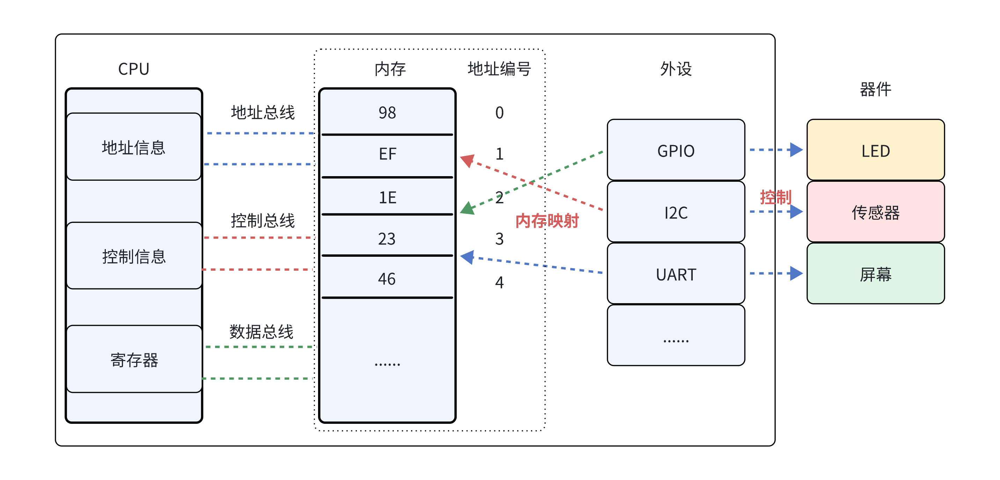

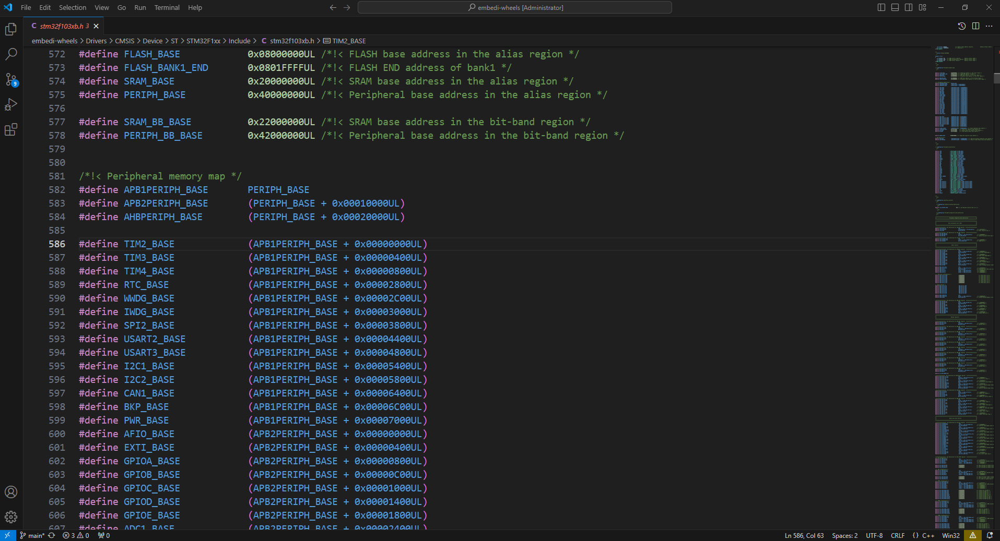

stm32外设内存映射

2.「函数（架构）视角」：程序逻辑、架构设计

面向过程的语言怎么做架构设计？能否借助C++/JAVA面向对象思想，写出优秀的代码？

a. C语言中的 ”重载“、”继承“、”多态“、”封装“思想

b. C语言程序设计怎么做到满足&quot;solid&quot;原则

c. 内核中常见的设计模式有哪些？

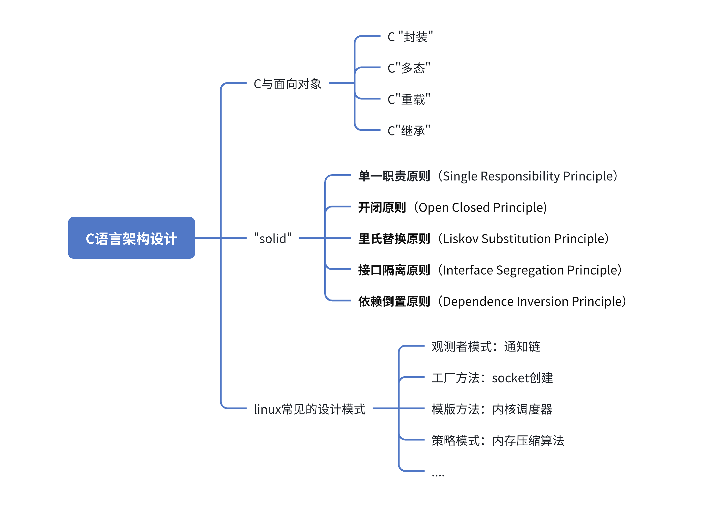

3.「编译器视角」

在工程中经常会讨论到，这个xx问题可能是编译器带来的。如，volatile防止O3编译优化导致的内存miss问题、 宏函数展开没有语法检查，怎么用才安全？

<pre class="guide-code"><code>#stm32f103xb.h
#define     __O     volatile             /*!&lt; Defines &#x27;write only&#x27; permissions 
*/
#define     __IO    volatile             /*!&lt; Defines &#x27;read / write&#x27; 
permissions */

typedef struct
{
  __IO uint32_t CRL;
  __IO uint32_t CRH;
  __IO uint32_t IDR;
  __IO uint32_t ODR;
  __IO uint32_t BSRR;
  __IO uint32_t BRR;
  __IO uint32_t LCKR;
} GPIO_TypeDef;</code></pre>

利用编译器特性做代码设计：__attribute__((packed))、__attribute__((&quot;section&quot;))  等等。官网(https://gcc.gnu.org/onlinedocs/gcc/Common-Function-Attributes.html)

<pre class="guide-code"><code>#cmsis_gcc.h
#define __NO_RETURN                __attribute__((__noreturn__))
#define __USED                     __attribute__((used))
#define __WEAK                     __attribute__((weak))
#define __PACKED                   __attribute__((packed, aligned(1)))
#define __PACKED_STRUCT            struct __attribute__((packed, aligned(1)))
#define __PACKED_UNION             union __attribute__((packed, aligned(1)))</code></pre>

<pre class="guide-code"><code>#include/linux/init.h
#ifndef MODULE
// 省略
#define module_init(x)  __initcall(x);
// 省略
#else

#define module_init(x)  __initcall(x);
|
--&gt; #define __initcall(fn) device_initcall(fn)
    |
    --&gt; #define device_initcall(fn)     __define_initcall(fn, 6)
        |
        --&gt; #define __define_initcall(fn, id) \
                static initcall_t __initcall_##fn##id __used \
                __attribute__((__section__(&quot;.initcall&quot; #id &quot;.init&quot;))) = fn</code></pre>

## 2. 编译器视角

### 2.1 预处理

预处理在工程上有很多的用处，特别是在代码管理、调试上有很多编程技巧可以用。

#### 2.1.1 条件编译

1、调试版本和release版本（调试信息的脱敏、性能的影响：code大小、运行效率）

<pre class="guide-code"><code>#include &lt;stdio.h&gt;
int password = 0x37847110；
int main(void)
{
    printf(&quot;debug log：password is %x\n&quot;，password)；
    return 0；
}</code></pre>

问：以上打印的debug log，怎么样在不修改代码的情况下去掉？

代码可以改造成这样：

<pre class="guide-code"><code>#include &lt;stdio.h&gt;

int password = 0x37847110;
int main(void)
{
#ifdef DEBUG
    printf(&quot;debug log：password is %x\n&quot;, password);
#else
    printf(&quot;release version \n&quot;);
#endif
    return 0;
}</code></pre>

编译时用gcc -D xx选项定义宏

<pre class="guide-code"><code>gcc -o bin 1.c -D DEBUG
./bin
#程序运行结果
log：password is 37847110</code></pre>

2、feature的配置（linux里面大量的feature宏设计）

<pre class="guide-code"><code>#include &lt;stdio.h&gt;

#ifdef TOUCH_PANEL_DERIVER
void tp_driver(void)
{
    printf(&quot;tp init \n&quot;);
}
#endif

int main(void)
{
#ifdef TOUCH_PANEL_DERIVER
    tp_driver();
#endif
    printf(&quot;main end\n&quot;);
    return 0;
}</code></pre>

<pre class="guide-code"><code>gcc -o bin 1.c -D TOUCH_PANEL_DERIVER
./bin
#程序运行结果
tp init
main end</code></pre>

3、通过#warning、#error进行配置提示

如上面这个例子，如果想让程序员实现touch panel的驱动，可以在预编译的时候直接提示或者直接报错。

<pre class="guide-code"><code>#include &lt;stdio.h&gt;

#ifndef TOUCH_PANEL_DERIVER
#warning &quot;You should complement TP driver&quot;
#endif

#ifdef TOUCH_PANEL_DERIVER
void tp_driver(void)
{
    printf(&quot;tp init \n&quot;);
}
#endif

int main(void)
{
#ifdef TOUCH_PANEL_DERIVER
    tp_driver();
#endif
    printf(&quot;main end\n&quot;);
    return 0;
}</code></pre>

<pre class="guide-code"><code>gcc -o bin 1.c
./bin
#程序运行结果
cc -o bin 1.c
1.c:4:2: warning: #warning &quot;You should complement TP driver&quot; [-Wcpp]
    4 | #warning &quot;You should complement TP driver&quot;
      |  ^~~~~~~</code></pre>

#### 2.1.2 宏定义使用

宏展开过程时纯粹文本替换，不进行语法检查。

<pre class="guide-code"><code>#define 宏名 宏体
#建议1:定义宏体用()包起来，不要吝啬（）
#建议2:宏名一般都是大写字母
#define ABC (123)
#define SECEND_OF_YEAR  (365*24*60*60)UL

#多行可以用“\”进行换行
#define IIC_SDA(status)                             \
    do {                                            \
        GPIO_InitTypeDef GPIO_InitStruct = {        \
            .Pin = _SDA,                            \
            .Mode = GPIO_MODE_OUTPUT_PP,            \
            .Pull = GPIO_NOPULL,                    \
            .Speed = GPIO_SPEED_FREQ_HIGH,          \
        };                                          \
        HAL_GPIO_Init(_SDA_PORT, &amp;GPIO_InitStruct); \
        HAL_GPIO_WritePin(_SDA_PORT, _SDA, status); \
    } while (0)

Q: 在Linux内核中有许多使用do{...}while(0)的宏定义。这种宏的用途是什么？有什么好处？
A: do {...} while(0)在C中是唯一的构造程序，让你定义的宏总是以你希望的方向工作，这样不管
怎么使用宏。感受一下这个例子：

1、
#define FUNC(a, b) a++; b++

if (xx)
    FUNC(a，b);

//展开后语法错误
if (xx)
    a++;
    b++;

2、
#define FUNC(a, b) {a++; b++}

if (xx)
    FUNC(a，b);
else
    xx

//展开后语法错误
if (xx) {
    a++;
    b++;
}；
else
    xx

3、
#define FUNC(a, b) do {a++; b++} while(0)
//展开后语法错误
if (xx)
    do {
        a++;
        b++;
    } while(0)；
else
    xx</code></pre>

<pre class="guide-code"><code>Q：下面代码运行是否符合预期？
#define ABC 10+2

void main(void)
{
    int a = ABC * 10;
    printf(&quot;a = %d \n&quot;, a);
}

A: 会有问题，宏展开后是10+2*10，不符合预期</code></pre>

<pre class="guide-code"><code>Q：下面代码编译完后，在运行时是否有乘法计算？

#define SECEND_OF_YEAR  (365*24*60*60)UL
void main(void)
{
    int a = SECEND_OF_YEAR;

    printf(&quot;a = %d \n&quot;, a);
}

A: 没有，编译器已经完成的计算</code></pre>

#### 2.1.3 宏函数

##### 2.1.3.1 宏函数的定义

宏函数本质不是函数。展开规则依旧是纯粹文本替换，不会检测语法错误。正因如此，宏函数直接插入调用的地方，少了函数调用的消耗（出栈入栈等操作），所以是典型的用空间换性能的做法。同样的，为了宏展开不会出错建议：整体和变量都加上()

<pre class="guide-code"><code>#define 宏名(x) (x)

#define ADD(a, b) ((a)+(b))
#define RAD2DEG（x） （(x)*57.295f）
#define F2C（x） (((x)-32)*5/9)</code></pre>

<pre class="guide-code"><code>Q：比较两个数大小的代码运行是否符合预期？
#include &lt;stdio.h&gt;
#define MAX(a, b) ((a)&gt;(b)?(a):(b))

int main(void)
{
    int a = 2;
    int b = 3;

    printf(&quot;a = %d, b = %d, the bigger value = %d \n&quot;,
            a, b, MAX(a++, b++));
    return 0;
}
期望：a = 3, b = 2, the bigger value = 3

A:</code></pre>

<pre class="guide-code"><code>#参考linux下MAX的实现(3.18内核)
#define MAX(x, y) ({                      \
        typeof(x) _max1 = (x);            \
        typeof(y) _max2 = (y);            \
        (void) (&amp;_max1 == &amp;_max2);        \
        _max1 &gt; _max2 ? _max1 : _max2; })</code></pre>

##### 2.1.3.2 '#' 字符串化

<pre class="guide-code"><code>#define LOG_INFO(x) printf(&quot;%s is %d \n&quot;, #x, (x))

int main(void)
{
    int a = 2;

    LOG_INFO(a);
    return 0;
}

#程序运行结果&amp;
a is 2</code></pre>

##### 2.1.3.3 '##' 连接符号

<pre class="guide-code"><code>#include &lt;stdio.h&gt;

#define DAY_DELARE(x) int day##x
#define DAY(x) day##x

DAY_DELARE(1);
DAY_DELARE(2);
int main(void)
{
    DAY(1) = 10;
    DAY(2) = 20;

    printf(&quot;day1:%d day2:%d \n&quot;, DAY(1), DAY(2));
    return 0;
}

#程序运行结果
day1:10 day2:20</code></pre>

#### 2.1.4 系统预定义的宏

__FUNCTION__：函数名

__LINE__：调用所在行数

__FILE__: 函数所在文件名

<pre class="guide-code"><code>#include &lt;stdio.h&gt;

#define LOG_INFO(x) printf(&quot;%s %s:line:%d：%d \n&quot;,\
                    __FILE__,\
                    __FUNCTION__,\
                    __LINE__,\
                    (x))
int main(void)
{
    int a = 10;

    LOG_INFO(a);
    return 0;
}

#程序运行结果
1.c main:line:12：10</code></pre>

#### 2.1.5 常用的log宏

<pre class="guide-code"><code>#include &lt;stdio.h&gt;

#define TAG &quot;ABC&quot;
#define LOG_INFO(format,...) printf(&quot;[%s][%s:%d]: &quot;format&quot;&quot;, TAG, __func__ , 
__LINE__, ##__VA_ARGS__)

int main(void)
{
    int a = 10;

    LOG_INFO(&quot;a = %d \n&quot;,a);
    return 0;
}

#程序运行结果
[ABC][main:10]: a = 10</code></pre>

### 2.2 关键字（32个）

编译器翻译代码的过程是逐行字符解析，所以C语言标准里面预定义了32个有特定意义的&quot;字符串&quot;，当编译器读到这些字符串就知道程序员想表达的意思。关键字大体上可以分成3大类：数据类型关键字、修饰关键字、逻辑关键字。

#### 2.2.1 sizeof关键字

sizeof（x）: 编译器给我们查看内存空间容量的一个工具，在编译时计算并确定出x在内存中所占字节数。

##### 2.2.1.1 sizeof(常量/变量/数据类型)

sizeof传入参数可以是常量、变量、数据类型。

<pre class="guide-code"><code>#include &lt;stdio.h&gt;

int main(void)
{
    int a = 10;

    printf(&quot;size of 10 is: %ld \n&quot;, sizeof(10));
    printf(&quot;size of a is: %ld \n&quot;, sizeof(a));
    printf(&quot;size of int is: %ld \n&quot;, sizeof(int));

    return 0;
}

#程序运行结果
size of 10 is: 4
size of a is: 4
size of int is: 4</code></pre>

##### 2.2.1.2 sizeof(函数)

sizeof传入函数时，得到的结果是计算出函数「返回值」的内存空间大小，函数本身不会被调用（侧面也反应sizeof是在编译时就计算出空间大小，而不是在运行时）。

<pre class="guide-code"><code>#include &lt;stdio.h&gt;

int func(void)
{
    printf(&quot;func call \n&quot;);//这句log不会被打印
    return 0;
}

int main(void)
{
    int a = 10;

    printf(&quot;size of func is: %ld \n&quot;, sizeof(func()));
    return 0;
}

#程序运行结果
size of func is: 4</code></pre>

##### 2.2.1.3 常被误解成函数

1、sizeof使用时不一定要有（），但函数调用一定要有（）。

<pre class="guide-code"><code>#include &lt;stdio.h&gt;

int a = 10;

int main(void)
{
    printf(&quot;size of a is: %ld&quot;, sizeof a);
    return 0;
}；

#程序运行结果
size of a is: 4</code></pre>

2、翻译成汇编就很清晰看到，sizeof在编译的时候就直接算出内存空间大小，并没有函数的入栈出栈、call 操作。可以体会一下 my_sizeof 和 sizeof 在汇编层面上的区别：

<pre class="guide-code"><code>#include &lt;stdio.h&gt;

int a = 10;
int b = 0;
int c = 0;

int my_sizeof(int a)
{
    return sizeof(a);
}

int main(void)
{
    b = sizeof(a);
    c = my_sizeof(a);
    return 0;
}</code></pre>

<pre class="guide-code"><code>main:
.LFB1:
    ...
    //b = sizeof(a);
    //编译时，就计算出来 b = 4
    movl    $4, b(%rip)

    //c = my_sizeof(a);
    movl    a(%rip), %eax
    movl    %eax, %edi
    call    my_sizeof
    movl    %eax, c(%rip)
    ...</code></pre>

#### 2.2.2 数据类型关键字

我们知道C语言最终是为操作内存资源服务的。那操作内存必然要回答一个问题：如何来圈定一个要操作内存的大小？继续往下看：

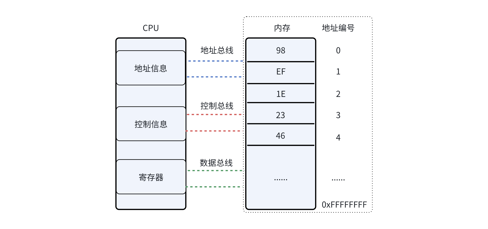

##### 2.2.2.1 标准类型

C语言标准给我们预定义了一系列的数据类型，我们逐一来思考这些数据类型关键字背后的逻辑是什么

2.2.2.1.1 char

最小内存空间的数据类型，也是最适合操作硬件的数据类型。

我们知道硬件上最小的状态是高低电平，对于软件来讲就是0和1状态，那C语言中为什么没有bit这个数据类型关键字呢？因为0-1只有这两个状态，对于内存来讲当然是充分利用，但对于CPU来讲处理效率非常低。比如要把32（0b100000）这个数据从内存读到CPU内部寄存器，至少需要执行6个指令周期（1个指令周期：寻址-&gt;发读的控制信息-&gt;数据通过数据总线送到寄存器）才能读到0b100000。所以兼顾CPU性能和内存管理，计算机科学家把操作内存最小单位为8bit，也称1byte，也就是char类型，可以表示256种状态。

当编译器看到char关键字的时候，就知道圈定的内存大小是1byte：

<pre class="guide-code"><code>#include &lt;stdio.h&gt;

int main(void)
{
    char a = 9;
    printf(&quot;a = %d, size of a is %ld byte \n&quot;, a, sizeof(a));
    return 0;
}

#程序运行结果
a = 10, size of a is 1 byte</code></pre>

<pre class="guide-code"><code>这里的 char a = 10; 相当于在内存中圈出一块1byte的内存，内存的标签叫a（也可以理解成这块内
存属于a），内存里面的值是10
Q：想一想，声明和定义的区别？extern char a 和 char a；
A: 声明没有分配内存，定义会分配内存。</code></pre>

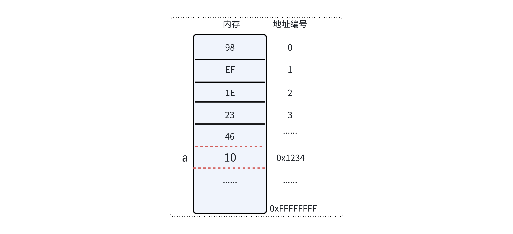

所以内存的访问的方式分成：标签访问和地址访问。可以这么理解，假设你要去访问你朋友的家。你朋友带你去就是标签访问，你自己根据目的地导航过去就是地址访问。

字符空间

char类型除了表示一个具体数字之外，它还可以描述字符空间，即ASCII码。在计算机的世界里，只认识01不认识字符，所以ASCII是人为定义的一套映射标准(见附录 7.1)。

<pre class="guide-code"><code>#include &lt;stdio.h&gt;

int main(void)
{
    char a = &#x27;a&#x27;;
    printf(&quot;a = %c, a ASCII = %d \n&quot;, a, a);
    return 0;
}

#程序运行结果
a = a, a ASCII = 97</code></pre>

<pre class="guide-code"><code> 这里char a = &#x27;a&#x27; 等价于char a = 97</code></pre>

<pre class="guide-code"><code>#include &lt;stdio.h&gt;

int main(void)
{
    char a = 97;
    printf(&quot;a = %c, a ASCII = %d \n&quot;, a, a);
    return 0;
}

#程序运行结果
a = a, a ASCII = 97</code></pre>

2.2.2.1.2 int

最适合CPU的数据类型，大小跟编译器有关。

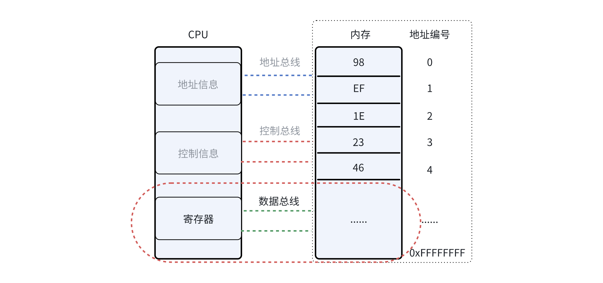

为了充分发挥CPU的数据处理能力，数据总线尽量要充分利用，在系统一个周期内所能接受的最大处理单位就是int。所以32位的CPU，int就是32bit（4byte），16位的CPU，int就是16bit（2byte）。对于一个数字常量默认就是int的，体会以下代码：

<pre class="guide-code"><code>#include &lt;stdio.h&gt;

int main(void)
{
    int a = 10;

    printf(&quot;size of 10 is: %ld \n&quot;, sizeof(10));
    printf(&quot;size of a is: %ld \n&quot;, sizeof(a));
    printf(&quot;size of int is: %ld \n&quot;, sizeof(int));

    return 0;
}

#程序运行结果
size of 10 is: 4
size of a is: 4
size of int is: 4</code></pre>

2.2.2.1.3 short/long

short和long关键字本质是修饰int的，只是默认情况下我们用short和long类型的时候把int省略了。见名知意，short是减少int的空间，long是加大int的空间。具体的大小，由编译器决定

<pre class="guide-code"><code>#include &lt;stdio.h&gt;
int main(void)
{
    short int a = 1;
    short b = 1;

    long int c = 1;
    long d = 1;
    printf(&quot;size, a b: %ld, %ld byte; c d : %ld, %ld byte \n&quot;,
         sizeof(a), sizeof(b), sizeof(c), sizeof(d));
    return 0;
}

#程序运行结果
size, a b: 2, 2 byte; c d : 8, 8 byte</code></pre>

2.2.2.1.4 signed/unsigned

这两个关键字用于圈定变量的区间范围。signed代表有符号数，最高位代表正负（1：代表负，0：代表正），区间范围从0为支点一分为半。如，char是8bit，所以signed char范围[-128, 127]，unsigned char范围[0, 255]。一般情况可以省略signed不写，int、long、short默认就是signed，但是char在C的标准中，允许定义为signed和unsigned，所以由编译器决定。可以测试一下你的机器上char是否是有符号数：

<pre class="guide-code"><code>#include &lt;stdio.h&gt;

int main(void)
{
    char a = 127;

    if (++a &gt; 127) {
        printf(&quot;char is unsigned \n&quot;);
    } else {
        printf(&quot;char is signed \n&quot;);
    }

    return 0;
}</code></pre>

2.2.2.1.5 float/double

float和double是浮点类型，即可以表示小数。float是4字节，double是8个字节。在一般的嵌入式中，浮点的运算相比于整形要慢，如果算法没有太高的精度要求，建议尽量用整形。

<pre class="guide-code"><code>#include &lt;stdio.h&gt;

int main(void)
{
    printf(&quot;float：%ld double %ld\n&quot;,sizeof(float), sizeof(double));
    return 0;
}

#程序运行结果
float：4 double 8</code></pre>

float和double是浮点类型在存储上存在精度，所以不能直接判断是否相等，而是人为的取一个精度，然后判断两个小数的模与这个精度的大小。

<pre class="guide-code"><code>#include &lt;stdio.h&gt;
#include &lt;math.h&gt;

int main(void)
{
    float a = 1.0;
    float b = 0.1;

    printf(&quot;   a = %.10f b = %.10f \n&quot;, a, b);
    fabs((a - b) - 0.9) &lt; 0.000001 ?
        printf(&quot;   a - b equal 0.9\n&quot;) :
        printf(&quot;   a - b not equal 0.9 \n&quot;);
    return 0;
}</code></pre>

2.2.2.1.6 void

void类型不能用于定义变量，因为空大小的内存圈定没有意义。一般void用于函数占位符、void*、强制转换防止未用参数被编译器警告。

<pre class="guide-code"><code>#include &lt;stdio.h&gt;

int main(void)
{
    void a;
    return 0;
}

#程序运行结果
1.c: In function ‘main’:
1.c:5:10: error: variable or field ‘a’ declared void
    5 |     void a;
      |</code></pre>

占位符：表示无或者空

<pre class="guide-code"><code>#include &lt;stdio.h&gt;

//表示函数没有形参和返回值
void main(void)
{
   printf(&quot;hello world \n&quot;)；
}</code></pre>

void *：表示数据空间

<pre class="guide-code"><code>#include &lt;stdio.h&gt;

void data_process(void *data，int len)
{
    unsigned char* buff = (unsigned char *)data;
    for (int i = 0; i &lt; len; i++) {
        ...
        buff[i];
    }
}</code></pre>

表示unused: 

<pre class="guide-code"><code>#include &lt;stdio.h&gt;

void func(int a)
{
    int b;
    //解决编译器报警告：参数定义未使用
    (void)a;
}</code></pre>

##### 2.2.2.2 自定义类型

C语言默认定义的数据类型，不满足实际内存资源分配的。所以C语言支持在标准类型的基础上，通过组合来形成新的类型。本质上就是支持程序员根据实际需要来圈定内存的大小。

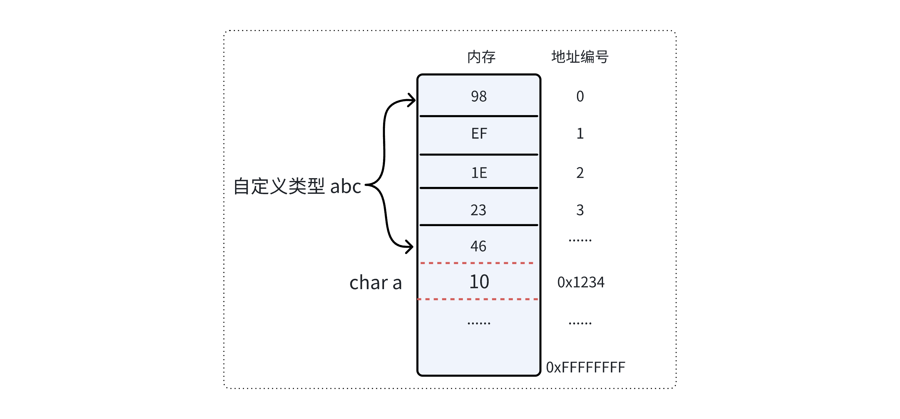

2.2.2.2.1 struct

C语言通过 struct 关键字表示新的组合类型，内存表现为累加且对齐，我们叫这种数据类型为结构体。声明的规则如下：

<pre class="guide-code"><code>struct 名字 {
    char b;
    int a;
    ....
};

Q：下面这段代码有分配内存吗？
struct abc {
    int a；
    char b；
}；
A:这里只是声明，没有分配内存，a和b这里代表结构体的成员。</code></pre>

结构体的初始化和访问

<pre class="guide-code"><code>#include &lt;stdio.h&gt;

struct abc {
    int a;
    char b;
};

int main(void)
{
    struct abc c = {
        .a = 1,
        .b = &#x27;c&#x27;,
    };

    printf(&quot;a = %d b = %c \n&quot;,c.a, c.b);
    return 0;
}

#程序运行结果
a = 1 b = c</code></pre>

字节对齐

什么是字节对齐，为什么要字节对齐？我们来体会一下下面这个例子：

<pre class="guide-code"><code>#include &lt;stdio.h&gt;
struct abc {
    char b;
    int a;
};

int main(void)
{
    struct abc c = {
        .a = 1,
        .b = &#x27;c&#x27;,
    };

    printf(&quot;int:%ld byte, char:%ld byte, abc:%ld byte\n&quot;,
            sizeof(int), sizeof(char), sizeof(struct abc));
    return 0;
}

#程序运行结果
int:4 byte, char:1 byte,  abc:8 byte

可以看到，组合成新的结构体类型后，整体的内存变大了，不仅仅是简单的叠加。原因也很简单，就是
想要充分利用CPU，提升性能。在32位的cpu中，每次读取的数据是4byte对齐访问，字节未对齐时，对
于成员变量a来说，需要读取两次才能拼凑成a的值；而对齐后，只需要一个机器周期就可以读取出来。
这也是典型通过空间换效率的例子。

Tips1：在定义结构体变量时，编译器默认会把首地址对齐到4字节（跟具体体系结构有关，也可能是2
个字节对齐）的倍数：首地址对齐
Tips2：边界对齐
1、部分CPU硬件支持非对齐访问，典型的就是X86，X86硬件会自动处理非对齐访问情况，对软件透
明，代价是牺牲效率（纯硬件做的数据拼接）
2、部分CPU“部分支持”非对齐访问，典型的就是ARM，其“单指令”操作支持非对齐，但“群指令”操作
(SIMD)则不支持(必须对齐访问)
3、部分CPU硬件不支持对齐访问，但通过软件支持。典型的就是部分mips架构，其通过内核中对
alignment fault异常处理流程中进行处理，比如将非对齐的数据访问，通过多次访存操作和拼接操作
来处理，也可以使用类似memcpy的方式来处理，当然代价是更严重的性能损失</code></pre>

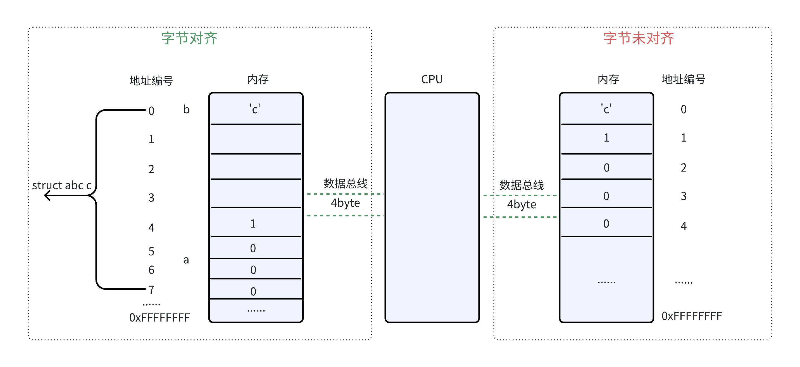

<pre class="guide-code"><code>Q：abc1 和 abc2 的内存空间一样吗？
#include &lt;stdio.h&gt;
struct abc1 {
    char b;
    int a;
    short c;
};

struct abc2 {
    char b;
    short c;
    int a;
};
int main(void)
{
    printf(&quot;abc1:%ld byte, abc2:%ld byte\n&quot;, sizeof(struct abc1), sizeof(struct
 abc2));
    return 0;
}

#程序运行结果
abc1:12 byte, abc2:8 byte

大家可以自己尝试分析分析为什么不一样</code></pre>

attribute((packed))

在数据传输的时候，往往需要知道真实的数据长度，这时候可以通过packed属性告诉编译器，不需要做字节对齐。

<pre class="guide-code"><code>#include &lt;stdio.h&gt;
struct abc {
    char b;
    int a;
} __attribute__((packed));

int main(void)
{
    printf(&quot;int:%ld byte, char:%ld byte, abc:%ld byte\n&quot;,
            sizeof(int), sizeof(char), sizeof(struct abc));
    return 0;
}

#程序运行结果
int:4 byte, char:1 byte, abc:5 byte</code></pre>

2.2.2.2.2 union

union关键字表示新的类型叫联合体，内存表现为：共享一份内存(以最大数据类型作为分配空间)和内存的首地址。声明的规则如下：

<pre class="guide-code"><code>union 名字 {
    char b;
    int a;
    ....
};</code></pre>

联合体的初始化和访问

<pre class="guide-code"><code>#include &lt;stdio.h&gt;

union abc {
    int a;
    char b;
};

int main(void)
{
    union abc c = {
        .a = 1,
    };
    printf(&quot;a = %d b = %d \n&quot;,c.a, c.b);

    c.b = 100;
    printf(&quot;a = %d b = %d \n&quot;,c.a, c.b);
    return 0;
}

#程序运行结果
a = 1 b = 1
a = 100 b = 100</code></pre>

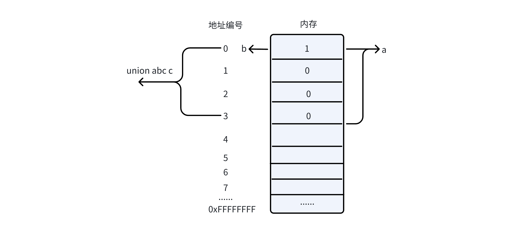

识别计算机的大小端

大小端是计算器存储数据的一个规则，小端是低地址存放低位，高地址存放高位；大端则相反。一般像x86、arm都是小端，51单片机是大端。两种存储方式都是对的，可以通过联合体来判断大小端情况。

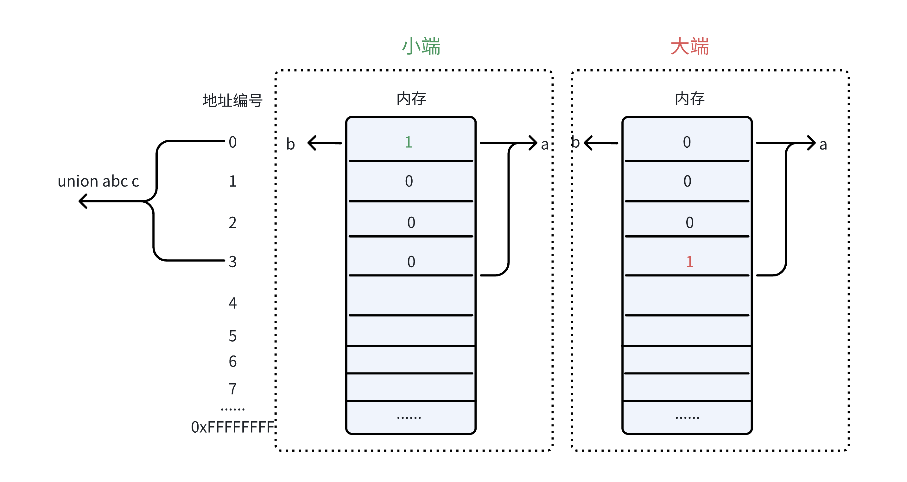

<pre class="guide-code"><code>#include &lt;stdio.h&gt;

void check_endian(void)
{
    union big_little {
        int a;
        char b;
    } data;
    data.a = 0x01;

    if (data.b == 0x01) {
        printf(&quot;little endian \n&quot;);
    } else {
        printf(&quot;big endian \n&quot;);
    }
}
int main(void)
{
    check_endian();
    return 0;
}</code></pre>

联合体+结构体设计数据包

在uart、usb、2.4G等等常见的数据包传输，会用到联合体+结构体的设计，这样的设计拓展性很强，符合开放封闭原则：拓展是开放的，修改是封闭的。可以体会一下下面这个例子：

<pre class="guide-code"><code>#include &lt;stdio.h&gt;

struct abc {
    int a;
    short b;
    long c;
} __attribute__((packed));

//拓展的数据结构
struct efg {
    char e;
    float f;
    int g;
} __attribute__((packed));

#pragma anon_unions
struct package {
    unsigned char id;
    union {
        unsigned char payload[24];
        struct abc a;
        //拓展的数据结构
        struct efg b;
    };
};

void send_package(void* data, int len)
{
    struct package *p = (struct package *)data;

    uart_send(p-&gt;id);
    for (int i = 0; i &lt; len; i++) {
        uart_send(p-&gt;payload[i]);
    }
}

可以看到，拓展的数据结构efg，不影响数据传输的功能，即send_package不需要修改。理论上支持无
限制的类型拓展。</code></pre>

2.2.2.2.3 enum

enum关键字表示的类型叫枚举类型，内存表现为：内存根据定义值的大小默认选择整数常量大小（int），如果超出int大小，编译器会选择更大的整型类型，比如long，所以内存大小不是固定的。声明的规则如下：

<pre class="guide-code"><code>enum 名字 {
    A = 200,
    B = 300,
    C = 321
};</code></pre>

enum的初始化和访问

<pre class="guide-code"><code>#include &lt;stdio.h&gt;

enum abc {
    A = 0,
    B = 1,
    C = 3,
    D
};

enum efg {
    E = 0x123456789,
    F,
    G
};

int main(void)
{
    printf(&quot;a = %d, b = %d, c = %d, d = %d\n&quot;,A, B, C, D);
    printf(&quot;size of a = %ld, abc = %ld\n&quot;,sizeof(A), sizeof(enum abc));
    printf(&quot;size of E = %ld, abc = %ld\n&quot;,sizeof(E), sizeof(enum efg));
    return 0;
}

#程序运行结果
a = 0, b = 1, c = 3, d = 4
size of a = 4, abc = 4 //int
size of E = 8, efg = 8 //long int</code></pre>

enum在C语言中只是一个建议性关键字

<pre class="guide-code"><code>#include &lt;stdio.h&gt;

enum abc {
    A = 0,
    B = 1,
    C = 3,
    D
};

enum abc func(void)
{
    return 10;
}

int main(void)
{
    enum abc a = func();

    printf(&quot;a = %d \n&quot;, a);
    return 0;
}

#程序运行结果
a = 10

Tips: 在C++ 11这会编译报错。</code></pre>

enum和宏的差别

<pre class="guide-code"><code>#define A 0
#define B 1
#define C 3
#define D 4

enum abc {
    A = 0,
    B = 1,
    C = 3,
    D
};

在C语言中，对于上面这段代码使用上几乎等价。</code></pre>

##### 2.2.2.3 地址（指针）类型

C语言中，地址类型也称指针类型，圈定的内存用来存放地址编号的值。指针类型的内存表现跟编译器有关或者说跟CPU的地址总线有关。在32位的系统中，指针类型占用4byte，在64位的系统中，指针类型占用8byte。

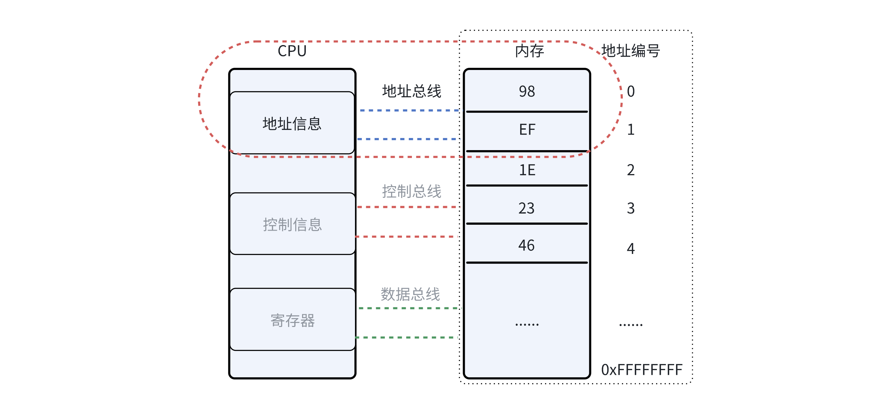

声明的规则如下：

<pre class="guide-code"><code>数据类型 *</code></pre>

指针变量初始化和访问

<pre class="guide-code"><code>#include &lt;stdio.h&gt;

int main(void)
{
    int a = 10;
    int *p = &amp;a;

    printf(&quot;symbol visit：a = %d, addr visit：a = %d\n&quot;, a, *p);
    return 0;
}
#程序运行结果
symbol visit：a = 10, addr visit：a = 10

1、首先，p也是一个变量（没啥神秘的），这本质上也是圈定一块内存，内存的大小跟编译器有关，p
是这块内存的标签。到这里p和a的在变量的视角中一摸一样
2、然后，p的特殊性在于，它圈定的那块内存，存放的不是一般的值而是一个地址编号。所以除了通过
标签p读出这个地址编号外，C语言还提供一种直接访问这个地址编号的方法，那就是在p前面加一个*
号。
举一个形象的例子：
你要去访问A朋友家，第一种是直接让A带你去，第二种是P知道A家的地址，通过P带你去。a 和 *p就
是这种感觉</code></pre>

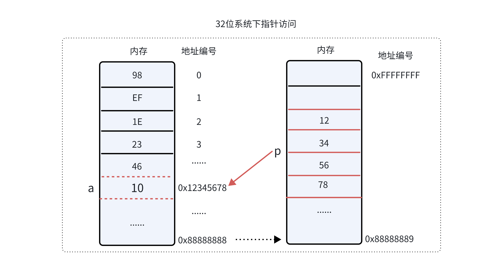

指针类型的内存大小跟数据类型没有关系

<pre class="guide-code"><code>#include &lt;stdio.h&gt;

struct abc {
    int a;
    int b;
    float c;
};

int main(void)
{
    char *p1;
    int *p2 ;
    struct abc *p3;

    printf(&quot;size of p1:%ld, p2:%ld, p3:%ld\n&quot;, sizeof(p1), sizeof(p2),
sizeof(p3));
    return 0;
}
#程序运行结果
size of p1:8, p2:8, p3:8</code></pre>

后续会有专门的一part来介绍指针的使用，大家先了解指针类型的基本思想。

##### 2.2.2.4 typedef

typedef关键字是给数据类型起一个别名，让程序的可读性更高，特别是复杂的类型（如函数指针类型），做到见字知意。使用的规则如下：

<pre class="guide-code"><code>typedef 数据类型 别名</code></pre>

<pre class="guide-code"><code>#include &lt;stdio.h&gt;

typedef struct abc {
    int a;
    int b;
    float c;
} abc_t;

typedef int len_t;
typedef unsigned char uint8_t;
typedef void (func*)(void);
func p;

int main(void)
{
    len_t a = 0;
    uint8_t b;
    abc_t c;

    return 0;
}</code></pre>

体会typedef 和 #define 的区别

<pre class="guide-code"><code>#include &lt;stdio.h&gt;

#define uint8 unsigned char
typedef unsigned char uint8_t;

int main(void)
{
    uint8 a = &#x27;c&#x27;;
    uint8_t b = &#x27;c&#x27;;

    printf(&quot;a = %c, b = %c \n&quot;, a, b);
    return 0;
}

#程序运行结果
a = c, b = c</code></pre>

<pre class="guide-code"><code>#include &lt;stdio.h&gt;

#define uchar_p unsigned char *
typedef unsigned char * uint8_p;

int main(void)
{
    uchar_p a, b;
    uint8_p c, d;

    a = &quot;hello&quot;;
    b = &quot;hello&quot;;//这里b是unsigned char，不是 unsigned char *
    c = &quot;hello&quot;;
    d = &quot;hello&quot;;

    return 0;
}

#程序运行结果
1.c: In function ‘main’:
1.c:12:7: warning: assignment to ‘unsigned char’ from ‘char *’ makes integer
from pointer without a cast [-Wint-conversion]
   12 |     b = &quot;hello&quot;;//
      |

#宏展开后的结果：
typedef unsigned char * uint8_p;

int main(void)
{
    unsigned char * a, b;//b 是 unsigned char
    uint8_p c, d;、</code></pre>

<pre class="guide-code"><code>    a = &quot;hello&quot;;
    b = &quot;hello&quot;;
    c = &quot;hello&quot;;
    d = &quot;hello&quot;;

    return 0;
}</code></pre>

#### 2.2.3 修饰关键字

我们知道数据类型关键字的作用是告诉编译器圈定内存的大小。但实际工程应用中，只有大小的限制是不够的。想一想，我们的内存空间这么大（32位系统为例，有4G的内存寻址空间），该从哪个地方圈定内存呢？是全部区域都可以吗？分配给你的内存空间，要不要有些操作做限定呢？这些都是需要修饰关键字来告诉编译器该怎么来做。

##### 2.2.3.1 auto

auto关键字是最无感的存在。编译器在默认缺省的情况下，所有变量都是auto的。你就当做它不存在，不曾来过。

##### 2.2.3.2 register

register关键字是一个建议性关键字。设计的初衷是想要定义的变量放到cpu的寄存器中，但是往往编译器看到这个关键字的时候，发出一句呐喊：臣妾做不到啊。寄存器相对于内存，cpu在访问速度上更快，但也很稀缺，不是说想放就放的。所以编译器只能尽量的去做，它不保证一定能做得到，大家也就不要奢望了。但值得注意的是加上register修饰后的变量，无法通过&amp;来取地址。即使大概率放进寄存器会失败，但编译器就不给你寻址，万一成功了呢？编译器还是有梦想的。

<pre class="guide-code"><code>#include &lt;stdio.h&gt;

int main(void)
{
    register char a = 1;

    printf(&quot;a = %d , addr of a:%p&quot;, a, &amp;a);
    return 0;
}

#程序运行结果
1.c: In function ‘main’:
1.c:6:5: error: address of global register variable ‘a’ requested
    6 |     printf(&quot;a = %d , addr of a:%p&quot;, a, &amp;a);
      |     ^~~~~~</code></pre>

##### 2.2.3.3 static

在C语言中static关键字有两个作用：1、变量的内存从静态全局数据区分配；2、限定变量或函数的作用域

2.2.3.3.1 修饰变量

生命周期：不管是修饰局部变量还是全局变量，最后都在静态全局数据区分配。这意味着变量在整个程序的生命周期内都是有效合法的。

<pre class="guide-code"><code>#include &lt;stdio.h&gt;

static int a = 20;
int func(void)
{
    static int b = 10;
    return ++b;
}

int main(void)
{
    printf(&quot;a = %d , b = %d ,b = %d \n&quot;, a, func(), func());
    return 0;
}
#程序运行结果
a = 20 , b = 12 ,b = 11</code></pre>

限定范围：限定全局变量只在当前定义的文件可见，其他文件即使加上extern修饰，也无法引用。会编译报错

<pre class="guide-code"><code>//1.c
#include &lt;stdio.h&gt;

static int a = 20;

int main(void)
{
    printf(&quot;a = %d\n&quot;, a);
    return 0;
}

//2.c
extern int a;
int func(void)
{
    return ++a;
}

#程序运行结果
/usr/bin/ld: 2.o: in function `func&#x27;:
2.c:(.text+0xa): undefined reference to `a&#x27;
/usr/bin/ld: 2.c:(.text+0x13): undefined reference to `a&#x27;
/usr/bin/ld: 2.c:(.text+0x19): undefined reference to `a&#x27;
collect2: error: ld returned 1 exit status</code></pre>

2.2.3.3.2 修饰函数

限定范围：限定函数在当前定义的文件可见，其他文件不可引用，但可以实现相同名字的函数(也需要用static修饰)，互不影响。感受一下下面这个例子：

<pre class="guide-code"><code>//1.c
#include &lt;stdio.h&gt;

static int a = 20;
static int func(void)
{
    return ++a;
}

int main(void)
{
    printf(&quot;a = %d\n&quot;, func());
    return 0;
}

//2.c
static int a = 10;
static int func(void)
{
    return ++a;
}

#程序运行结果
a = 21</code></pre>

##### 2.2.3.4 extern

extern用来声明一个没有被static修饰的变量或者函数。

<pre class="guide-code"><code>//1.c
#include &lt;stdio.h&gt;

extern int func(void);
int main(void)
{
    func();
    return 0;
}

//2.c
#include &lt;stdio.h&gt;
int func(void)
{
    printf(&quot;func call \n&quot;);
}

#程序运行结果
func call</code></pre>

在架构设计中尽量不要用extern，会导致代码耦合度非常高而且不太可控。建议参考如下方案：

<pre class="guide-code"><code>//1.c
#include &lt;stdio.h&gt;
#include &quot;2.h&quot;

int main(void)
{
    set_a(20);
    printf(&quot;a = %d\n&quot;, read_a());
    return 0;
}

//2.h
void set_a(int value);
int read_a(void);

//2.c
static int a = 10;
void set_a(int value)
{
    mutex_lock();
    a = value;
    mutex_unlock();
}
int read_a(void)
{
    return a;
}</code></pre>

extern &quot;C&quot;，用C++的编译器（g++）按照C的规则进行编译。C++和C语言在编译规则上有很多不同，所以在C++中想完全复用C写的代码，就可以用extern &quot;C&quot;来修饰。这种在C++使用C的lib库的时候比较常见。另外，面试也很喜欢问这个。

<pre class="guide-code"><code>#include &lt;stdio.h&gt;

void func(void)
{
    printf(&quot;func call \n&quot;);
}
//FPIC 生成的so库跟绝对代码位置无关，可以在任意位置被引用
//-shared 共享库
gcc -o libfunc.so 2.c -fPIC -shared</code></pre>

<pre class="guide-code"><code>#include &lt;stdio.h&gt;

#if defined(__cplusplus)
extern &quot;C&quot; {
#endif
void func(void);
#if defined(__cplusplus)
}
#endif</code></pre>

<pre class="guide-code"><code>int main(void)
{
    func();
    return 0;
}

export LD_LIBRARY_PATH=$LD_LIBRARY_PATH:./
g++ -o bin 1.c -lfunc -L.
./bin
#程序运行结果
func call</code></pre>

##### 2.2.3.5 const

const是constant的缩写，是恒定不变的意思，被修饰的变量经常被人误解成常数或者常量。这个理解不太准确，准确的理解应该是read only。本质上还是变量，编译器只能尽量的不让你去修改，但是实际上总有一些方法可以做到修改const 修饰变量的值，往往都是一些异常的操作导致（比如数组越界、指针越界访问、栈溢出等等）。我们要建立一个正确的编程理念：const 修饰的变量技术上能改，但是不要去改。

<pre class="guide-code"><code>const 数据类型 变量名 or 数据类型 const 变量名

#include &lt;stdio.h&gt;

int main(void)
{
    const int a = 10;
    int const b = 20;

    //a = 20;//编译错误,编译不给修改
    printf(&quot;a = %d, b = %d\n&quot;, a, b);
    return 0;
}</code></pre>

修改const修饰的变量

<pre class="guide-code"><code>#include &lt;stdio.h&gt;

int main(void)
{
    int a = 1234568;
    const int b = 11111111;
    int *p = &amp;a;

    p[1] = 22222222;
    printf(&quot;b = %d \n&quot;, b);
    return 0;
}</code></pre>

const 修饰指针

很多同学对const修饰指针变量，有时候分不清楚是修饰指针变量还是限定指针指向的内容。今天教大家一个方法，叫&quot;近水楼台先得月&quot;：

<pre class="guide-code"><code>#include &lt;stdio.h&gt;

const int * a;  //-&gt; const * a -&gt;靠近 *，所以 地址指向的内容（*a）不能变
int const * b;  //-&gt; const * b -&gt;靠近 *，所以 地址指向的内容（*d）不能变
int * const c; //-&gt; * const c -&gt;靠近 c，所以 c指针变量不能变
const int * const d; //-&gt; const * const d -&gt;靠近 * 又靠近c，所以d和*d都不能变

int main(void)
{
    //下面5个语句编译器会报错拦截
    *a = 1;
    *b = 1;
    c = 1;
    *d = 1;
    d = 1;

    return 0;
}
//编译器报错
1.c: In function ‘main’:
1.c:11:8: error: assignment of read-only location ‘*a’
   11 |     *a = 1;
      |        ^
1.c:12:8: error: assignment of read-only location ‘*b’
   12 |     *b = 1;
      |        ^
1.c:13:7: error: assignment of read-only variable ‘c’
   13 |     c = 1;
      |       ^
1.c:14:8: error: assignment of read-only location ‘*d’
   14 |     *d = 1;
      |        ^
1.c:15:7: error: assignment of read-only variable ‘d’
   15 |     d = 1;
      |       ^
    ^</code></pre>

使用const可以提高运行效率：如果用const修饰，编译器会直接把立即数200赋值给变量a，而没有const修饰的则每次都需要读取内存中ABC值。这样用const修饰时，执行效率就比较高（我们知道读取内存是相对慢的操作）。

<pre class="guide-code"><code>#include &lt;stdio.h&gt;

const int ABC = 200;
int main(void)
{
    int a = ABC;
    return 0;
}</code></pre>

<pre class="guide-code"><code>//int a = ABC;
movl    ABC(%rip), %eax //把内存中ABC的值读到寄存器中去
movl    %eax, -4(%rbp)

//const int a = ABC;
movl    $200, -4(%rbp)</code></pre>

const和宏的区别

const设计的初衷就是为了代替宏，消除它的缺点，继承它的优点。

1. 编译器处理方式：define宏是在预处理阶段展开；const变量是编译运行阶段使用

2. 安全检查：define宏不做任何类型检查，仅仅是展开；const变量编译阶段会执行类型检查

3. 内存位置：define宏在代码段；const常量可以在静态全局数据段、栈中

##### 2.2.3.6 volatile

volatile关键字用于告诉编译器，被声明为 volatile 的变量的值可能在程序的控制之外发生变化，因此编译器不应该对其进行某些优化。主要用于处理硬件寄存器、中断服务程序和多线程等情况：下面如果buff变量是uart的DR寄存器映射，即使代码中没有地方更新buff的值，也应该告诉编译器不要优化，如果有地方读取buff的值的时候，都需要从内存中读取，因为外部uart会触发更新。

<pre class="guide-code"><code>#include &lt;stdio.h&gt;

volatile unsigned char buff;

int main(void)
{
    while (buff) {//等待buff不为0
        //do something
    }
    return 0;
}</code></pre>

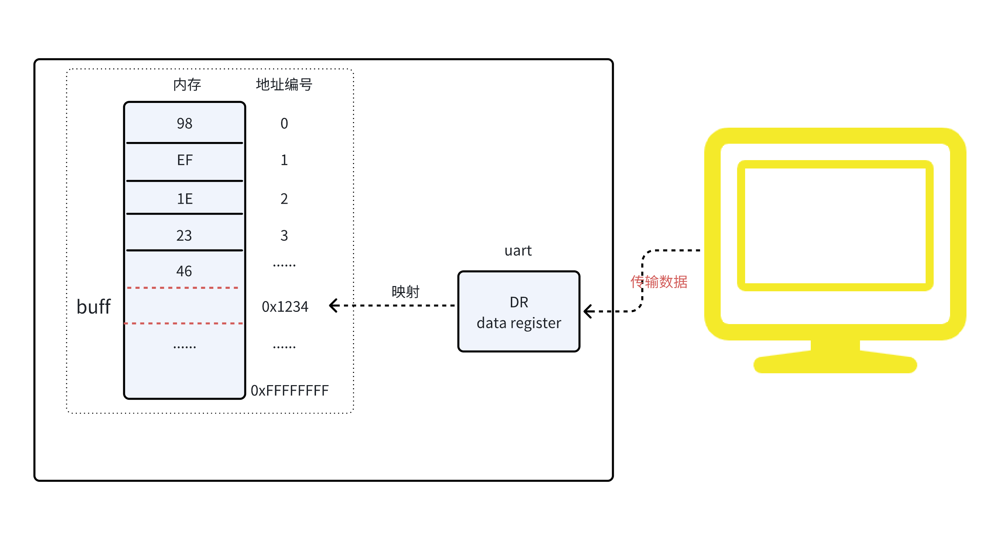

体会一下下面这个例子：

<pre class="guide-code"><code>#include &lt;stdio.h&gt;
#include &lt;stdlib.h&gt;
#include &lt;unistd.h&gt;
#include &lt;pthread.h&gt;

static volatile int wait = 1;

void* function(void* arg)
{
    while (1) {
        sleep(1);
        wait = 0;
        printf(&quot;flag wait = %d in thread \n&quot;, wait);
    }
    return NULL;
}
int main(void)
{
    pthread_t tid;
    pthread_create(&amp;tid, NULL, function, NULL);

    while(wait);
    printf(&quot;flag wait = %d in main \n&quot;, wait);
    return 0;
}
gcc -o bin 1.c -lpthread -O3
./bin
#程序运行结果
当wait不加volatile时，程序出现死循环

#体会一下两种情况的下汇编
//不加volatile时，while(wait)
        movl        wait(%rip), %eax
        testl        %eax, %eax
        je        .L6
.L7:
        jmp        .L7

//加volatile时，while(wait)
.L6:
        movl        wait(%rip), %eax
        testl        %eax, %eax
        jne        .L6</code></pre>

#### 2.2.4 逻辑关键字

在cpu的眼里很单纯，程序指针（PC）指到哪里就执行哪里，默认情况下顺序往下执行，而逻辑关键字作用就是改变PC指针的指向，这个最基本的思想就构成了程序里各种逻辑设计（条件、选择、跳转、循环）。

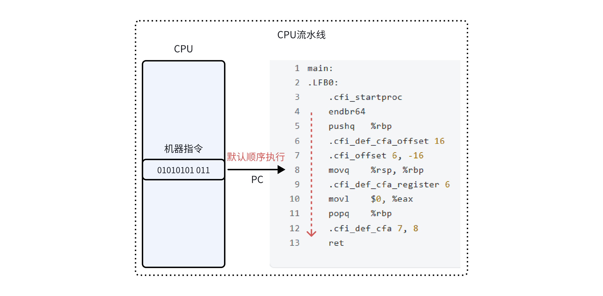

##### 2.2.4.1 条件：if、else

条件逻辑关键字，判断条件表达式是否为真，为真后停止判断并进入处理对应逻辑。

<pre class="guide-code"><code>if (条件表达式)
    xx；//表达式为真，进来此分支
else if(条件表达式)
    yy;
....
else
    zz；</code></pre>

<pre class="guide-code"><code>#include &lt;stdio.h&gt;

int main(void)
{
    int a = 2;

    if (a == 1) {
        printf(&quot;hello 1 \n&quot;);
    } else if (2 == a)) {
        printf(&quot;hello 2 \n&quot;);
    } else {
        printf(&quot;hello a = %d \n&quot;, a);
    }
    return 0;
}

#程序运行结果
hello 2</code></pre>

##### 2.2.4.2 选择：swtich、case、default

选择逻辑关键字基于某个表达式的值选择不同的执行路径。它的基本语法如下：

<pre class="guide-code"><code>switch (表达式  整形数字) {
    case 值1:
        // 当表达式等于值1时执行的代码
        break;
    case 值2:
        // 当表达式等于值2时执行的代码
        break;
    //....
    default:
        // 如果表达式的值与所有case不匹配时执行的代码
}
#include &lt;stdio.h&gt;

int main(void)
{
    int a = 2;

    switch (a) {
    case 1:
        printf(&quot;hello 1 \n&quot;);
        break;
    case 2:
        printf(&quot;hello 2 \n&quot;);
        break;
    default:
        printf(&quot;hello a = %d \n&quot;, a);
    }
    return 0;
}

#程序运行结果
hello 2

Tips：
1、每个case块末尾都需要有break语句，否则将继续执行后面的case块，直到遇到break或者switch
结束。
2、switch条件不能是浮点数：
#程序运行结果
1.c: In function ‘main’:
1.c:7:13: error: switch quantity not an integer
    7 |     switch (1.1) {
      |</code></pre>

##### 2.2.4.3 循环：do、while、for

do-while循环是C语言中的一种循环结构，它的基本语法如下：

<pre class="guide-code"><code>while (条件) {
    // 循环体
}；

do {
    // 循环体
    // 这里的代码至少会执行一次
} while (条件);
do-while与while循环不同的是，do-while循环会先执行一次循环体，然后检查条件，如果条件为
真，循环将继续执行，这确保循环体至少被执行一次。</code></pre>

<pre class="guide-code"><code>#include &lt;stdio.h&gt;

int main()
{
    int number;
    do {
        printf(&quot;please enter a positive number: &quot;);
        scanf(&quot;%d&quot;, &amp;number);

        if (number &lt;= 0) {
            printf(&quot;ensure positive number entered \n&quot;);
        }
    } while (number &lt;= 0);
    printf(&quot;positive number：%d\n&quot;, number);
    return 0;
}

#程序运行结果
please enter a positive number: 1
positive number：1</code></pre>

for 也是另一种循环结构，它的基本语法如下：

<pre class="guide-code"><code>for (初始化;  条件表达式 ; 条件更新) {
    //循环体 -&gt;条件表达式为真时进来
}

Tips：养成好的习惯，条件的更新不要在循环体里进行更新，容易出现死循环</code></pre>

<pre class="guide-code"><code>#include &lt;stdio.h&gt;

int main()
{
    for (int i = 0; i &lt; 5; i++) {
        printf(&quot;i = %d \n&quot;, i);
    }
    return 0;
}

#程序运行结果
i = 0
i = 1
i = 2
i = 3
i = 4</code></pre>

do-while 和 for 怎么选

一般是：某个条件不满足时退出循环，用do-while或者while，而靠计数结束退出循环，用for。

<pre class="guide-code"><code>#include &lt;stdio.h&gt;

void main()
{
    while(1) {

    }

    for(;;) {

    }
}

单片机中有两种死循环的写法？你一般用哪种？
(不用纠结，用哪种都可以，基本没有什么区别)</code></pre>

##### 2.2.4.4 跳转：continue、break、return、goto

continue、break一般结合循环来用：continue 跳过以下的循环体，进行下一轮循环，break 提前结束循环。

<pre class="guide-code"><code>#include &lt;stdio.h&gt;
int main()
{
    for (int i = 0; i &lt; 5; i++) {
        if (i == 1) {
           continue;
        } else if (i == 4) {
           break;
        }
        printf(&quot;i = %d \n&quot;, i);
    }
    return 0;
}
#程序运行结果
i = 0
//i = 1 不打印是因为continue跳过了
i = 2
i = 3
//i = 4 不打印是因为break直接结束循环了</code></pre>

return 结束本次的函数执行，至多可带一个数值返回。

<pre class="guide-code"><code>#include &lt;stdio.h&gt;

int func(void)
{
    for (int i = 0; i &lt; 5; i++) {
        if (i == 4) {
           return i;
        }
        printf(&quot;i = %d \n&quot;, i);
    }
    printf(&quot;func end\n&quot;);
}

int main()
{
    printf(&quot;value:%d of func return \n&quot;, func());

    return 0;
}
#程序运行结果
i = 0
i = 1
i = 2
i = 3
//i = 4 和 func end 不打印是因为return直接结束了func

value:4 of func return</code></pre>

goto：直接跳转到对于label位置执行。尽管在许多编程风格中，使用goto被视为不推荐的实践，因为它可能导致代码不易理解和维护，但有时候它可以用于一些特殊的控制流需求（linux的源码中有大量的使用）。建议是在同一个函数内用，不要在不同函数直接跳，程序会把你逼疯的。它的基本语法如下：

<pre class="guide-code"><code>goto label;

// 在标签位置定义代码块
label:
    // 代码块</code></pre>

<pre class="guide-code"><code>//体会linux驱动中常用的goto案例
#include &lt;stdio.h&gt;
#include &lt;stdlib.h&gt;

int main()
{
    int *p1;
    int *p2;
    int *p3;

    p1 = (int*)malloc(sizeof(int));
    if (!p1) {
        return -1;
    }
    p2 = (int*)malloc(sizeof(int));
    if (!p2) {
        goto fail_1;
    }
    p3 = (int*)malloc(sizeof(int));
    if (!p3) {
        goto fail_2;
    }

    free(p3);
fail_2:
    free(p2);
fail_1:
    free(p1);
    return 0;
}
Tips：建议是在一个函数也只往一个方向上goto，不要往回跳，代码阅读性很差也很容易死循环。</code></pre>

### 2.3 运算符

程序的本质是逻辑和数据。狭义上运算是指是数学运算，广义的运算是数据处理。在C语言中运算符分为：算数运算、逻辑预算、位运算、赋值更新、内存访问。这里提一个理念：对于运算符的优先级问题，不建议死记硬背，用()万能钥匙来人为定义优先级。不要吝啬用()，()会让你的程序变得清晰可读。

#### 2.3.1 算数运算

##### 2.3.1.1 加减乘除：+、-、*、/

加减乘除大家从小学就开始学了，所以非常容易理解。这里提一个观念就是：对于CPU来讲，加减法的运行速率比乘除要快。这是因为CPU进行运算主要依赖于算术逻辑单元（ALU）和浮点运算单元（FPU），而ALU的本质是累加器，所以加减法在硬件处理就很快，乘除法有时候编译器会转换成加减法或者移位操作。随着计算机的发展，现在已经有了&quot;乘法器&quot;的硬件支持，速度上也已经很快。我们感受一下编译器对乘除法的优化：

直接调用&quot;乘法器&quot;进行运算

<pre class="guide-code"><code>#include &lt;stdio.h&gt;

int main()
{
    int a = 10;
    int b = a * 34;

    printf(&quot;b = %d \n&quot;, b);
    return 0;
}
//    int a = 10;
//    int b = a * 33;
movl    $10, -8(%rbp)
movl    -8(%rbp), %eax
imull   $34, %eax, %eax
movl    %eax, -4(%rbp)</code></pre>

乘法转换成向左移位和加法运算

<pre class="guide-code"><code>int main()
{
    int a = 10;
    int b = a * 33;

    return 0;
}

//    int a = 10;
//    int b = a * 33;
movl    $10, -8(%rbp)
movl    -8(%rbp), %edx
movl    %edx, %eax
sall    $5, %eax
addl    %edx, %eax
movl    %eax, -4(%rbp)
movl    $0, %eax</code></pre>

除法转换成向右移位运算

<pre class="guide-code"><code>int main()
{
    int a = 100;
    int b = a / 32;

    return 0;
}

//    int a = 100;
//    int b = a / 32;
movl    $100, -8(%rbp)
movl    -8(%rbp), %eax
sarl    $5, %eax
movl    %eax, -4(%rbp)</code></pre>

##### 2.3.1.2 mod操作：%

%运算我们也称为mod运算，表示取余数。

<pre class="guide-code"><code>#include &lt;stdio.h&gt;

int main()
{
    int a = 10;

    printf(&quot;a mod 3 = %d \n&quot;, a % 3);
    return 0;
}

#程序运行结果
a mod 3 = 1</code></pre>

循环队列的索引更新

<pre class="guide-code"><code>#define LEN 10
int buff[LEN]；
int index = 0；

void data_process(int data)
{
    index = index % LEN;
    buff[index] = data;
    index++;
}</code></pre>

生成[L, R]区间内的随机数

<pre class="guide-code"><code>#include &lt;stdio.h&gt;
#include &lt;stdlib.h&gt;
#include &lt;malloc.h&gt;
#include &lt;time.h&gt;

int* generate_array(int n, int L, int R)
{
    int* array = (int*)malloc(sizeof(int) * n);
    srand(time(NULL));
    for (int i = 0; i &lt; n; i++) {
        array[i] = rand() % (R - L + 1) + L;
    }
    return array;
}

void print_array(int* data, int n)
{
    for (int i = 0; i &lt; n; i++) {
        printf(&quot;%d &quot;, data[i]);
    }
    printf(&quot;\n&quot;);
}
int main()
{
    int *arr = generate_array(10, 0, 10);
    print_array(arr, 10);
    return 0;
}
//运行结果
0 4 7 0 8 6 1 10 3 5</code></pre>

%还可以做占位符号，在格式转换时用

<pre class="guide-code"><code>#include &lt;stdio.h&gt;

int main()
{
    int a = 10;

    printf(&quot;a = %d %x %o \n&quot;, a, a, a)
    return 0;
}</code></pre>

#### 2.3.2 位运算

##### 2.3.2.1 移位：<< 、>>

&lt;&lt; 左移：在没有溢出之前，每移动一位等价于乘于2，且移位后右边补0；

<pre class="guide-code"><code>#include &lt;stdio.h&gt;

#define CALCULATE_LEN(a) (sizeof(a)*8)
//%d %x %o 
void print_binary(long long a, int n)
{
    printf(&quot;: &quot;);
    while (n--) {
        printf(&quot;%lld &quot;, (a &gt;&gt; n) &amp; 0x01);
    }
    printf(&quot;: %lld \n&quot;, a);
}

void main(void)
{
    char a = 1;
    for (int i = 0; i &lt; 8; i++) {
        printf(&quot;%d left shift %d &quot;,a, i);
        print_binary(a &lt;&lt; i, CALCULATE_LEN(a));
    }
}

#程序运行结果
a = 1, left shift 0 : 0 0 0 0 0 0 0 1 : 1 // 1 &lt;&lt; 0
a = 1, left shift 1 : 0 0 0 0 0 0 1 0 : 2 // 1 &lt;&lt; 1
a = 1, left shift 2 : 0 0 0 0 0 1 0 0 : 4 // 1 &lt;&lt; 2
a = 1, left shift 3 : 0 0 0 0 1 0 0 0 : 8 // 1 &lt;&lt; 3
a = 1, left shift 4 : 0 0 0 1 0 0 0 0 : 16
a = 1, left shift 5 : 0 0 1 0 0 0 0 0 : 32
a = 1, left shift 6 : 0 1 0 0 0 0 0 0 : 64
a = 1, left shift 7 : 1 0 0 0 0 0 0 0 : 128
a = 1, left shift 8 : 0 0 0 0 0 0 0 0 : 0  //因为a为char类型，左移8位后溢出了</code></pre>

&gt;&gt; 右移：每移动一位等价于除于2。signed类型和unsigned在右移的时候有差别：如果是负数，移位后补1，正数补0，所以负数通过右移永远都不会等于0：

<pre class="guide-code"><code>#include &lt;stdio.h&gt;

#define CALCULATE_LEN(a) (sizeof(a)*8)

void print_binary(char a, int n)
{
    printf(&quot;: &quot;);
    while (n--) {
        printf(&quot;%d &quot;, (a &gt;&gt; n) &amp; 0x01);
    }
    printf(&quot;: %d \n&quot;, a);
}

void main(void)
{
    char a = 0x80;

    for (int i = 0; i &lt; 9; i++) {
        printf(&quot;a = 0x%x, right shift %d times&quot;,a &amp; 0xFF, i);
        print_binary((a &gt;&gt; i), CALCULATE_LEN(a));
    }
}

#程序运行结果：a 为 char类型 a = -1
a = 0x80, right shift 0 times: 1 0 0 0 0 0 0 0 : -128
a = 0x80, right shift 1 times: 1 1 0 0 0 0 0 0 : -64
a = 0x80, right shift 2 times: 1 1 1 0 0 0 0 0 : -32
a = 0x80, right shift 3 times: 1 1 1 1 0 0 0 0 : -16
a = 0x80, right shift 4 times: 1 1 1 1 1 0 0 0 : -8
a = 0x80, right shift 5 times: 1 1 1 1 1 1 0 0 : -4
a = 0x80, right shift 6 times: 1 1 1 1 1 1 1 0 : -2
a = 0x80, right shift 7 times: 1 1 1 1 1 1 1 1 : -1  
a = 0x80, right shift 8 times: 1 1 1 1 1 1 1 1 : -1

#程序运行结果：a 为 unsigned char类型 a = 128
a = 0x80, right shift 0 times: 1 0 0 0 0 0 0 0 : 128
a = 0x80, right shift 1 times: 0 1 0 0 0 0 0 0 : 64
a = 0x80, right shift 2 times: 0 0 1 0 0 0 0 0 : 32
a = 0x80, right shift 3 times: 0 0 0 1 0 0 0 0 : 16
a = 0x80, right shift 4 times: 0 0 0 0 1 0 0 0 : 8
a = 0x80, right shift 5 times: 0 0 0 0 0 1 0 0 : 4
a = 0x80, right shift 6 times: 0 0 0 0 0 0 1 0 : 2
a = 0x80, right shift 7 times: 0 0 0 0 0 0 0 1 : 1
a = 0x80, right shift 8 times: 0 0 0 0 0 0 0 0 : 0</code></pre>

##### 2.3.2.2 位与或、取反：& 、| 、~

我们知道操作硬件的最小能力是bit位，所以按位与&quot;&amp;&quot; 、按位或&quot;|&quot;、按位取反&quot;~&quot; 在嵌入式的寄存器操作中运用非常广泛。下面是基本规则：

<pre class="guide-code"><code>|: 1 | 1 = 1； 1 | 0 = 1； 0 | 1 = 1； 0 | 0 = 0  -&gt; 俗称 置位器（set）
&amp;: 1 &amp; 1 = 1； 1 &amp; 0 = 0； 0 &amp; 1 = 0； 0 &amp; 0 = 0  -&gt; 俗称 清零器（clr）
~：~(0x80) = 0x7F  -&gt; 按位取反 0b10000000 ~ 0b01111111</code></pre>

置位: |

<pre class="guide-code"><code>#include &lt;stdio.h&gt;

#define CALCULATE_LEN(a) (sizeof(a)*8)
#define SET(reg, n) ((reg) |= 0x1&lt;&lt;(n))

void print_binary(unsigned char a, int n)
{
    printf(&quot;: &quot;);
    while (n--) {
        printf(&quot;%d &quot;, (a &gt;&gt; n) &amp; 0x01);
    }
    printf(&quot;: %d \n&quot;, a);
}

void main(void)
{
    unsigned char a = 0x01;

    printf(&quot;a&quot;);
    print_binary(a, CALCULATE_LEN(a));

    //a = a | 0x80;
    //a =  a | 0x1 &lt;&lt; 7;
    SET(a, 7);
    printf(&quot;a&quot;);
    print_binary(a, CALCULATE_LEN(a));
}

#程序运行结果：
a: 0 0 0 0 0 0 0 1 : 1
a: 1 0 0 0 0 0 0 1 : 129</code></pre>

清零:  &amp; 和 ~ 一起用

<pre class="guide-code"><code>#include &lt;stdio.h&gt;

#define CALCULATE_LEN(a) (sizeof(a)*8)
#define CLR(reg, n) ((reg) &amp;= ~(0x1&lt;&lt;(n)))

void print_binary(unsigned char a, int n)
{
    printf(&quot;: &quot;);
    while (n--) {
        printf(&quot;%d &quot;, (a &gt;&gt; n) &amp; 0x01);
    }
    printf(&quot;: %d \n&quot;, a);
}

void main(void)
{
    unsigned char a = 0x81;

    printf(&quot;a&quot;);
    print_binary(a, CALCULATE_LEN(a));

    //a = a &amp; 0x7F;
    //a =  a &amp; ~(0x1&lt;&lt;7);
    CLR(a, 7);
    printf(&quot;a&quot;);
    print_binary(a, CALCULATE_LEN(a));
}

#程序运行结果：
a: 1 0 0 0 0 0 0 1 : 129
a: 0 0 0 0 0 0 0 1 : 1</code></pre>

##### 2.3.2.3 位异或：^

按位异或&quot;^&quot;在嵌入中运用相对较少，一般用于算法中，如加密算法。下面是基本规则：

<pre class="guide-code"><code>^: 1 ^ 1 = 0； 1 ^ 0 = 1； 0 ^ 1 = 1； 0 ^ 0 = 0 -&gt; 当相同的时候为0，不相同的时候为1</code></pre>

<pre class="guide-code"><code>//不需要用第三个变量就可以实现两个变量的值交换

void swap(int* a, int* b)
{
    if ((*a) == (*b)) {
        return;
    }

    *a = (*a) ^ (*b);
    *b = (*a) ^ (*b);
    *a = (*a) ^ (*b);
}

Tips：这个方法的优势在于不需要额外的空间，并且没有溢出的风险。需要注意的是，该方法在处理相
同的数值时会导致结果为零。在实际应用中，要考虑这一点</code></pre>

#### 2.3.3 逻辑运算

逻辑运算的结果只有真假，即1和0。

##### 2.3.3.1 条件或与：||、&&

<pre class="guide-code"><code>A &amp;&amp; B （与运算，都为真才为真）
Tips：只要A为假，则B不会被执行
A || B （或运算，一个为真就为真）
Tips：只要A为真，则B不会被执行</code></pre>

<pre class="guide-code"><code>#include &lt;stdio.h&gt;

int func1(void)
{
    printf(&quot;func1 call \n&quot;);
    return 0;
}
int func2(void)
{
    printf(&quot;func2 call \n&quot;);
    return 10;
}
void main(void)
{
    printf(&quot;---------1--------\n&quot;);
    if (func1() &amp;&amp; func2()) {
        printf(&quot;do something  \n&quot;);
    }

    printf(&quot;---------2--------\n&quot;);
    if (func2() &amp;&amp; func1()) {
        printf(&quot;do something  \n&quot;);
    }

    printf(&quot;---------3--------\n&quot;);
    if (func1() || func2()) {
        printf(&quot;do something  \n&quot;);
    }

    printf(&quot;---------4--------\n&quot;);
    if (func2() || func1()) {
        printf(&quot;do something  \n&quot;);
    }
}

#程序运行结果：
---------1--------
func1 call
---------2--------
func2 call
func1 call
---------3--------
func1 call
func2 call
do something
---------4--------
func2 call
do something</code></pre>

##### 2.3.3.2 大小判断：== 、>、<、>=、<=、? :

<pre class="guide-code"><code>Tips1：== 因为 = 在使用上容易混淆。建议使用==时，把数字放在左边，变量放在右边，这样如果写
成=编译器就会报错拦截出来。
if (10 == a) {
    ...
}

Tips2：A ? B : C 等价于
if (A) {
    B;
} else {
    C;
}</code></pre>

##### 2.3.3.3 条件取反：！

<pre class="guide-code"><code>Tips1：常用于指针空判断
int *p = (int*)malloc(sizeof(int));
if (!p) {
    //do something
}

Tips2：用于二值化处理
int a = xx；
unsigned char b = 0;

b = !!a； --&gt;不管a的值是多少，b只有0和1</code></pre>

#### 2.3.4 赋值更新：=、 += 、-=、&=、|=，++、 --

赋值更新的本质是：通过标签（变量名）改变内存里面的值。

<pre class="guide-code"><code>int a；
a = 10；
a += 1; //-&gt; a = a + 1
a -= 1; //-&gt; a = a - 1
a &amp;= 1; //-&gt; a = a &amp; 1
a |= 1; //-&gt; a = a | 1
a++;    //-&gt; a = a + 1
a--;    //-&gt; a = a - 1
*(int*)0x12345678 = 1;

tips1:主要 a++ 和 ++a 的区别：

a = 0；
if (a++) {//先用a，再++
    //不执行
}

a = 0；
if (++a) {//先++，再用a
    //执行
}</code></pre>

#### 2.3.5 内存操作

##### 2.3.5.1 函数访问:  ()

<pre class="guide-code"><code>#include &lt;stdio.h&gt;

int func1(void)
{
    int a = 0;

    printf(&quot;func1 call \n&quot;);
    return 0;
}

void main(void)
{
    func1();
}

func1:
.LFB0:
    endbr64
    pushq   %rbp
    movq    %rsp, %rbp
    subq    $16, %rsp //开辟栈空间
    movl    $0, -4(%rbp) //访问栈内存中的变量a
    ...
    ret

main:
.LFB1:
    ...
    call    func1 //调用函数
    ...
    ret</code></pre>

##### 2.3.5.2 取值操作：[]、*、->、.

<pre class="guide-code"><code>#include &lt;stdio.h&gt;
struct abc {
    int a;
    int b;
    int c;
};

int main(void)
{
    struct abc d = {
        .a = 1,
        .b = 2,
        .c = 3,
    };
    struct abc *p = &amp;d;
    printf(&quot;%d %d %d \n&quot;, d.a, d.b, d.c);
    printf(&quot;%d %d %d \n&quot;, p-&gt;a, p-&gt;b, p-&gt;c);

    int a[3] = {1,2,3};
    int *p1 = a;
    printf(&quot;%d %d %d \n&quot;, a[0], a[1], a[2]);
    printf(&quot;%d %d %d \n&quot;, (*p1), (*(p1+1)), (*(p1+2)));

    return 0;
}

#程序运行结果：
1 2 3
1 2 3
1 2 3
1 2 3</code></pre>

##### 2.3.5.3 取址操作：&

<pre class="guide-code"><code>#include &lt;stdio.h&gt;

int func1(void)
{
    int a = 0;
    printf(&quot;addr of a is %p \n&quot;, &amp;a);

    return 0;
}

Tips: &amp; 还有位与的功能。
1、&amp;左边有值就是位与：0x1 &amp; a
2、&amp;左边没有值就是取变量地址，&amp;a</code></pre>

##### 2.3.5.4 内存打包：{}

结构体、联合体、枚举、函数就是典型的通过{}进行打包

<pre class="guide-code"><code>#include &lt;stdio.h&gt;

struct abc {
    int a;
    int b;
    int c;
}

void func(void)
{
    return;
}</code></pre>

## 3. 函数视角

希望大家养成一个好的编程&quot;洁癖&quot;：Don&#x27;t Repeat Yourself，不要写重复的代码。所以当别人问你函数有什么用时，你就可以这么回答他。C语言是一个面向过程的语言，即面向方法（函数）编程（C++/Java 是面向对象编程），所以理解和应用函数的重要性不言而喻。

<pre class="guide-code"><code>//取绝对值的逻辑
if (a &lt; 0)
    a = -a;
else
    a = a;

int abs(int a)
{
    if (a &lt; 0)
        a = -a;
    else
        a = a;
    return a;
}</code></pre>

### 3.1 函数的世界

啥是函数？函数的英文是&quot;function&quot;，翻译过来就是功能。所以函数字面意思就是：封装一些逻辑，实现一个功能。举一个例子：

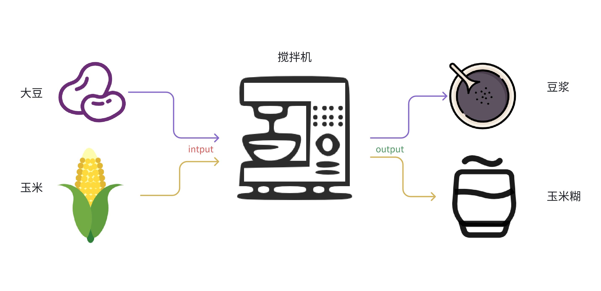

#### 3.1.1 函数三大属性

把上面那个例子进行抽象，就可以得到函数的三大属性：输入参数、返回值、函数名。

<pre class="guide-code"><code>1. 函数名（地址）
2. 输入参数 (可多个)
3. 返回值（至多一个）

输出: 函数名: 输入
int function(int，char)
{
    xxx
}

Tips：编译器只要看到有这三到属性，就判定为函数（即使函数体是空的）</code></pre>

函数名本质上是一个地址标签。如果知道函数的地址，就可以直接用() 调过去

<pre class="guide-code"><code>#include &lt;stdio.h&gt;

int function(int a, int b)
{
    return (a+b);
}

void main(void)
{
    function(1, 2);
}

通过命令：objdump -d bin &gt; bin.s 进行反汇编得到：

0000000000001129 &lt;function&gt;:
    1129:   f3 0f 1e fa             endbr64
    112d:   55                      push   %rbp
    112e:   48 89 e5                mov    %rsp,%rbp
    1131:   89 7d fc                mov    %edi,-0x4(%rbp)
    1134:   89 75 f8                mov    %esi,-0x8(%rbp)
    1137:   8b 55 fc                mov    -0x4(%rbp),%edx
    113a:   8b 45 f8                mov    -0x8(%rbp),%eax
    113d:   01 d0                   add    %edx,%eax
    113f:   5d                      pop    %rbp
    1140:   c3                      retq

0000000000001141 &lt;main&gt;:
    1141:   f3 0f 1e fa             endbr64
    1145:   55                      push   %rbp
    1146:   48 89 e5                mov    %rsp,%rbp
    1149:   be 02 00 00 00          mov    $0x2,%esi
    114e:   bf 01 00 00 00          mov    $0x1,%edi
    1153:   e8 d1 ff ff ff          callq  1129 &lt;function&gt;
    1158:   90                      nop
    1159:   5d                      pop    %rbp
    115a:   c3                      retq
    115b:   0f 1f 44 00 00          nopl   0x0(%rax,%rax,1)</code></pre>

<pre class="guide-code"><code>//函数名本质上是一个地址，体会下面的例子
#include &lt;stdio.h&gt;
#include &lt;stdlib.h&gt;
#include &lt;string.h&gt;
//extern int printf (const char *__restrict __format, ...)
int (*show)(const char *, ...);
void func(void)
{
    show = printf;
    show(&quot;func call \n&quot;);
}

int main(void)
{
    func();
    return 0;
}

#程序运行结果：
func call</code></pre>

#### 3.1.2 参数传递

##### 3.1.2.1 参数传递的本质

调用函数时，需要传入和返回参数。传入和返回的参数过程本质上是：内存拷贝。既然是拷贝，那一定存在两个对象：目的地（dest），源（src）。在C语言中，传入参数时，目的地叫形参、源叫实参；返回参数时，目的地和源都叫返回值。

<pre class="guide-code"><code>#include &lt;stdio.h&gt;
int show(int a) //a 是形参，传递过程，就把num的值拷贝给了a
{
    printf(&quot;%d \n&quot;, a);
    a++;

    return a;//a此时是返回值
}

void main(void)
{
    int num = 10086;
    int ret = 0;

    //num 是实参
    ret = show(num); // show函数返回a的值会拷贝给ret
}</code></pre>

##### 3.1.2.2 值传递

因为存在拷贝的机制，值传递的时，不会对调用者的源数据进行破坏，所以值传递对数据起到保护和隔离的作用。体会一下下面的例子：

<pre class="guide-code"><code>#include &lt;stdio.h&gt;

int show(int a)
{
    a++;
    printf(&quot;a in show %d \n&quot;, a);
    return a;
}

void main(void)
{
    int num = 10086;//源数据
    int ret = 0;//返回值

    ret = show(num);
    printf(&quot;a in main %d ，ret = %d \n&quot;, num, ret);
}

#程序运行结果：
a in show 10087
a in main 10086 ，ret = 10087</code></pre>

另外，大家要养成一个思维习惯：当函数结束时，函数里的局部变量（形参也是局部变量）都会被&quot;销毁&quot;，即使内存中原来的值还存在，但已经不受到系统保护，数据随时可能被覆盖、改写等等。所以当我们要返回一个局部变量的指针时，需要考虑指针指向的内存的生命周期。

恢复栈中的局部变量：在分析crash问题的时，通常需要分析调用栈，可以通过保存之前的栈针地址，查看原来内存的值。可参考：

<pre class="guide-code"><code>#include &lt;stdio.h&gt;

static unsigned long addr = 0;

void show(void)
{
    int a = 10086;
    int b = 10010;

    asm volatile(&quot;movq %rbp, addr(%rip)&quot;);
}

void main(void)
{
    show();

    int *p = (int*)addr;
    printf(&quot;show bp = 0x%lx, a = %d, b = %d \n&quot;,addr, p[-1], p[-2]);

}
#程序运行结果：
show bp = 0x7fffff2cacb0, a = 10010, b = 10086</code></pre>

##### 3.1.2.3 地址传递

地址传递本质上跟值传递一样，只不过这个值有特殊的含义：代表了一个地址编号。地址传递一般用于返回结果和连续空间传递。

3.1.2.3.1 形参当做返回值

<pre class="guide-code"><code>#include &lt;stdio.h&gt;

int func(void)
{
    return 100 * 2;
}

void main(void)
{
    int ret;
    ret = func();

    printf(&quot;ret = %d \n&quot;, r1);
}
#程序运行结果：
ret = 200</code></pre>

3.1.2.3.2 多值返回

我们知道，函数返回return 后面只能带有一个值，所以如果有多个值需要返回的需求，可以利用值传递来做，比如，可以这样设计：

<pre class="guide-code"><code>#include &lt;stdio.h&gt;

int func(int *r1, int* r2)
{
    if (!r1 || !r2) {
        return -1;
    }

    *r1 = 100 * 2;
    *r2 = 200 * 2;

    return 0;
}

void main(void)
{
    int ret, r1, r2;

    ret = func(&amp;r1, &amp;r2);
    printf(&quot;ret = %d, a = %d, b = %d \n&quot;,ret, r1, r2);
}
#程序运行结果：
ret = 0, a = 200, b = 1000

Tips: 在这种情况下，这里的返回值ret代表的是func运行是否存在异常（linux 中 0 代表正常，非
零代表异常），大家可以借鉴这个设计思想。</code></pre>

3.1.2.3.3 连续空间传递

因为参数传递是内存拷贝，所以如果传入的参数是一片连续的空间，那每次调用都会进行冗余的内存分配，造成内存不必要的浪费。所以连续空间，一般都是传这片空间的首地址。

<pre class="guide-code"><code>#include &lt;stdio.h&gt;

struct abc {
    int a;
    int b;
    int c;
};

int func(struct abc *p, int b[])
{
    printf(&quot;a = %d, b = %d, c = %d \n&quot;, p-&gt;a, p-&gt;b, p-&gt;c);
    printf(&quot;%d, %d,\n&quot;, b[0], b[1]);
    return 0;
}

void main(void)
{
    int ret = 0;
    struct abc a = {
        .a = 1,
        .b = 2,
        .c = 3,
    };
    int b[2] = {4,5};

    ret = func(&amp;a, b);
}

#程序运行结果：
a = 1, b = 2, c = 3
4, 5,</code></pre>

1. 非字符空间

对于非字符空间，在函数设计的时候，需要传入连续地址的长度，否则默认为是返回结果的设计。

<pre class="guide-code"><code>#include &lt;stdio.h&gt;

int func(int *p, int len)
{
    int i;

    for(i = 0;i &lt; len ; i++) {
         printf(&quot;%d &quot;, p[i]);
    }
    return 0；
}

void main(void)
{
    int ret;
    int arr[2] = {1,2};

    ret = func(arr, 2);
}
#程序运行结果：
1 2

#系统函数
void *memcpy(void *dest, const void *src, size_t n);</code></pre>

2. 字符空间

在C语言中，字符空间的结束符是&#x27;\0&#x27;，所以默认情况下，传入字符空间可以不用传入字符传的长度。如：

<pre class="guide-code"><code>#include &lt;stdio.h&gt;

int func(const char *s)
{
    int i = 0;
    while (s[i] != 0) {
        printf(&quot;%c&quot;, s[i]);
        i++;
    }
    printf(&quot;\n&quot;);
    return 0;
}

void main(void)
{
    int ret = 0;
    ret = func(&quot;hello world&quot;);
}

#程序运行结果：
hello world

#系统函数
char *strcpy(char *dest, const char *src);
size_t strlen(const char *s)</code></pre>

### 3.2 C与面向对象

C语言是面向过程的语言，但我们可以借助C++/JAVA面向对象思想，实现类似 &quot;继承&quot;、&quot;多态&quot;、&quot;封装&quot;、&quot;重载&quot;的功能。从而服务于架构设计。

#### 3.2.1 C与"继承"

继承是使用已存在的类作为基础建立新的类的技术。新的类可以增加新的数据类型或者方法，也可以使用父类的功能，但不能选择性的继承父类。通过继承可以很好的复用以前的代码，提高开发效率。

<pre class="guide-code"><code>#include &lt;iostream&gt;

using namespace std;

// 基类
class shape  {
   protected:
      int width;
      int height;

   public:
      void setWidth(int w) {
         width = w;
      }
      void setHeight(int h) {
         height = h;
      }
};

// 派生类
class rectangle : public shape
{
   public:
      int getArea() {
         return (width * height);
      }
};

int main(void)
{
   rectangle rect;
   rect.setWidth(5);
   rect.setHeight(7);

   // 输出对象的面积
   cout &lt;&lt; &quot;Total area: &quot; &lt;&lt; rect.getArea() &lt;&lt; endl;

   return 0;
}</code></pre>

<pre class="guide-code"><code>#include &lt;stdio.h&gt;
#include &lt;string.h&gt;

// 基类
struct shape {
      int width;
      int height;
      void (*setWidth)(struct shape*s, int w);
      void (*setHeight)(struct shape*s, int h);
};

void setWidth(struct shape*s, int w)
{
     s-&gt;width = w;
}

void setHeight(struct shape*s, int h)
{
     s-&gt;height = h;
}

// 派生类
struct rectangle {
    struct shape s;
    int (*getArea)(struct shape *s);
};

int getArea(struct shape *s)
{
     return (s-&gt;width * s-&gt;height);
}

int main(void)
{
   struct rectangle rect = {
       .s.setWidth = setWidth,
       .s.setHeight = setHeight,
       .getArea = getArea,
   };

   rect.s.setWidth(&amp;rect.s, 5);
   rect.s.setHeight(&amp;rect.s, 7);

   // 输出对象的面积
   printf(&quot;Total area: %d \n&quot;, rect.getArea(&amp;rect.s));

   return 0;
}</code></pre>

linux设备驱动中的继承

<pre class="guide-code"><code>//linux中设备模型的继承关系：platform_device ：device ：kobject
1、kobject：它是Linux设备模型的核心之一，用于表示内核中的各种实体，如设备、驱动程序、总
线、类别等
2、device：用于表示内核中设备的各种实体，如i2c、spi、platform设备等
3、platform_device：用于表示内核中platform设备实体

struct kobject {
        const char              *name;
        struct list_head        entry;
        struct kobject          *parent;
        struct kset             *kset;
        struct kobj_type        *ktype;
        struct kernfs_node      *sd;
        struct kref             kref;
        ....
}

struct device {
    struct device        *parent;

    struct device_private    *p;

    struct kobject kobj;
    .....
};

struct platform_device {
    const char *name;
    int id;
    struct device dev;
    ....
};</code></pre>

#### 3.2.2 C与"封装"

封装的概念是指：将抽象的数据和行为（或者方法）相结合，形成一个有机的整体。是面向对象思想的核心，目的是增强安全性和简化编程，使用者不必理解具体的实现细节，通过调用接口使用数据成员。

<pre class="guide-code"><code>class car  {
   protected:
      int direction;
      int throttle；
      int brake;

   public:
      void setDirection(int d) {
         direction = d;
      }

      void setThrottle(int t) {
         throttle = t;
      }

      void setBrake(int b) {
         brake= b;
      }
};</code></pre>

体会以下的代码设计：

<pre class="guide-code"><code>#include &lt;stdio.h&gt;

class person {
   protected:
        char name[12];
        int age;

   public:
        void get_name(char *n) {
             strcpy(n, name);
        }
        void get_age(int *a) {
             *a = age;
        }
        person(const char *n, int a) {
              strcpy(name, n);
              age = a;
        }
};

int main(void)
{
    char name[12];
    int age;
    person p(&quot;xiaohua&quot;, 21);

    p.get_age(&amp;age);
    p.get_name(name);

    printf(&quot;name:%s, age:%d \n&quot;,name, age);
    return 0;
}

//运行结果
name:xiaohua, age:18</code></pre>

<pre class="guide-code"><code>#include &lt;stdio.h&gt;
#include &lt;string.h&gt;

struct person {
    char name[12];
    int age;
    void (*get_name)(struct person *p, char *name);
    void (*get_age)(struct person *p, int *age);
};

static void get_name(struct person *p, char *name)
{
    strcpy(name, p-&gt;name);
}

static void get_age(struct person *p, int *age)
{
    *age = p-&gt;age;
}
static struct person p1 = {
    .name = &quot;xiaohua&quot;,
    .age = 21,
    .get_age = get_age,
    .get_name = get_name,
};

int main(void)
{
    char name[12] = {0};
    int age = 0;
    struct person *p = &amp;p1;

    p-&gt;get_age(p, &amp;age);
    p-&gt;get_name(p, name);

    printf(&quot;name:%s, age:%d \n&quot;,name, age);
    return 0;
}

//运行结果
name:xiaohua, age:18</code></pre>

<pre class="guide-code"><code>//linux 中文件系统中inode中inode_operations的设计
struct inode {
        struct hlist_node       i_hash;              /* 哈希表 */
        struct list_head        i_list;              /* 索引节点链表 */
        struct list_head        i_dentry;            /* 目录项链表 */
        unsigned long           i_ino;               /* 节点号 */
        atomic_t                i_count;             /* 引用记数 */
        umode_t                 i_mode;              /* 访问权限控制 */
        unsigned int            i_nlink;             /* 硬链接数 */
        uid_t                   i_uid;               /* 使用者id */
        gid_t                   i_gid;               /* 使用者id组 */
        ...
        struct inode_operations *i_op;               /* 索引节点操作表 */
        ...
};

struct inode_operations {
        struct dentry * (*lookup) (struct inode *,struct dentry *, struct
nameidata *);
        void * (*follow_link) (struct dentry *, struct nameidata *);
        int (*permission) (struct inode *, int);
        struct posix_acl * (*get_acl)(struct inode *, int);

        int (*readlink) (struct dentry *, char __user *,int);
        void (*put_link) (struct dentry *, struct nameidata *, void *);

        int (*create) (struct inode *,struct dentry *,int, struct nameidata *);
        int (*link) (struct dentry *,struct inode *,struct dentry *);
        int (*unlink) (struct inode *,struct dentry *);
        int (*symlink) (struct inode *,struct dentry *,const char *);
        int (*mkdir) (struct inode *,struct dentry *,int);
        int (*rmdir) (struct inode *,struct dentry *);
        int (*mknod) (struct inode *,struct dentry *,int,dev_t);
        ...
};</code></pre>

#### 3.2.3 C与"多态"

多态的概念是指：通过父类的指针来调用子类中的方法。作用是把不同的子类对象当做父类来看，屏蔽不同子类之间的差异，用于适应需求的不断变化，本质上是面向抽象编程，在C++中，多态的实现是通过虚函数来实现。体会一下以下这个例子：

<pre class="guide-code"><code>#include &lt;stdio.h&gt;
#include &lt;string.h&gt;

class person {
   protected:
        char name[24];
        int age;

   public:
      virtual void get_name(char *n) {
         strcpy(n, name);
      }
      person(const char *n, int a) {
          strcpy(name, n);
          age = a;
      }
};

class usa_person : public person {
   public:
      void get_name(char *n) {
         sprintf(n, &quot;%s&quot;, name);
         sprintf(n+strlen(n), &quot;%s&quot;, &quot;-usa&quot;);
      }
      usa_person(const char *n, int a) : person(n, a) {
      }
};

class china_person : public person {
   public:
      void get_name(char *n) {
         sprintf(n, &quot;%s&quot;, name);
         sprintf(n+strlen(n), &quot;%s&quot;, &quot;-china&quot;);
      }
      china_person(const char *n, int a) : person(n, a) {
      }
};

int main(void)
{
    char name[24] = {0};
    struct person *p = new usa_person(&quot;xiaohua&quot;, 21);

    p-&gt;get_name(name);
    printf(&quot;name:%s \n&quot;,name);
    delete p;

    p = new china_person(&quot;xiaohua&quot;, 21);
    p-&gt;get_name(name);
    printf(&quot;name:%s \n&quot;,name);
    delete p;

    return 0;
}</code></pre>

<pre class="guide-code"><code>#include &lt;stdio.h&gt;
#include &lt;string.h&gt;

struct person {
    char name[24];
    int age;
    void (*get_name)(struct person *p, char *name);
};

struct usa_person {
    struct person p;
    void (*get_name)(struct person *p, char *name);
};
static void get_name(struct person *p, char *name)
{
    struct usa_person *child = (struct usa_person *)p;

    child-&gt;get_name(p, name);
}

static void get_usa_name(struct person *p, char *name)
{
    sprintf(name, &quot;%s&quot;, p-&gt;name);
    sprintf(name+strlen(p-&gt;name), &quot;%s&quot;, &quot;-usa&quot;);
}

static struct usa_person usa_p = {
    .get_name = get_usa_name,
    .p.get_name= get_name,
    .p.name = &quot;xiaohua&quot;,
};

int main(void)
{
    char name[24] = {0};
    struct person *p = (struct person *)&amp;usa_p;

    p-&gt;get_name(p, name);
    printf(&quot;name:%s \n&quot;,name);
    return 0;
}
//运行结果:通过基类person的对象，调用派生类usa中的方法
name:usa-xiaohua</code></pre>

<pre class="guide-code"><code>//linux的设备驱动模型就是典型的多态思想设计
struct platform_driver {
    int (*probe)(struct platform_device *);
    int (*remove)(struct platform_device *);
    void (*shutdown)(struct platform_device *);
    int (*suspend)(struct platform_device *, pm_message_t state);
    int (*resume)(struct platform_device *);
    struct device_driver driver;
    ...
};

int platform_driver_register(struct platform_driver *drv)
{
    ...
    if (drv-&gt;probe)
            drv-&gt;driver.probe = platform_drv_probe;
    if (drv-&gt;remove)
            drv-&gt;driver.remove = platform_drv_remove;
    if (drv-&gt;shutdown)
            drv-&gt;driver.shutdown = platform_drv_shutdown;
    if (drv-&gt;suspend)
            drv-&gt;driver.suspend = platform_drv_suspend;
    if (drv-&gt;resume)
            drv-&gt;driver.resume = platform_drv_resume;
    return driver_register(&amp;drv-&gt;driver);
}

static int platform_drv_probe(struct device *_dev)
{
    struct platform_driver *drv = to_platform_driver(_dev-&gt;driver);
    struct platform_device *dev = to_platform_device(_dev);
    ...
    return drv-&gt;probe(dev);
}

 driver.probe -&gt; platform_drv_probe-&gt;to_platform_driver(_dev-&gt;driver)-&gt;    drv-
&gt;probe
 (device_driver类)
(platform_driver类)
//父类：driver，派生类platform_driver ，通过driver的probe最终调用到platform_driver的
probe</code></pre>

#### 3.2.4 C与"重载"

重载的概念是指：在同一个范围中声明几个同名函数，但同名函数的形参不同（个数、类型、顺序），一般是用来处理功能类似但是数据类型不同的问题。严格意义上C的编译器不支持重载，但我们有一些方法达到相同的目的

<pre class="guide-code"><code>//printf函数是C中典型有重载效果的函数
#include &lt;stdio.h&gt;

int main(void)
{
    printf(&quot;%s \n&quot;, &quot;hello world&quot;);
    printf(&quot;%s %s \n&quot;, &quot;hello world 1&quot;, &quot;hello world 2&quot;);
    printf(&quot;%d %s \n&quot;, 10, &quot;hello world 1&quot;);
    printf(&quot;%s %d \n&quot;, &quot;hello world 1&quot;, 10);
    return 0;
}</code></pre>

##### 3.2.4.1 可变参数函数

<pre class="guide-code"><code>void va_func(强制参数, 可变参数)
1. 强制参数有至少有一个，代表以一种规则，由函数定义者自行定义和解析。
2. 可变参数可以有多个，函数定义者和调用者自行决定

va_list: 一个元素的结构体数组
----/usr/lib/gcc/x86_64-linux-gnu/9/include-----
typedef __builtin_va_list __gnuc_va_list;
typedef __gnuc_va_list va_list; //一个元素的结构体数组

va_list = struct __va_list_tag {
    unsigned int gp_offset;
    unsigned int fp_offset;
    void *overflow_arg_area;
    void *reg_save_area;
} [1]

va_start：定位到可变参数的地址
va_arg：遍历可变参数
va_end：终止va_list遍历

#define va_start(v,l)   __builtin_va_start(v,l)
#define va_end(v)   __builtin_va_end(v)
#define va_arg(v,l) __builtin_va_arg(v,l)</code></pre>

<pre class="guide-code"><code>#include &lt;stdio.h&gt;
#include &lt;stdarg.h&gt;

//这里约定n为后面参数的个数（一种规则）
static void va_func(int n, ...)
{
    va_list ptr;
    va_start(ptr, n);
    while (n--) {
        printf(&quot;%d \n&quot;, va_arg(ptr, int));
    }
    va_end(ptr);
}
int main(void)
{
    va_func(1, 100);
    va_func(2, 200, 300);

    return 0;
}

//运行结果:
100
200
300</code></pre>

<pre class="guide-code"><code>//选自glibc-2.40
#include &lt;libioP.h&gt;
#include &lt;stdarg.h&gt;
#include &lt;stdio.h&gt;

#undef printf

/* Write formatted output to stdout from the format string FORMAT.  */
/* VARARGS1 */
int
__printf (const char *format, ...)
{
  va_list arg;
  int done;

  va_start (arg, format);
  done = __vfprintf_internal (stdout, format, arg, 0);
  va_end (arg);

  return done;
}

#undef _IO_printf
ldbl_strong_alias (__printf, printf);
ldbl_strong_alias (__printf, _IO_printf);</code></pre>

##### 3.2.4.2 回调函数+void*

<pre class="guide-code"><code>#include &lt;stdio.h&gt;
class swap {
    public:
      void exchange(int *a, int *b) {
         int tmp = *a;
         *a = *b;
         *b = tmp;
      }
      void exchange(double *a, double *b) {
         doubl e tmp = *a;
         *a = *b;
         *b = tmp;
      }
};

int main(void)
{
    swap s;
    int a = 10;
    int b = 20;
    double c = 1.23;
    double d = 4.56;

    s.exchange(&amp;a, &amp;b);
    s.exchange(&amp;c, &amp;d);

    printf(&quot;a = %d, b = %d \n&quot;, a , b);
    printf(&quot;c = %f, d = %f \n&quot;, c , d);
    return 0;
}</code></pre>

<pre class="guide-code"><code>//实现一个可以交换不同数据类型的swap函数
#include &lt;stdio.h&gt;
#include &lt;stdarg.h&gt;

typedef void (*func)(void*, void*);
void swap(func exchange, void *a, void *b)
{
    exchange(a, b);
}

void exchange_int(void *a, void *b)
{
    int *_a = (int*)a;
    int *_b = (int*)b;
    int tmp = 0;
    tmp = *_a;
    *_a = *_b;
    *_b= tmp ;
}

void exchange_double(void *a, void *b)
{
    double*_a = (double*)a;
    double*_b = (double*)b;
    double tmp = 0;

    tmp = *_a;
    *_a = *_b;
    *_b= tmp;
}

void main(void)
{
    int a = 10;
    int b = 20;
    double c = 1.23;
    double d = 4.56;

    swap(exchange_int, &amp;a, &amp;b);
    swap(exchange_double, &amp;c, &amp;d);

    printf(&quot;a = %d, b = %d \n&quot;, a , b);
    printf(&quot;c = %f, d = %f \n&quot;, c , d);
}

//运行结果:
a = 20, b = 10
c = 4.560000, d = 1.230000</code></pre>

##### 3.2.4.3 弱连接函数（weak）

这个在驱动设计时，经常用到。weak修饰的函数属于弱连接函数，当前工程中如果有定义跟其相同的函数时，weak修饰的函数会被编译覆盖，达到override的效果。

<pre class="guide-code"><code>//1.c
#include &lt;stdio.h&gt;

extern void config(void);
void __attribute__((weak)) config(void)
{
    printf(&quot;config default\n&quot;);
}

void main(void)
{
    config();
}

//2.c
#include &lt;stdio.h&gt;
void config(void)
{
    //i2c bus no
    //LDO
    //hardware reg config
    printf(&quot;config one \n&quot;);
}

//运行结果:
config two</code></pre>

<pre class="guide-code"><code>//stm32中常用于设计中断回调函数，当用户自定义了相同的callback函数，就会跑用户自定义函数，
表现出很好的拓展性设计

#ifndef __weak
#define __weak  __attribute__((weak))
#endif

/**
  * @brief  EXTI line detection callbacks.
  * @param  GPIO_Pin: Specifies the pins connected EXTI line
  * @retval None
  */
__weak void HAL_GPIO_EXTI_Callback(uint16_t GPIO_Pin)
{
  /* Prevent unused argument(s) compilation warning */
  UNUSED(GPIO_Pin);
  /* NOTE: This function Should not be modified, when the callback is needed,
           the HAL_GPIO_EXTI_Callback could be implemented in the user file
   */
}</code></pre>

### 3.3 solid设计原则

solid设计是面向对象的原则，是由Gang of Four（四人帮），即Erich Gamma, Richard Helm, Ralph Johnson &amp; John Vlissides四人）的《设计模式》（1995年出版）是第一次将设计模式提升到理论高度，并将之规范化。

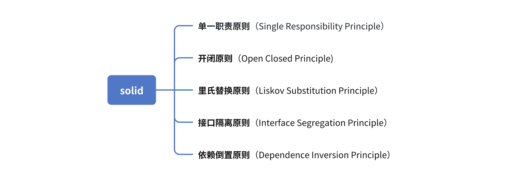

这些原则属于建议性原则，大家在做架构设计的时候要从实际的业务角度出发，切记不要为了设计而设计（冗余设计）。

#### 3.3.1 单一职责原则

一个类只负责一件事情。价值：高内聚，低耦合，拓展性和健壮性强。

<pre class="guide-code"><code>#include &lt;stdio.h&gt;

class Game {
public:
        DataCompute();
        ~DataCompute();

        void setShapen();
        void setPlace();

        void showViewCcon(); //游戏方块显示
private:
        int mPlace[4];                //位置
        int mShape[4];                //形状

        DataCompute *mDataCompute;    //游戏逻辑
        int mStartButton;             //开始按钮
        int mEndButton;               //结束按钮
};
#include &lt;stdio.h&gt;

//游戏逻辑
class DataCompute {
public:
        DataCompute();
        ~DataCompute();

        void setShapen();
        void setPlace();
private:
        int mPlace[4];                //位置
        int mShape[4];                //形状
};

//游戏界面
class GameUI
{
public:
        GameUI();
        ~GameUI();

        void showViewCcon();              //游戏方块显示
private:
        DataCompute *mDataCompute;        //游戏逻辑
        int mStartButton;                 //开始按钮
        int mEndButton;                   //结束按钮
};</code></pre>

在C语言中，就是一个结构体在设计和封装的时候只负责一个事情。以一个imu器件的驱动结构体为例：

<pre class="guide-code"><code>struct imu_operations {
    int (*init)(struct int_param_s *int_param);
    int (*set_bypass)(unsigned char bypass_on);
    int (*enable_sensor)(unsigned char sensors);
    int (*configure_fifo)(unsigned char sensors);
    int (*set_sample_rate)(unsigned short rate);
    int (*set_mag_sample_rate)(unsigned short rate);
    int (*get_sample_rate)(unsigned short *rate);
    int (*set_gyro_fsr)(unsigned short fsr);
    int (*set_accel_fsr)(unsigned char fsr);
    int (*get_gyro_fsr)(unsigned short *fsr);
    int (*get_accel_fsr)(unsigned char *fsr);
    int (*get_compass_fsr)(unsigned short *fsr);
    int (*get_gyro_sens)(float *sens);
    int (*get_mag_sens)(float *sens);
    int (*get_accel_sens)(unsigned short *sens);
    int (*read_gyro_data)(short *data, unsigned long *timestamp);
    int (*read_accel_data)(short *data, unsigned long *timestamp);
    int (*read_mag_data)(short *data, unsigned long *timestamp);
};

struct imu_chip {
    struct imu_operations *ops;
    struct imu_data accel_data[CALI_DATA_LEN];
    struct imu_data gyro_data[CALI_DATA_LEN];
    struct imu_data compass_data[CALI_DATA_LEN];
    ...
}</code></pre>

#### 3.3.2 开闭原则

软件中的对象（类、模块、函数等）应该满足对于拓展是开放的，对修改是封闭的。体会一下模块化编程的例子：

<pre class="guide-code"><code>//keil stm32 方案
//module_init.h
typedef void (*init_t)(void);

#define module_init(fn) \
const init_t __embedi_##fn __attribute__((section(&quot;embedi_init&quot;)))  
__attribute__((used)) = fn

//module_init.c
extern int embedi_init$$Base;
extern int embedi_init$$Length;

void embedi_module_init(void)
{
    init_t* init_call = (init_t*)&amp;embedi_init$$Base;
    int count = 0;

    count = (int)(&amp;embedi_init$$Length) / sizeof(init_t);
    while (count--) {
        (*init_call)();
        init_call++;
    }
    osLog(&quot;module init \n&quot;);
}

//1.c
static void module_one_init(void)
{
    // do something
}
module_init(module_one_init);

//2.c
static void module_two_init(void)
{
    // do something
}
module_init(module_two_init);</code></pre>

<pre class="guide-code"><code>//GCC 方案
#include &lt;stdio.h&gt;

typedef void (*init_t)(void);

#define module_init(fn) \
const init_t __embedi_##fn __attribute__((section(&quot;.embedi_init&quot;)))  
__attribute__((used)) = fn

//module_init.c
extern init_t __init_start;
extern init_t __init_end;

void embedi_module_init(void)
{
    init_t* init_call = (init_t*)&amp;__init_start;

    for ( ; init_call &lt; &amp;__init_end; init_call++){
        (*init_call)();
    }
}

static void module_one_init(void)
{
    printf(&quot;%s call \n&quot;, __FUNCTION__);
}
module_init(module_one_init);
static void module_two_init(void)
{
    printf(&quot;%s call \n&quot;, __FUNCTION__);
}
module_init(module_two_init);

//1.lds
__init_start = .;
.embedi_init : {*(.embedi_init)}
__init_end = .;

//gcc -o bin 1.c -T 1.lds</code></pre>

#### 3.3.3 里氏替换原则

里氏替换原则：简单来讲就是子类可以去拓展父类的功能，但不能改变父类原有的功能。技术上，所有引用基类的地方必须能够透明的使用其子类的对象。价值：继承一定程度上破坏了封装，此原则用来包含封装性。但嵌入式中应用相对较少，可以感受一下下面这个例子：

<pre class="guide-code"><code>#include &lt;iostream&gt;

using namespace std;

// 基类
class birds  {
   protected:
      int flySpeed;
      int runSpeed;

   public:
      void setFlySpeed(int s) {
         flySpeed = s;
      }
      void setRunSpeed(int s) {
         runSpeed = s;
      }
      int getFlySpeed(void) {
         return flySpeed;
      }
      int getRunSpeed(void) {
         return runSpeed;
      }
      int calculateFlyTime(int distance) {
         return distance / flySpeed;
      }
};

// 派生类
class swallow : public birds
{

};

class ostrich : public birds
{
   public:
      void setFlySpeed(int s) {
         flySpeed = 0;
      }
};

int main(void)
{
   birds *b1 = new swallow;
   birds *b2 = new ostrich;
   int distance = 100;

   b1-&gt;setFlySpeed(10);
   cout &lt;&lt; &quot;b1 flySpeed: &quot; &lt;&lt; b1-&gt;getFlySpeed() &lt;&lt; endl;
   cout &lt;&lt; &quot;b1 flyTime: &quot;  &lt;&lt; b1-&gt;calculateFlyTime(distance) &lt;&lt; endl;

   b2-&gt;setFlySpeed(0);
   cout &lt;&lt; &quot;b2 flySpeed: &quot; &lt;&lt; b2-&gt;getFlySpeed() &lt;&lt; endl;
   cout &lt;&lt; &quot;b2 flyTime: &quot;  &lt;&lt; b2-&gt;calculateFlyTime(distance) &lt;&lt; endl;

   delete b1;
   delete b2;

   return 0;
}</code></pre>

<pre class="guide-code"><code>#include &lt;iostream&gt;

using namespace std;

// 基类
class animal {
   protected:
      int runSpeed;

   public:
      void setRunSpeed(int s) {
         runSpeed = s;
      }
      int getRunSpeed(void) {
         return runSpeed;
      }
};
class birds  : public animal {
   protected:
      int flySpeed;

   public:
      void setFlySpeed(int s) {
         flySpeed = s;
      }
      int getFlySpeed(void) {
         return flySpeed;
      }
      int calculateFlyTime(int distance) {
         return distance / flySpeed;
      }
};

// 派生类
class swallow : public birds
{
};

class ostrich : public animal
{

};</code></pre>

<pre class="guide-code"><code>#include &lt;stdio.h&gt;
#include &lt;string.h&gt;

struct birds  {
    int flySpeed;
    int runSpeed;
    void (*setFlySpeed)(struct birds *b, int s);
    void (*setRunSpeed)(struct birds *b, int s);
    int (*getFlySpeed)(struct birds *b);
    int (*getRunSpeed)(struct birds *b);
    int (*calculateFlyTime)(struct birds *b, int distance);
};

void setFlySpeed(struct birds *b, int s) {
    b-&gt;flySpeed = s;
}
void setRunSpeed(struct birds *b, int s) {
    b-&gt;runSpeed = s;
}
int getFlySpeed(struct birds *b) {
    return b-&gt;flySpeed;
}
int getRunSpeed(struct birds *b) {
    return b-&gt;runSpeed;
}
int calculateFlyTime(struct birds *b, int distance) {
    return distance / b-&gt;flySpeed;
}

// 派生类
struct swallow {
    struct birds b;
};

struct ostrich {
    struct birds b;
};

struct swallow s = {
    .b.setFlySpeed = setFlySpeed,
    .b.setRunSpeed = setRunSpeed,
    .b.getFlySpeed = getFlySpeed,
    .b.getRunSpeed = getRunSpeed,
    .b.calculateFlyTime = calculateFlyTime,
};

struct ostrich o = {
    .b.setFlySpeed = setFlySpeed,
    .b.setRunSpeed = setRunSpeed,
    .b.getFlySpeed = getFlySpeed,
    .b.getRunSpeed = getRunSpeed,
    .b.calculateFlyTime = calculateFlyTime,
};

int main(void)
{
   struct birds *b1 = (struct birds*)&amp;s;
   struct birds *b2 = (struct birds*)&amp;o;
   int distance = 100;

   b1-&gt;setFlySpeed(b1, 10);
   printf(&quot;b1 flySpeed: %d \n&quot;, b1-&gt;getFlySpeed(b1));
   printf(&quot;b1 flyTime: %d \n&quot;,  b1-&gt;calculateFlyTime(b1, distance));

   b2-&gt;setFlySpeed(b2, 0);
   printf(&quot;b2 flySpeed: %d \n&quot;, b2-&gt;getFlySpeed(b2));
   printf(&quot;b2 flyTime: %d \n&quot;,  b2-&gt;calculateFlyTime(b2, distance));

   return 0;
}</code></pre>

#### 3.3.4 接口隔离原则

定义：不应该强迫用户端实现一个它用不上的接口。具体两个的例子：

1. 抽象了面积和体积的两个接口，客户端在使用的这个接口的时候会发现，对于正方形来说没有体积，所以实现体积的函数对它来说就是冗余的。

2. 抽象了器件初始化和读取数据的接口。对于LED灯来说，一般都是控制型，没有必要实现一个读LED数据的接口，所以对LED来说，读取数据就是冗余的。

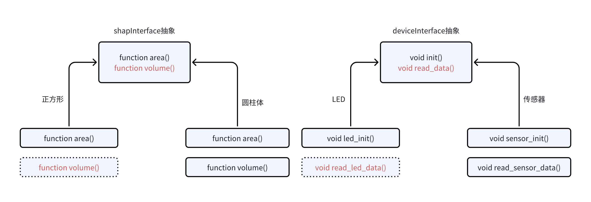

#### 3.3.5 依赖倒置原则

高层次模块不应该依赖测层次的模块，实际上是面向抽象编程思想，这样可以降低代码间的耦合度，使其看扩展、易维护。举一个驱动的例子：在这个架构设计中，IMU有很多公共的业务逻辑：初始化、读取数据、数据校准等等，这些业务逻辑不应该耦合具体驱动的接口，而是依赖于抽象接口；同时驱动与驱动之间也不能互相调用，而是调用抽象接口。后续的器件增加拓展，只需要修改驱动部分，抽象层都不会改动。

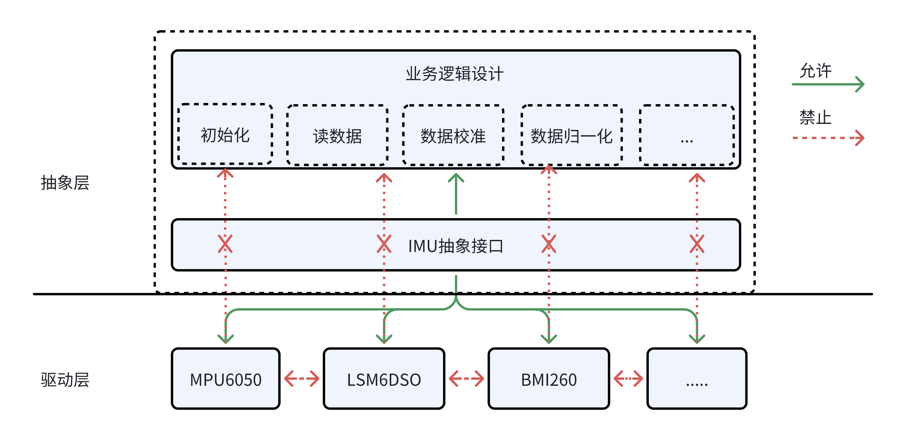

## 4. 内存视角

前面在学习数据类型关键字的时候我们了解到，定义一个变量的本质是在内存中圈定一块特定大小的内存。本章将会对内存的位置、生命周期、操作权限等做更多的探讨。

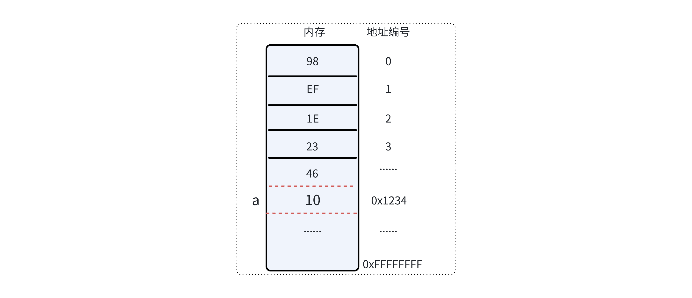

### 4.1 内存基础概念

#### 4.1.1 内存空间分布图

内存分布分成静态区和动态区，静态区在编译时已经决定了内存分配大小，动态区是运行时分配。

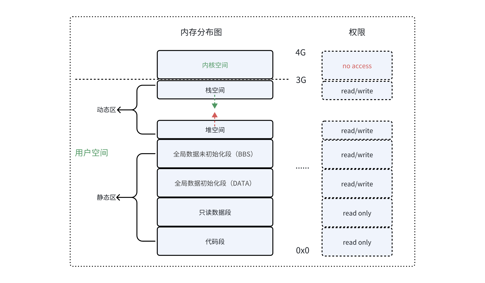

<pre class="guide-code"><code>#include &lt;stdio.h&gt;

int global_inited = 10;  // 全局初始化变量
int global_uninited;  // 全局未初始化变量
int main(void)
{
    int local_var = 20;  // 局部变量
    char *str = &quot;Hello&quot;;  // 字符串常量
    static int static_var = 30;  // 静态变量
    int *heap_var = (int *)malloc(sizeof(int)); // 动态分配的内存

    printf(&quot;address of code: %p\n&quot;, main);
    printf(&quot;address of str: %p\n&quot;, str);
    printf(&quot;address of global_inited : %p\n&quot;, (void *)&amp;global_inited );
    printf(&quot;address of static_var: %p\n&quot;, (void *)&amp;static_var);
    printf(&quot;address of global_uninited: %p\n&quot;, (void *)&amp;global_uninited);
    printf(&quot;address of heap_var : %p\n&quot;, (void *)heap_var);
    printf(&quot;address of local_var : %p\n&quot;, (void *)&amp;local_var);

    // 释放动态分配的内存
    free(heap_var);

    return 0;
}
//运行结果：
address of code: 0x55e737e1f1a9
address of str: 0x55e737e20008
address of global_inited : 0x55e737e22010
address of static_var: 0x55e737e22014
address of global_uninited: 0x55e737e2201c
address of heap_var : 0x55e738cb12a0
address of local_var : 0x7ffe44b03c14</code></pre>

##### 4.1.1.1 代码段

代码段只能读不可以写，写会触发Segmentation fault (core dumped)，俗称&quot;段错误&quot;。在整个程序生命周期内合法有效。

<pre class="guide-code"><code>#include &lt;stdio.h&gt;

void func(void)
{
    printf(&quot;hello func \n&quot;);
}

int main(void)
{
    printf(&quot;func addr %p \n&quot;, func);

    void (*p)(void) = func;
    //try to access
    p();
    int *p1 = (int *)func;
    //try to read
    printf(&quot;func addr %d \n&quot;, *p1);
    //try to write
    *p1 = 1;
    return 0;
}
//运行结果：
func addr 0x561398e14169
hello func
func addr -98693133
Segmentation fault (core dumped)</code></pre>

##### 4.1.1.2 只读数据段

只读数据段存放字符传常量，地址比代码段更高。权限是：只能读不可以写，写会触发Segmentation fault (core dumped)，在整个程序生命周期内合法有效。

<pre class="guide-code"><code>#include &lt;stdio.h&gt;

int main(void)
{
    printf(&quot;%s read only data addr: %p \n&quot;, &quot;hello world&quot;, &quot;hello world&quot;);
    char *s = &quot;hallo world&quot;;
    s[1] = &#x27;e&#x27;;//try to write rodata Segmentation 
    return 0;
}
//运行结果：
read only data addr: 0x56014766f008
Segmentation fault (core dumped)</code></pre>

##### 4.1.1.3 全局数据段

全局变量和局部static修饰的变量会放在全局数据段（data/bbs），允许读写，在整个程序生命周期内合法有效。

<pre class="guide-code"><code>#include &lt;stdio.h&gt;
int a = 10;
int b;

int func(void)
{
    static int d = 10;
    b++;
    return ++d;
}

int main(void)
{
    static int c;
    printf(&quot;%p , %p, %p \n&quot;, &amp;a, &amp;b, &amp;c);
    //try to write data Segmentation
    a = 20;
    b = 30;
    c = 40;
    printf(&quot;a = %d , b = %d, c = %d \n&quot;, a, b, c);

    printf(&quot;b = %d , d = %d, d = %d\n&quot;, b, func(), func());
    return 0;
}
//运行结果： 
0x5556e9e9b010 , 0x5556e9e9b020, 0x5556e9e9b01c
a = 20 , b = 30, c = 40
b = 32 , d = 12, d = 11</code></pre>

##### 4.1.1.4 堆空间

堆空间在运行时由程序员来分配（malloc）和释放（free），可读可写，生命周期是程序员来决定。值得注意的是，如果在一个函数中分配堆内存，函数执行结束后malloc空间不会被释放，如果不手动进行释放的话，会造成内存泄漏。

<pre class="guide-code"><code>#include &lt;stdio.h&gt;
#include &lt;stdlib.h&gt;

void func(void)
{
    int *heap_var = (int *)malloc(sizeof(int)); // 动态分配的内存，单位是B，默认反
馈的类型是void*
    if (!heap_var) {
        return;
    }
    //try to write heap Segmentation
    *heap_var = 10;
    printf(&quot;heap addr = %p , heap_var = %d\n&quot;, heap_var, *heap_var);
    free(heap_var);//如果没有free动作，heap_var指向的内存就存在泄漏：不会再使用但又不
能分配给别人
}

int main(void)
{
    func();
    return 0;
}</code></pre>

<pre class="guide-code"><code>//运行结果：
heap addr = 0x55bf2b8db2a0 , heap_var = 10</code></pre>

##### 4.1.1.5 栈空间

栈空间指的是在函数运行时的上下文分配的空间，可读可写，生命周期在函数执行结束后结束。看下面的一个例子：buff和s都是局部变量，系统会给buff分配sizeof(&quot;hello world&quot;)栈空间，而s的栈空间是4byte，它指向只读数据段中的字符串&quot;hello world&quot;地址编号。所以这里返回buff就会有问题，返回指针没有问题。

<pre class="guide-code"><code>#include &lt;stdio.h&gt;

char* func(void)
{
    char *s = &quot;hello world&quot;;
    char buff[] = &quot;hello world&quot;;

    printf(&quot;func:%s \n&quot;, buff);
    return s;
}
void main(void)
{
    char *p = func();
    printf(&quot;main:%s \n&quot;, p);
}</code></pre>

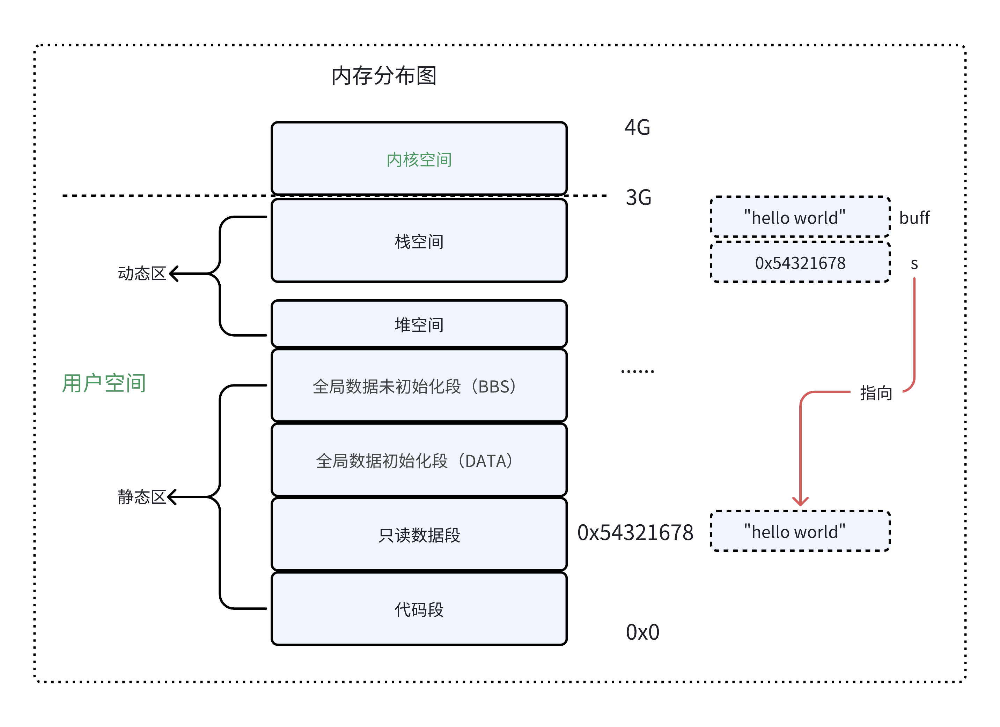

堆栈的生长方向问题：

<pre class="guide-code"><code>#include &lt;stdio.h&gt;
#include &lt;stdlib.h&gt;
void func(int *a)
{
    int *p1 = (int *)malloc(sizeof(int));
    int *p2 = (int *)malloc(sizeof(int));
    if (p2 &gt; p1) {
        printf(&quot;heap upward \n&quot;);
    } else {
        printf(&quot;heap downward \n&quot;);
    }
    free(p1);
    free(p2);

    int a = 1;
    int b = 2;
    if (&amp;b &gt; a) {
        printf(&quot;stack upward \n&quot;);
    } else {
        printf(&quot;stack downward \n&quot;);
    }
}

int main(void)
{
    int a;

    func(&amp;a);
    return 0;
}</code></pre>

#### 4.1.2 内存溢出问题

内存溢出指的是程序运行过程中，访问超过其分配空间范围的内存区域。

##### 4.1.2.1 栈溢出

递归函数：递归函数如果没有正常的退出条件，最后会把整个栈空间消耗殆尽，最后出现段错误。

<pre class="guide-code"><code>#include &lt;stdio.h&gt;

void try_overflow(void)
{
    int a = 10;
    try_overflow();
}

void main(void)
{
    try_overflow();
}
//运行结果：
Segmentation fault (core dumped)

//汇编
try_overflow:
.LFB0:
    endbr64
    pushq   %rbp
    movq    %rsp, %rbp
    subq    $16, %rsp //分配栈空间的内存
    movl    $10, -4(%rbp)
    call    try_overflow //反复调用
    nop
    leave
    ret</code></pre>

很大的局部变量

<pre class="guide-code"><code>#include &lt;stdio.h&gt;
#include &lt;string.h&gt;

#define N 8192*1024
void main(void)
{
    char arr[N];
    memset(arr, &#x27;c&#x27;, sizeof(char)*N);

    for (int i = 0; i &lt; N; i++) {
        printf(&quot;%c&quot;, arr[i]);
    }
    puts(&quot;&quot;);
}

//运行结果：
Segmentation fault (core dumped)

murphy@ubuntu:/home/workspace/course$ ulimit -a
core file size          (blocks, -c) 0
data seg size           (kbytes, -d) unlimited
scheduling priority             (-e) 0
file size               (blocks, -f) unlimited
pending signals                 (-i) 15152
max locked memory       (kbytes, -l) 65536
max memory size         (kbytes, -m) unlimited
open files                      (-n) 1024
pipe size            (512 bytes, -p) 8
POSIX message queues     (bytes, -q) 819200
real-time priority              (-r) 0
stack size              (kbytes, -s) 8192
cpu time               (seconds, -t) unlimited
max user processes              (-u) 15152
virtual memory          (kbytes, -v) unlimited
file locks                      (-x) unlimited</code></pre>

栈缓冲区溢出

<pre class="guide-code"><code>#include &lt;stdio.h&gt;
#include &lt;string.h&gt;

#define N 10
void main(void)
{
    char arr[N];
    char arr1[] = &quot;hello world&quot;;

    strcpy(arr, arr1);//工程上建议不要用strcpy，用strncpy
    //strncpy(arr, arr1，N);
    printf(&quot;arr:%s \n&quot;,arr);
    printf(&quot;arr1:%s \n&quot;,arr1);
}
//strcpy运行结果
arr:hello world
arr1:d

//strncpy运行结果
arr:hello worlhello world //原因是arr长度不够，copy N个字符中缺少结束符&#x27;\0&#x27;
arr1:hello world</code></pre>

##### 4.1.2.2 堆缓冲区溢出

<pre class="guide-code"><code>#include &lt;stdio.h&gt;
#include &lt;string.h&gt;
#include &lt;stdlib.h&gt;
#define N 5
void main(void)
{
    char *str = (char*)malloc(sizeof(char)*N);
    char *str1 = (char*)malloc(sizeof(char)*N);

    strcpy(str1, &quot;hello world&quot;);
    strcpy(str, &quot;hello world&quot;);

    printf(&quot;str:%s \n&quot;,str);
    printf(&quot;str1:%s \n&quot;,str1);
}

//运行结果：溢出没有显示出异常，但已经污染了堆的其他区域
str:hello world
str1:hello world</code></pre>

### 4.2 指针

前面在介绍指针类型时，已经知道指针变量圈定的内存大小跟编译器有关或者说跟CPU的地址总线有关。在32位的系统中，指针类型占用4byte，在64位的系统中，指针类型占用8byte。指针变量的值有特殊意义，代表了一个地址编号，本章讲重点讲指针访问内存的规则和技巧。另外，希望大家对这两个概念：指针和指针变量，有清晰的区分。我们一般说指针，代表就是这个指针变量的值，即内存地址；指针变量就是一个变量，用于存放内存地址。

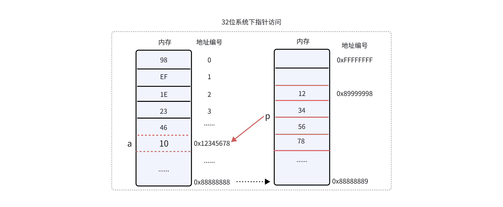

#### 4.2.1 指针访问内存

要访问指针指向的地址，那就必然需要回答两个问题： 1、内存的可读可写性是什么？ 2、内存的访问规则是什么？

##### 4.2.1.1 指针变量的初始化

大家要养成思维习惯：每当看到一个指针变量，要对其值的合法性保持敬畏。

<pre class="guide-code"><code>#include &lt;stdio.h&gt;
#include &lt;stdlib.h&gt;

int b = 20;
void main(void)
{
    int a = 10;
    int *p1 = &amp;a;
    int *p2 = &amp;b;
    int *p3 = (int*)malloc(sizeof(int));
    if (!p3) {
       return;
    }
    *p3 = 30;

    int *p;
    p = (int *)100;//从复制语法上可行，但内存不可读，不可写

    printf(&quot;*p1 = %d, *p2 = %d, *p3 = %d \n&quot;, *p1, *(&amp;b), p3[0]);
    printf(&quot;p = %p \n&quot;, p);
    printf(&quot;*p = %d \n&quot;, *p);

    free(p3);
}

//运行结果：
*p1 = 10, *p2 = 20, *p3 = 30
p = 0x64
Segmentation fault (core dumped)</code></pre>

##### 4.2.1.2 空指针和野指针

空指针很好理解，就是值为0（NULL）的指针变量，如果访问了0地址就会出现非法访问的错误。野指针是指值为非法地址的指针变量。野指针在实际工程中有很大的危害，会造成代码的稳定问题（不可预知的bug）。要形成free后，把指针变量置空（NULL）的习惯。

<pre class="guide-code"><code>#include &lt;stdio.h&gt;
#include &lt;string.h&gt;
#include &lt;stdlib.h&gt;

void main(void)
{
    int *ptr = NULL;
    printf(&quot; *p = %d \n&quot;, *ptr);

    ptr = (int*)malloc(sizeof(int));
    *ptr = 102;
    printf(&quot; *p = %d \n&quot;, *ptr);

    free(ptr);
}</code></pre>

<pre class="guide-code"><code>#include &lt;stdio.h&gt;
#include &lt;string.h&gt;
#include &lt;stdlib.h&gt;

void main(void)
{
    int *ptr = (int*)malloc(sizeof(int));
    printf(&quot; *ptr = %d \n&quot;, *ptr);
    free(ptr);
    //ptr = NULL;
    if (NULL != ptr) {
        *ptr = 102;
    }

    int *p = (int*)malloc(sizeof(int));
    printf(&quot; *p = %d \n&quot;, *p);
    printf(&quot; ptr = %p \n&quot;, ptr);
    printf(&quot;   p = %p \n&quot;, p);
    //*ptr = 101;
}

//运行结果：
  *ptr = 0
  *p = 102 //指针执行的内容被别的指针（ptr）修改了
 ptr = 0x55bf1f2cc2a0 //ptr就是野指针，指向的这块内存已经不属于它，但是它仍可以非法访问
   p = 0x55bf1f2cc2a0</code></pre>

##### 4.2.1.3 指针访问内存的规则

我们前面学过几种指针访问内存的方式：*p、p[x]、p-&gt;x。那每次访问的大小是多少呢？我们知道指针变量的定义的形式是：数据类型 * p；所以每次访问的大小由前面修饰的数据类型决定。

4.2.1.3.1 标准数据类型指针

<pre class="guide-code"><code>#include &lt;stdio.h&gt;

void main(void)
{
    int a = 0x12345678;

    int *p = &amp;a;
    char *p1 = (char*)&amp;a;

    printf(&quot; *p  = 0x%x \n&quot;, *p);
    printf(&quot; *p1 = 0x%x \n&quot;, *p1);

    printf(&quot; p1[0] = 0x%x \n&quot;, p1[0]);
    printf(&quot; p1[1] = 0x%x \n&quot;, p1[1]);
    printf(&quot; p1[2] = 0x%x \n&quot;, p1[2]);
    printf(&quot; p1[3] = 0x%x \n&quot;, p1[3]);
}
//运行结果
 *p  = 0x12345678
 *p1 = 0x78
 p1[0] = 0x78
 p1[1] = 0x56
 p1[2] = 0x34
 p1[3] = 0x12

Tips：
1、记住，不管大端还是小端，指针p和p1都是指向低地址。</code></pre>

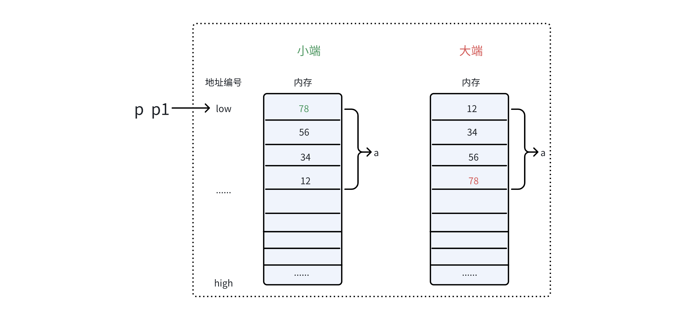

4.2.1.3.2 连续空间类型指针

<pre class="guide-code"><code>#include &lt;stdio.h&gt;

struct abc {
    int a;
    int b;
    char c;
};

int arr[3] = {1,2,3};

int main(void)
{
    struct abc data = {
        .a = 1,
        .b = 2,
        .c = 3,
    };
    printf(&quot; size of struct abc = %ld\n&quot;, sizeof(struct abc));

    struct abc *p = &amp;data;
    printf(&quot; a = %d, b = %d, c = %d\n&quot;, p-&gt;a, p-&gt;b, p-&gt;c);

    int* p1 = (int *)&amp;data;
    printf(&quot; struct p1[0] = %d \n&quot;, p1[0]);
    printf(&quot; struct p1[1] = %d \n&quot;, p1[1]);
    printf(&quot; struct p1[2] = %d \n&quot;, p1[2]);

    int* p2 = arr;
    printf(&quot; arr p2[0] = %d \n&quot;, p2[0]);
    printf(&quot; arr p2[1] = %d \n&quot;, p2[1]);
    printf(&quot; arr p2[2] = %d \n&quot;, p2[2]);
    return 0;
}

//运行结果：
 a = 1, b = 2, c = 3
 p1[0] = 1
 p1[1] = 2
 p1[2] = 3</code></pre>

<pre class="guide-code"><code>//linux container_of 宏的思想
#define offsetof(TYPE, MEMBER) ((size_t) &amp;((TYPE *)0)-&gt;MEMBER)
#define container_of(ptr, type, member) ({ \
    const typeof( ((type *)0)-&gt;member ) *__mptr = (ptr); \
    (type *)( (char *)__mptr - offsetof(type,member) );})
#include &lt;stdio.h&gt;
struct abc {
    int a;
    int b;
    char c;
};

void find_struct(int *member)
{
    unsigned long offset = 0;
    struct abc* p = NULL;

    offset = (unsigned long)&amp;((struct abc*)0)-&gt;b;
    printf(&quot; member offset: %ld \n&quot;, offset);

    p = (struct abc *)((char*)member - offset);

    printf(&quot; a:%d, b:%d c: %d \n&quot;, p-&gt;a, p-&gt;b, p-&gt;c);
}

int main(void)
{
    struct abc data = {
        .a = 1,
        .b = 2,
        .c = 3,
    };
    printf(&quot; size of struct abc = %ld\n&quot;, sizeof(struct abc));

    struct abc *p = &amp;data;
    printf(&quot; a = %d, b = %d, c = %d\n&quot;, p-&gt;a, p-&gt;b, p-&gt;c);

    find_struct(&amp;data.b);
    return 0;
}</code></pre>

4.2.1.3.3 函数类型指针

<pre class="guide-code"><code>#include &lt;stdio.h&gt;
#include &lt;stdlib.h&gt;
#include &lt;string.h&gt;

int (*show)(const char *, ...);
void func(void)
{
    show = printf;
    show(&quot;func call \n&quot;);
}

int main(void)
{
    func();
    return 0;
}

tips: 函数指针结合typedef来用，代码更容易读懂：
typedef void(*func)(void);
func call;//定义一个指针变量
call();//调用</code></pre>

4.2.1.3.4 指针修改const变量

<pre class="guide-code"><code>#include &lt;stdio.h&gt;

int main(void)
{
    int a = 0x12345678;
    const int b = 0x11111111;

    int *p = &amp;a;
    p[1] = 0x22222222;//越界访问

    printf(&quot;a = 0x%x, b = 0x%x \n&quot;,a , b);

    return 0;
}

//运行结果：编译连警告都没有
a = 0x12345678, b = 0x22222222</code></pre>

#### 4.2.2 指针运算

##### 4.2.2.1 指针+、-、++、--运算

指针变量本质也是一个变量，所以进行算数运算语法上是可以的。但是实际的工程应用中，指针变量的乘除法没有意义，更多的是加减法。总的来说，+ 运算符用于指针的算术运算，允许将指针移动

到任意偏移位置，而 ++ 运算符是 + 运算符的特例，它递增指针指向的位置，移动一个对象的大小。看一个例子：

<pre class="guide-code"><code>#include &lt;stdio.h&gt;

int main(void)
{
    int array[] = {1, 2, 3, 4, 5};
    int *p = array;

    p = p + 2;//p[2]
    printf(&quot;*p = %d \n&quot;, *p);

    p++;//p[3]
    printf(&quot;*p = %d \n&quot;, *p);

    return 0;
}

//运行结果
*p = 3
*p = 4</code></pre>

##### 4.2.2.2 指针逻辑运算

逻辑运算中，判断两个指针是否相等比较常用，其他的不常用。另外，只有两个相同类型的指针比较才有意义，一般编译也会包警告，如果类型不同。

<pre class="guide-code"><code>#include &lt;stdio.h&gt;
#include &lt;stdlib.h&gt;

int main(void)
{
    int *p = (int*)malloc(sizeof(int));
    if (p == NULL) {
        return -1;
    }

    char *p1 = NULL;
    if (p1 == p) { // warning
        //do something
    }
    free(p);
    return 0;
}

//运行结果
1.c: In function ‘main’:
1.c:12:12: warning: comparison of distinct pointer types lacks a cast
   12 |     if (p1 == p) {
      |</code></pre>

<pre class="guide-code"><code>#参考linux下MAX的实现(3.18内核)
#define MAX(x, y) ({                      \
        typeof(x) _max1 = (x);            \
        typeof(y) _max2 = (y);            \
        (void) (&amp;_max1 == &amp;_max2);        \
        _max1 &gt; _max2 ? _max1 : _max2; })</code></pre>

#### 4.2.3 多级指针

多级指针本质上也是一个指针，也需要一个指针变量来存放。这个指针变量的内存大小跟一级指针一样，跟系统有关。

<pre class="guide-code"><code>int **p

1. *p 第一&quot;*&quot; 决定 变量p 是一个指针变量
2. **p 第二&quot;*&quot; 决定 指针p 访问内存规则是以 指针类型 进行访问，所以*p的值还是一个指针(地
址)
3. int 决定 指针(*p) 访问内存规则是以 int类型 进行访问，所以 *(*p) 是 int类型</code></pre>

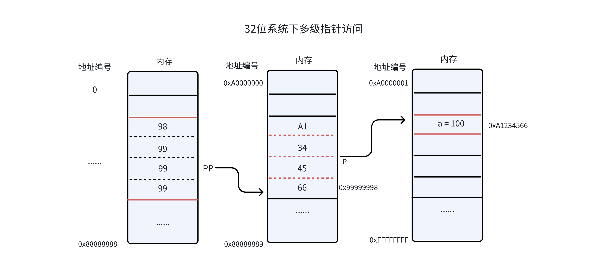

<pre class="guide-code"><code>#include &lt;stdio.h&gt;
#include &lt;stdlib.h&gt;

int main(void)
{
    int a = 100;
    int *p = &amp;a;
    int **pp = &amp;p;

    printf(&quot;**pp = %d, *pp[0] = %d \n&quot;,**pp, *pp[0]);
    printf(&quot;size of pp %ld \n&quot;, sizeof(pp));
    return 0;
}</code></pre>

<pre class="guide-code"><code>//运行结果
**pp = 100, *pp[0] = 100 //建议用*pp[]的方式访问
size of pp 8</code></pre>

用于指针变量地址传递

<pre class="guide-code"><code>#include &lt;stdio.h&gt;
#include &lt;stdlib.h&gt;

void func1(char * s)
{
    printf(&quot;func1: %s \n&quot;, s);

    s = &quot;hello linux&quot;;
}

void func2(char **s)
{
    *s = &quot;hello linux&quot;;
}

int main(void)
{
    char * s = &quot;hello world&quot;;

    func1(s);
    printf(&quot;s1 = %s \n&quot;, s);

    func2(&amp;s);
    printf(&quot;s2 = %s \n&quot;, s);
    return 0;
}

//运行结果
func1: hello world
s1 = hello world
s2 = hello linux</code></pre>

多级指针用于物理无序映射到逻辑有序的数据结构设计：

<pre class="guide-code"><code>#include &lt;stdio.h&gt;
#include &lt;stdlib.h&gt;

int main(void)
{
    char *arr[3] = {&quot;welcome&quot;, &quot;to&quot;, &quot;linux&quot;};
    char **s = arr;

    printf(&quot;%s:%p\n&quot;,s[0], s[0]);
    printf(&quot;%s:%p\n&quot;,s[1], s[1]);
    printf(&quot;%s:%p\n&quot;,s[2], s[3]);

    printf(&quot;&amp;s[0]:%p\n&quot;,&amp;s[0]);
    printf(&quot;&amp;s[1]:%p\n&quot;,&amp;s[1]);
    printf(&quot;&amp;s[2]:%p\n&quot;,&amp;s[2]);

    return 0;
}

//运行结果
welcome:0x5557a265a004
to:0x5557a265a00c
linux:0x75e4a3ccff45c900
&amp;s[0]:0x7ffd01eaeb80
&amp;s[1]:0x7ffd01eaeb88
&amp;s[2]:0x7ffd01eaeb90</code></pre>

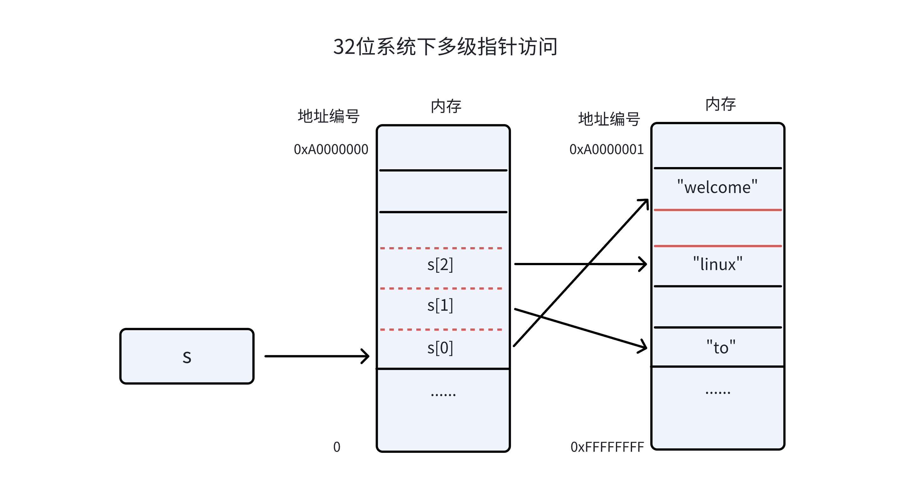

### 4.3 数组

数组本质上不算是一个新的数据类型，而是一种用于存储相同类型数据元素的数据结构。数组中的每个元素都有唯一的索引（位置），通过索引可以访问和操作数组中的元素。

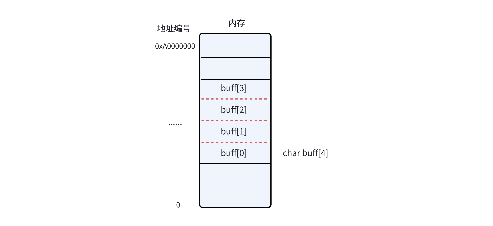

#### 4.3.1 数组的定义

数组定义需要回答：分配多少空间？读取的方式是什么？

<pre class="guide-code"><code>数据类型 数组名[n] ：int array[10]

tips:
n的作用域是在申请空间的时候生效，代表圈定了n*sizeof(数据类型)字节的空间

#include &lt;stdio.h&gt;

int main(void)
{
    int arr[5] = {1,2,3,4,5};
    printf(&quot;size of arr is: %ld byte，len is %ld \n&quot;, sizeof(arr),
        sizeof(arr) / sizeof(arr[0]));

    return 0;
}
//运行结果：
size of arr is: 40 byte，len is 10</code></pre>

##### 4.3.1.1 数组名的本质

数组名是一个常量标签（类似函数名），所以数组名不能做左值，是圈定的内存的别名。数组名的值是地址常量（指针常量），是一个地址编号，指向数组的首元素。

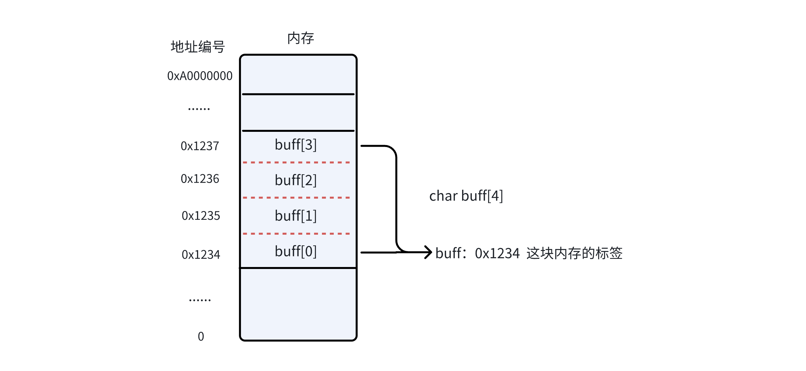

数组名是常量标签

<pre class="guide-code"><code>#include &lt;stdio.h&gt;
#include &lt;stdlib.h&gt;
int main(void)
{
    char arr[20];
    arr = &quot;hello wolrd&quot;;//编译报错

    return 0;
}

1.c: In function ‘main’:
1.c:7:9: error: assignment to expression with array type
    7 |     arr = &quot;hello wolrd&quot;;
      |

Tips：啥是指针常量？假设0x12345678合法，则（int*）0x12345678 就是一个指针常量，指针常量
当然不能被赋值：（int*）0x12345678 = 123; //不符合语法，类似（int）123 = 456；一样</code></pre>

arr 和 &amp;arr 的区别

arr的值和&amp;arr值一样，但是意义不同：arr的值是指向数组的首元素的地址常量（指针常量），&amp;arr的值是指向整片数组内存的地址常量（指针常量）。所以都是指针常量，但是指针读取内存规则不一样。

<pre class="guide-code"><code>#include &lt;stdio.h&gt;
#include &lt;stdlib.h&gt;

char arr[12];
int main(void)
{
    printf(&quot;arr      = %d\n&quot;, arr);
    printf(&quot;&amp;arr     = %d\n&quot;, &amp;arr);
    printf(&quot;size of arr is: %ld\n&quot;, sizeof(arr));
    printf(&quot;arr + 1  = %d\n&quot;, arr + 1);
    printf(&quot;&amp;arr + 1 = %d\n&quot;, &amp;arr + 1);

    return 0;
}

//运行结果
arr      = 738533400
&amp;arr     = 738533400
size of arr is: 12
arr + 1  = 738533401
&amp;arr + 1 = 738533412</code></pre>

##### 4.3.1.2 一维数组的访问

<pre class="guide-code"><code>#include &lt;stdio.h&gt;
#include &lt;stdlib.h&gt;
int main(void)
{
    char arr[12] = &quot;hello world&quot;;

    printf(&quot;%c \n&quot;, arr[4]);
    printf(&quot;%c \n&quot;, *(arr+4));

    return 0;
}

//运行结果
o
o</code></pre>

##### 4.3.1.3 二维数组的访问

<pre class="guide-code"><code>#include &lt;stdio.h&gt;

int main()
{
    int arr[3][5] = {{1, 2, 3, 4, 5}, {6, 7, 8, 9, 10}, {11, 12, 13, 14, 15}};

    // 打印数组指针指向的数组中的元素
    for (int i = 0; i &lt; 3; i++) {
        for (int j = 0; j &lt; 5; j++) {
            printf(&quot;%d &quot;, arr[i][j]);
        }
        printf(&quot;\n&quot;);
    }
    printf(&quot;%p %p %d\n&quot;, arr, *arr, **arr);
    // 打印数组指针指向的数组中的元素
    for (int i = 0; i &lt; 3; i++) {
        for (int j = 0; j &lt; 5; j++) {
            printf(&quot;%d &quot;, *(*(arr+i)+j));
        }
        printf(&quot;\n&quot;);
    }

    return 0;
}</code></pre>

<pre class="guide-code"><code>//运行结果
1 2 3 4 5
6 7 8 9 10
11 12 13 14 15

0x7ffc6fb525d0 0x7ffc6fb525d0 1

1 2 3 4 5
6 7 8 9 10
11 12 13 14 15</code></pre>

#### 4.3.2 数组与指针

##### 4.3.2.1 数组与指针区别

数组和指针本质上都可以代表一个连续的空间。只是数组名是这段连续空间的标签（指针常量），而指针需要一个指针变量来存放。在访问内存时，数组名和指针可以画等号。

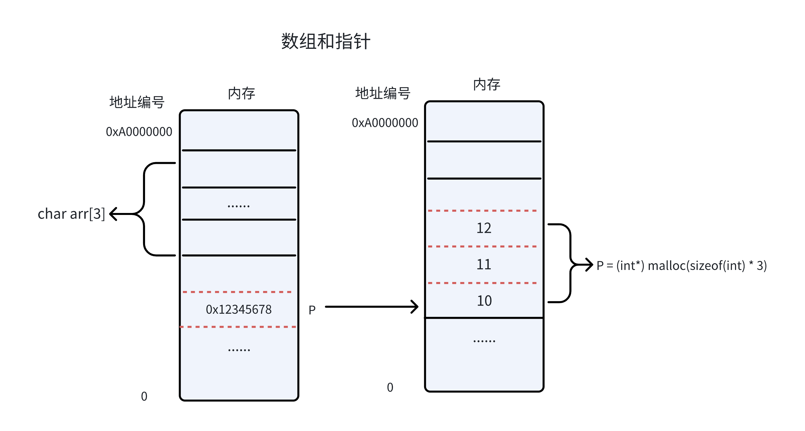

##### 4.3.2.2 指针数组与数组指针

指针数组：指针数组是一个数组，其中的每个元素都是一个指针。

示例： int *array[3]; 声明了一个包含3个元素的指针数组，每个元素都是一个指向整数的指针。

用途： 指针数组常用于存储一组指针，每个指针可以指向不同类型的数据或不同位置的数组。

<pre class="guide-code"><code>int main()
{
    int a = 1, b = 2, c = 3;
    int *array[3] = {&amp;a, &amp;b, &amp;c};
    // 打印指针数组中每个元素指向的值
    for (int i = 0; i &lt; 3; i++) {
        printf(&quot;%d &quot;, *array[i]);
    }

    return 0;
}</code></pre>

数组指针：数组指针是一个指针，它指向一个数组

示例： int (*ptr)[3]; 声明了一个指针，指向包含3个元素的整数数组

用途： 数组指针常用于处理二维数组或作为指向动态分配数组的指针

<pre class="guide-code"><code>#include &lt;stdio.h&gt;

int main()
{
    int arr[3][5] = {{1, 2, 3, 4, 5}, {6, 7, 8, 9, 10}, {11, 12, 13, 14, 15}};
    int (*p)[5] = arr;

    // 打印数组指针指向的数组中的元素
    for (int i = 0; i &lt; 3; i++) {
        for (int j = 0; j &lt; 5; j++) {
            printf(&quot;%d &quot;, p[i][j]);
        }
        printf(&quot;\n&quot;);
    }

    return 0;
}</code></pre>

##### 4.3.2.3 二维数组和二级指针的关系

先说结论：没有关系。二维数组本质上是一段连续空间的圈定，跟二级指针在概念上就不是一个维度，无法比较。但二维数组名是一个二级指针常量。在内存访问时，二维数组名和二级指针可以画等号。

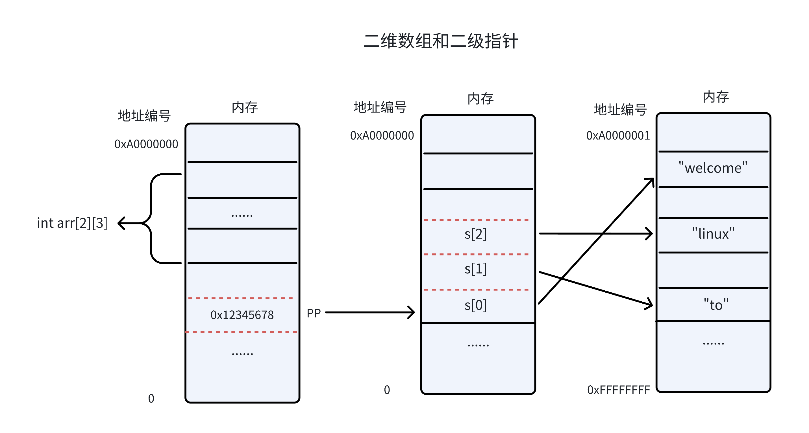

## 5. 常见面试题

### 5.1 预处理-#define

<pre class="guide-code"><code>Q: 用预处理指令#define声明一个常数，用以表明1年中有多少秒(忽略闰年问题)

#define 宏名 宏体
宏名：大写字母表示

#define SECOND_OF_YEAR （365 * 24 * 3600）UL

L表示长整型//因为可能CPU位数不一样，至少保证为4字节
U表示无符号

int a = SECOND_OF_YEAR;//编译阶段已经处理为常数

1、#define语法的基本知识（例如：不能以分号结束、括号的使用，等等）
2、懂得预处理器将为你计算常数表达式的值，因此，直接写出你是如何计算一年中有多少秒而不是计算
出实际的值，是更清晰而没有代价的。
3、意识到这个表达式将使一个16位机的整型数溢出，因此要用到长整型符号L，告诉编译器这个常数是
的长整型数。
4、如果你在你的表达式中用到UL（表示无符号长整型）.
//嵌入式程序员面试题: 下面这个MIN宏有哪些问题?
#define MIN(A,B) A &lt;= B ? A : B
问题1：3 * MIN2(10, 20) 结果不符合预期
解决方案：#define MIN(A,B) (A &lt;= B ? A : B)

问题2：MIN2(10, 20 &lt; 30? 20 : 30)结果不符合预期
解决方案：
#define MIN(A,B) ((A) &lt;= (B) ? (A) : (B))

问题3：MIN2(a++, 20 &lt; 30? 20 : 30)结果不符合预期
解决方案：
#define MIN(A,B) ({ \
    typeof(A) _min1 = (A); \
    typeof(B) _min2 = (B); \
    _min1 &lt; _min2 ? _min1 : _min2;\
})

int main(void)
{
    int a = 10;

    printf(&quot;    min = %d \n&quot;, 3 * MIN(a++, 20 &lt; 30? 20 : 30));
    printf(&quot;    a = %d \n&quot;, a);
    return 0;
}</code></pre>

### 5.2 修饰符-const

<pre class="guide-code"><code>C:只读，建议性，不具备强制性 !=常量
const意味着“只读”
const int a = 100; // a是变量，尽量保持100不变，可通过指针修改

const int a;
int const a;
前两个的作用是一样，a是一个常整型数。

const int *a;
意味着a是一个指向常整型数的指针（也就是，整型数是不可修改的，但指针可以）。

int * const a;
a是一个指向整型数的常指针（也就是说，指针指向的整型数是可以修改的，但指针是不可修改的）。

int const * const a;
a是一个指向常整型数的常指针（也就是说，指针指向的整型数是不可修改的，同时指针也是不可修改
的）。
合理地使用关键字const可以使编译器很自然地保护那些不希望被改变的参数，防止其被无意的代码修
改。简而言之，这样可以减少bug的出现。</code></pre>

### 5.3 signed与unsigned隐式转换

<pre class="guide-code"><code>#include &lt;stdio.h&gt;
//嵌入式程序员面试题：下面的代码输出是什么，为什么？

int main(void)
{
    unsigned int a = 9;
    int b = -10;

    printf(&quot;    a+b = %d \n&quot;, a+b);
    (b+a &gt; 0) ?
        puts(&quot;    a+b &gt; 0&quot;):
        puts(&quot;    a+b &lt;= 0&quot;);
    return 0;
}

//输出结果
    a+b = -1
    a+b &gt; 0</code></pre>

### 5.4 复杂类型定义

右左原则。

<pre class="guide-code"><code>Q:用变量a给出下面的定义

1. 一个整型数（An integer）；

int a;

2. 一个指向整型数的指针（A pointer to an integer）；

int *a;

3. 一个指向指针的指针，它指向的指针是指向一个整型数（A pointer to a pointer to an
integer）；

int **a;
4. 一个有10个整型数的数组（An array of 10 integers）；

int a[10];

5. 一个有10个指针的数组，该指针是指向一个整型数的（An array of 10 pointers to
integers）；

int *a[10];

6. 一个指向有10个整型数数组的指针（A pointer to an array of 10 integers）；

int (*a)[10];

7. 一个指向函数的指针，该函数有一个整型参数并返回一个整型数（A pointer to a function
that takes an integer as an argument and returns an integer）；

int (*a)(int)

8. 一个有10个指针的数组，该指针指向一个函数，该函数有一个整型参数并返回一个整型数（ An
array of ten pointers to functions that take an integer argument and return an
integer ）

int (*a[10]) (int)</code></pre>

## 6. 附录

### 6.1 推荐的学习网站

https://c-cpp.com/c/language

https://www.geeksforgeeks.org/c-programming-language/?ref=gcse_ind

### 6.2 ASCII码表

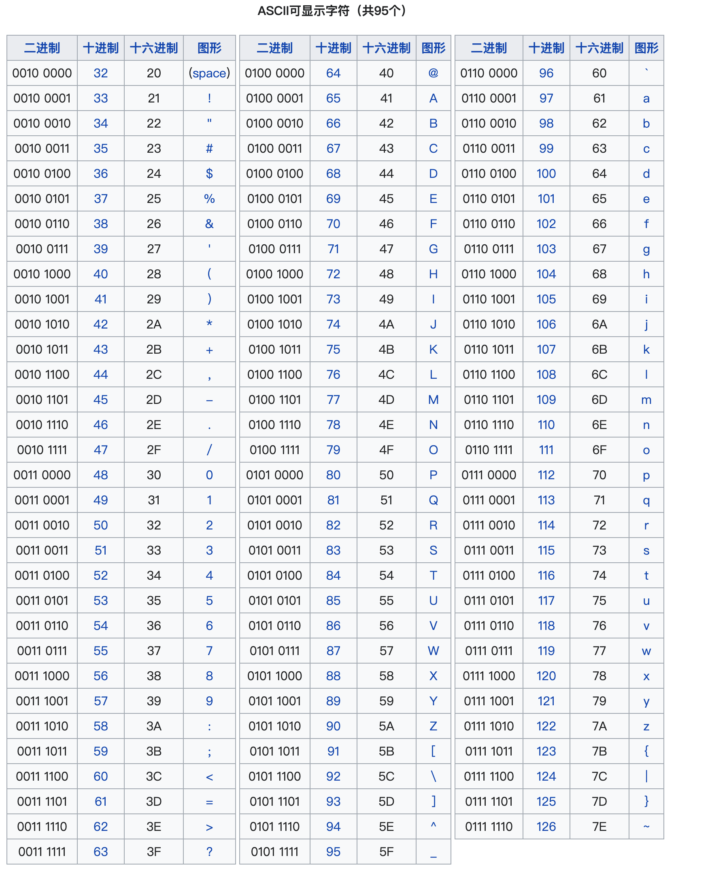

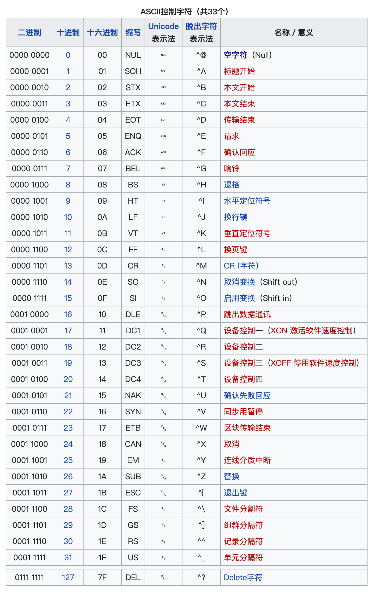
