# STM32F103 中断教程

本文面向第一次接触 STM32 中断的新手，以 STM32F103 和 HAL 库为主线，解释中断为什么存在、CPU 如何响应中断、NVIC 与 EXTI 各自负责什么，以及怎样把一个 GPIO 边沿最终变成用户代码中的回调函数。

学完后，你应当能够独立完成一个按键外部中断，理解中断优先级和嵌套关系，并能按信号源、EXTI、NVIC、中断服务函数和回调函数的顺序排查故障。

## 1 中断是什么

CPU 正常情况下会从主程序的一条指令执行到下一条指令。中断发生时，CPU 暂停当前程序，保存必要的运行现场，转去执行与该事件对应的中断服务程序；处理完成后，CPU 恢复现场，并从原来被打断的位置继续运行。

下图可以把中断理解为“写作业时先去处理一件更紧急的事，处理完再回到断点继续写”。

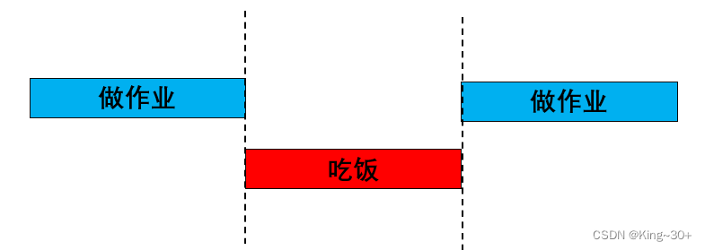

几个常用术语如下：

- **中断源**：提出请求的硬件，例如 GPIO、定时器、串口或 SysTick。
- **中断请求 IRQ**：Interrupt Request，中断源向处理器发出的请求。
- **中断服务函数 ISR**：Interrupt Service Routine，中断发生后 CPU 实际执行的函数。
- **断点**：主程序被暂停的位置。ISR 结束后，CPU 从附近的下一条指令继续运行。
- **现场**：被打断程序当时的寄存器和状态。Cortex-M3 会自动保存并恢复一部分核心现场。
- **中断向量**：中断服务函数的入口地址。

### 1.1 中断与轮询的区别

轮询是主程序反复检查某个条件，中断则由硬件在事件发生时主动通知 CPU。

| 比较项 | 轮询 | 中断 |
| --- | --- | --- |
| 检查方式 | CPU 主动反复读取状态 | 硬件在事件出现时提出请求 |
| 程序结构 | 直观，适合简单低速任务 | 响应路径分散，需要理解中断链路 |
| CPU 占用 | 即使没有事件也要检查 | 没有事件时不需要反复检查 |
| 响应速度 | 取决于轮询周期 | 通常能快速响应，但仍受优先级和关中断时间影响 |
| 适用场景 | 状态持续时间长、逻辑简单 | 短脉冲、异步通信、定时和故障处理 |

中断并不意味着“真正同时执行”。单核 Cortex-M3 在某一时刻仍只执行一条指令，只是通过快速切换提高响应能力。

### 1.2 SysTick 为什么能产生周期任务

SysTick 是 Cortex-M3 内核中的系统定时器。HAL 工程通常把它配置为每 1 ms 产生一次中断，并在中断处理中累加系统节拍。

如果某个计数器累计到 500，就可以触发 500 ms 周期任务；累计到 1000，则可以触发 1 s 周期任务。这里的关键不是把耗时任务全部放进 ISR，而是利用 1 ms 节拍更新时间或设置任务标志，再由主循环执行较长的工作。

## 2 STM32 中断系统的完整链路

STM32F103 的中断链路可以概括为：

```text
中断源 → 外设状态/EXTI → NVIC → 中断向量表 → IRQHandler → HAL 处理函数 → 用户回调
```

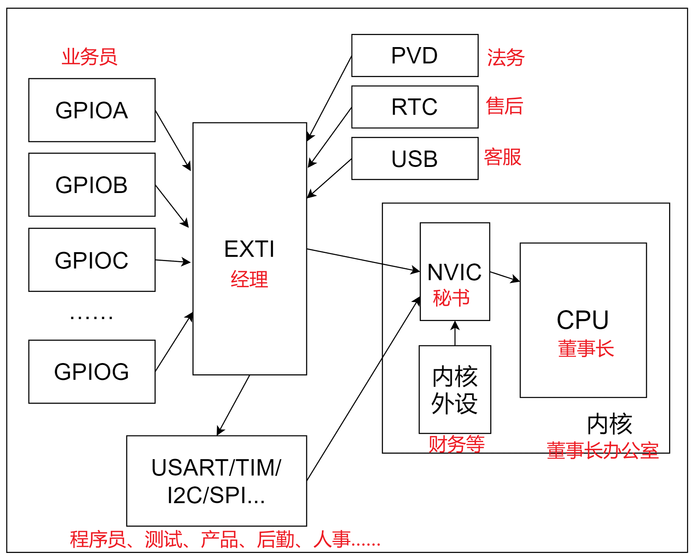

以 PA0 的下降沿外部中断为例：

1. PA0 从高电平变成低电平。
2. AFIO 把 PA0 连接到 EXTI0。
3. EXTI0 检测到已启用的下降沿，置位挂起标志。
4. 如果 EXTI0 未被屏蔽，EXTI 向 NVIC 提出请求。
5. NVIC 根据使能状态和优先级决定何时让 CPU 响应。
6. CPU 从中断向量表取得 `EXTI0_IRQHandler` 的入口地址。
7. `EXTI0_IRQHandler` 调用 HAL 的通用处理函数。
8. HAL 清除挂起标志，再调用 `HAL_GPIO_EXTI_Callback()`。
9. 用户代码在回调中识别引脚并记录事件。

只要其中任意一环缺失，就可能出现“GPIO 电平变了，但程序不进入回调”。

## 3 中断向量表与中断服务函数

中断向量表是一段按固定顺序保存入口地址的内存区域。复位后，处理器从表中取得初始栈顶地址和复位入口；发生异常或中断时，处理器用对应编号找到处理函数。

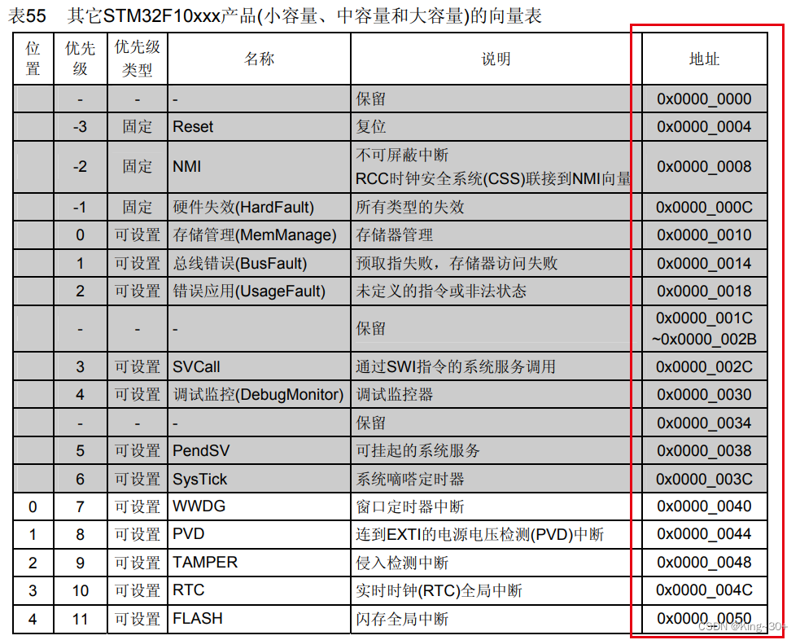

启动文件通常为每个中断提供一个弱定义的默认处理函数。工程中的 `stm32f1xx_it.c` 再定义实际需要的 IRQHandler，从而覆盖弱定义。

```c
void EXTI0_IRQHandler(void)
{
    HAL_GPIO_EXTI_IRQHandler(GPIO_PIN_0);
}
```

中断服务函数的名字不能随意修改，它必须与启动文件向量表中的符号一致。对于 STM32F103 的 GPIO 外部中断：

- EXTI0 至 EXTI4 各自拥有独立的 IRQHandler。
- EXTI5 至 EXTI9 共用 `EXTI9_5_IRQHandler`。
- EXTI10 至 EXTI15 共用 `EXTI15_10_IRQHandler`。

共用 IRQHandler 时，HAL 会根据挂起位判断是哪一条 EXTI 线产生请求。用户回调仍应检查 `GPIO_Pin`，不要假设只有一个引脚会触发。

## 4 NVIC 负责使能 优先级和嵌套

NVIC 是 Nested Vectored Interrupt Controller，即嵌套向量中断控制器。它位于 Cortex-M3 内核中，负责管理中断是否使能、请求是否挂起、优先级如何比较以及高优先级中断是否可以抢占当前 ISR。

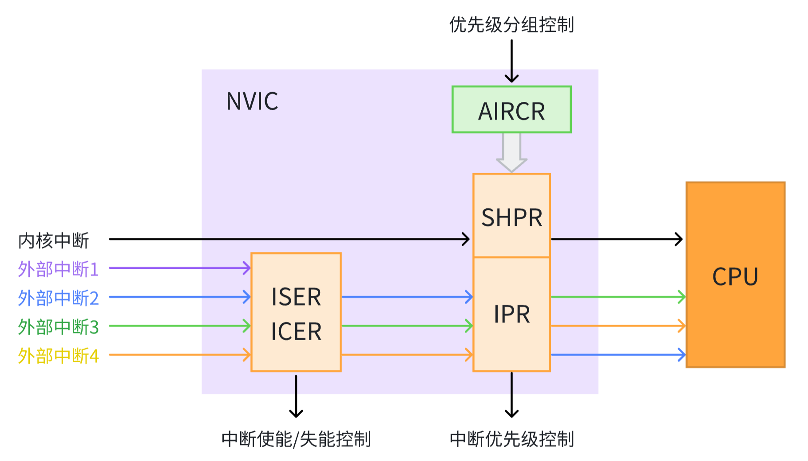

### 4.1 常见 NVIC 概念

- **使能**：允许 NVIC 接收并响应某个中断请求。
- **挂起**：中断请求已经出现，但 CPU 可能尚未处理。
- **活动**：CPU 正在执行该中断的 ISR。
- **抢占优先级**：数值更小的中断可以打断数值更大的中断。
- **子优先级**：当多个相同抢占优先级的中断同时等待时，决定谁先执行；它不能造成相互抢占。
- **自然优先级**：在可编程优先级仍相同的情况下，由异常编号决定先后。

STM32 的优先级数值越小，优先级越高。`0` 是最高的可编程优先级，而不是最低。

### 4.2 优先级分组

STM32F1 实际使用优先级字段的高 4 位。优先级分组决定这 4 位中有多少位属于抢占优先级、多少位属于子优先级。

HAL 工程通常在 `HAL_Init()` 中设置一次优先级分组。一个工程中不要在不同模块反复修改分组，否则已经配置的优先级含义会改变。

假设分组允许同时设置抢占优先级和子优先级：

- 中断 A：抢占 2，子优先级 1。
- 中断 B：抢占 3，子优先级 0。
- 中断 C：抢占 2，子优先级 0。

则 C 和 A 都能抢占 B；C 与 A 的抢占级相同，不能相互打断，但二者同时等待时 C 先执行。

### 4.3 HAL 中的 NVIC 配置

```c
HAL_NVIC_SetPriority(EXTI0_IRQn, 2, 0);
HAL_NVIC_EnableIRQ(EXTI0_IRQn);
```

第一行设置 EXTI0 的抢占优先级为 2、子优先级为 0；第二行使能该 IRQ。`EXTI0_IRQn` 是 CMSIS 头文件中定义的中断编号枚举，不是 GPIO 引脚编号。

常用函数还有：

```c
HAL_NVIC_DisableIRQ(EXTI0_IRQn);       // 禁用 IRQ
HAL_NVIC_ClearPendingIRQ(EXTI0_IRQn);  // 清除 NVIC 挂起状态
```

清除 NVIC 挂起状态不等同于清除外设自己的中断标志。正确顺序由具体外设和 HAL 驱动决定。

## 5 EXTI 负责检测外部边沿

EXTI 是 External Interrupt/Event Controller，即外部中断和事件控制器。它检测输入线的上升沿或下降沿，并产生中断请求或硬件事件。

STM32F1 的 EXTI0 至 EXTI15 可用于 GPIO；另外的 EXTI 线连接 PVD、RTC 闹钟、USB 唤醒等内部信号。具体芯片支持哪些内部线，应以对应型号的参考手册和启动文件为准。

### 5.1 上升沿和下降沿

- **上升沿**：信号从 0 变为 1。
- **下降沿**：信号从 1 变为 0。
- **双边沿**：两种变化都会触发。

如果按键使用内部上拉并在按下时接地，那么松开状态为 1，按下瞬间产生下降沿，通常应选择 `GPIO_MODE_IT_FALLING`。

### 5.2 中断和事件的区别

EXTI 可以产生中断，也可以产生事件：

- **中断**经过 NVIC，CPU 会进入 ISR。
- **事件**不要求 CPU 执行 ISR，可用于唤醒或触发片上硬件。

大多数 GPIO 按键示例使用的是中断路径。

### 5.3 EXTI 内部路径和寄存器

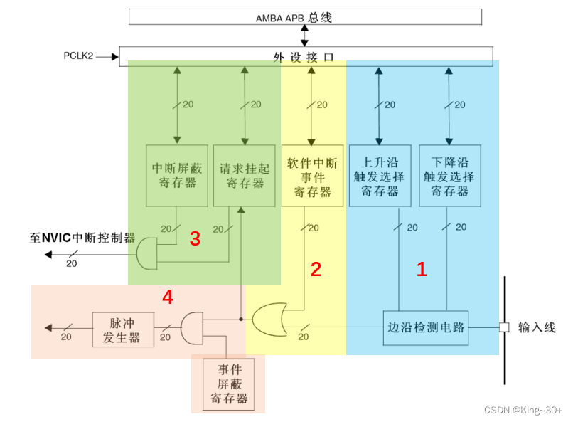

外部输入先经过边沿检测，随后分别进入中断路径和事件路径。与 GPIO 外部中断最相关的寄存器如下：

| 寄存器 | 作用 |
| --- | --- |
| `EXTI_IMR` | 中断屏蔽寄存器；置 1 允许请求进入中断路径 |
| `EXTI_EMR` | 事件屏蔽寄存器；置 1 允许产生事件 |
| `EXTI_RTSR` | 上升沿触发选择 |
| `EXTI_FTSR` | 下降沿触发选择 |
| `EXTI_SWIER` | 软件触发中断或事件 |
| `EXTI_PR` | 挂起寄存器；检测到边沿后置位，向对应位写 1 清除 |

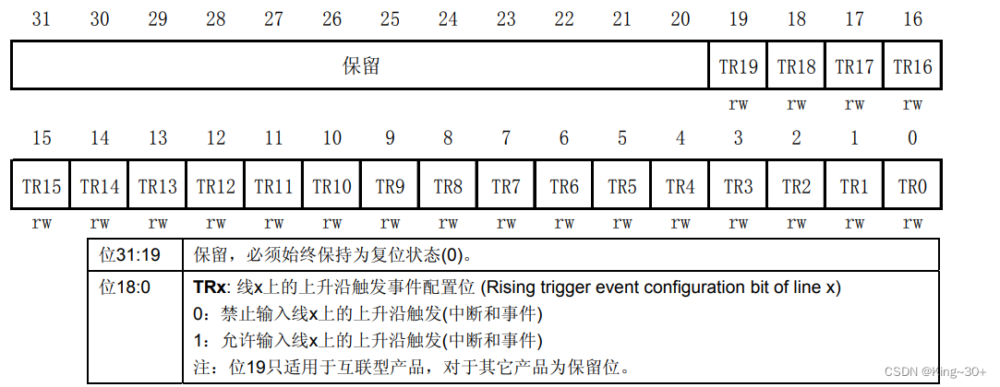

`EXTI_PR` 的“写 1 清除”很容易被误解。它不是向该位写 0，而是向目标位写 1，请求硬件清除此挂起标志。

使用 HAL 时，`HAL_GPIO_EXTI_IRQHandler()` 已经检查并清除 EXTI 挂起标志，IRQHandler 中不要在其后再次手动清除同一标志。

## 6 AFIO 决定哪个 GPIO 接入哪条 EXTI 线

STM32F103 有多个 GPIO 端口，但 GPIO 外部中断只有 EXTI0 至 EXTI15 共 16 条编号线。相同编号的引脚共享同一条 EXTI 线：

```text
PA0、PB0、PC0 ... → EXTI0 中选择一个
PA1、PB1、PC1 ... → EXTI1 中选择一个
...
PA15、PB15、PC15 ... → EXTI15 中选择一个
```

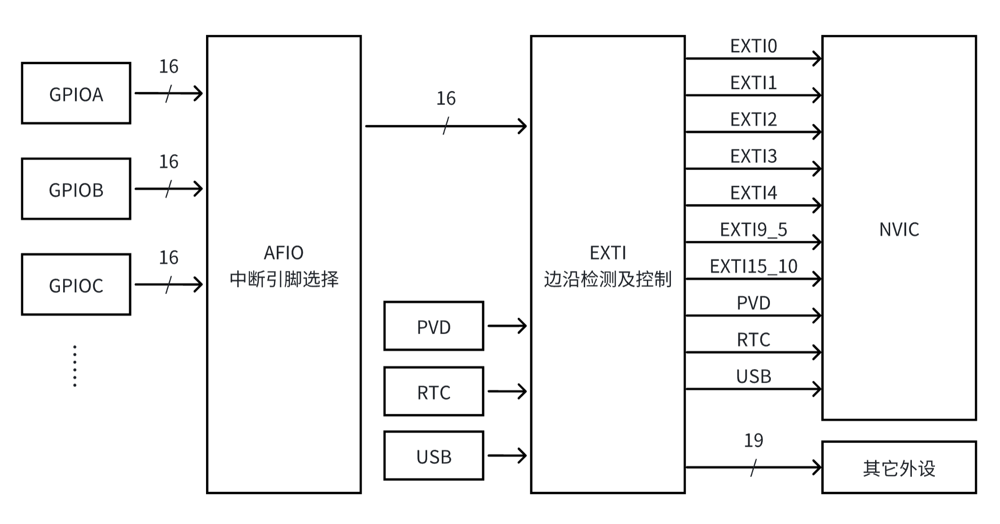

因此，PA0 与 PB0 不能同时作为两个独立的 EXTI0 输入。AFIO 的 `EXTICR1` 至 `EXTICR4` 用于选择每条 EXTI 线来自哪个 GPIO 端口。

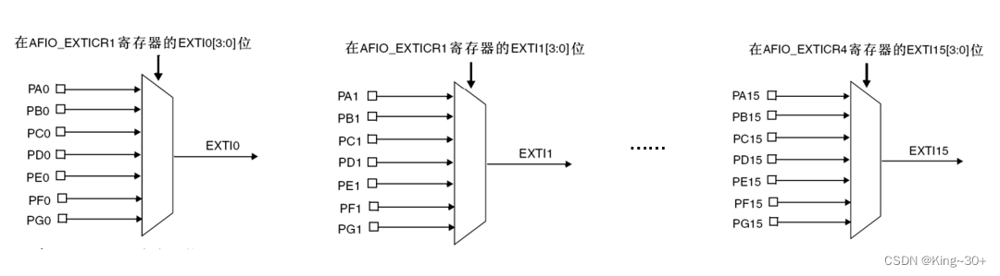

STM32F1 在配置 EXTI 端口映射前必须使能 AFIO 时钟。HAL 的 GPIO 初始化流程会完成常见映射，但手写寄存器时不能漏掉：

```c
__HAL_RCC_AFIO_CLK_ENABLE();
```

## 7 使用 HAL 配置 GPIO 外部中断

完整配置包括 GPIO 时钟、输入模式、EXTI 路由与边沿、NVIC 优先级、IRQ 使能和服务函数。下面的流程图给出了这些步骤之间的关系。

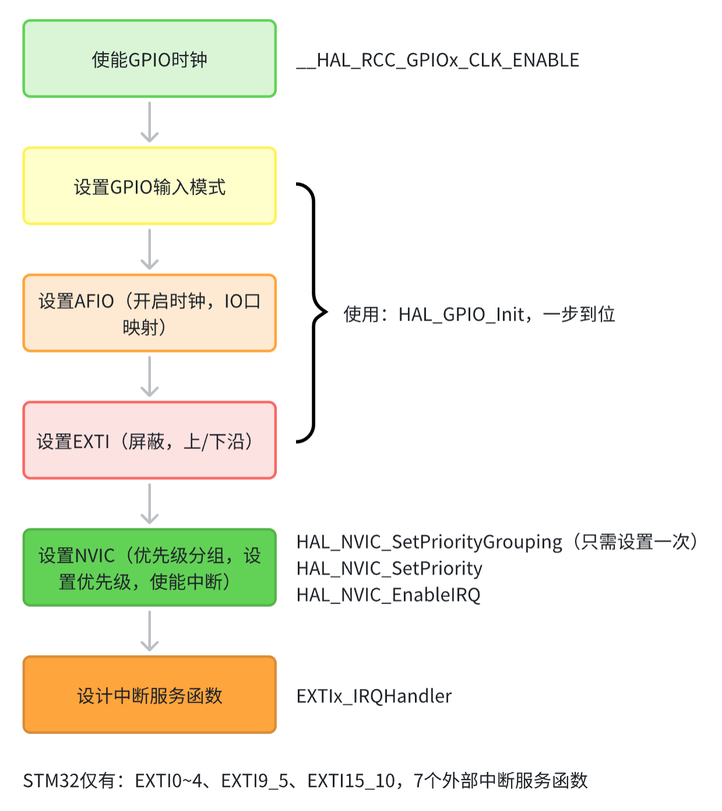

以下示例面向 STM32F103C8T6 Blue Pill：板载 LED 位于 PC13，低电平点亮；外接按键连接 PA0 与 GND，使用内部上拉，按下产生下降沿。

### 7.1 GPIO 和 NVIC 初始化

```c
static void MX_GPIO_Init(void)
{
    GPIO_InitTypeDef GPIO_InitStruct = {0};

    __HAL_RCC_GPIOA_CLK_ENABLE();
    __HAL_RCC_GPIOC_CLK_ENABLE();
    __HAL_RCC_AFIO_CLK_ENABLE();

    HAL_GPIO_WritePin(GPIOC, GPIO_PIN_13, GPIO_PIN_SET);

    GPIO_InitStruct.Pin = GPIO_PIN_13;
    GPIO_InitStruct.Mode = GPIO_MODE_OUTPUT_PP;
    GPIO_InitStruct.Speed = GPIO_SPEED_FREQ_LOW;
    HAL_GPIO_Init(GPIOC, &GPIO_InitStruct);

    GPIO_InitStruct.Pin = GPIO_PIN_0;
    GPIO_InitStruct.Mode = GPIO_MODE_IT_FALLING;
    GPIO_InitStruct.Pull = GPIO_PULLUP;
    HAL_GPIO_Init(GPIOA, &GPIO_InitStruct);

    HAL_NVIC_SetPriority(EXTI0_IRQn, 2, 0);
    HAL_NVIC_EnableIRQ(EXTI0_IRQn);
}
```

先把 PC13 的输出锁存值设置为高，再切换为输出，可以避免初始化瞬间误亮。PA0 使用上拉后，未按下为高，按下接地为低。

### 7.2 IRQHandler 和 HAL 调用链

```c
void EXTI0_IRQHandler(void)
{
    HAL_GPIO_EXTI_IRQHandler(GPIO_PIN_0);
}
```

HAL 的处理函数会检查中断标志、清除挂起位，然后调用弱定义回调函数。用户在自己的代码中重新实现回调即可。

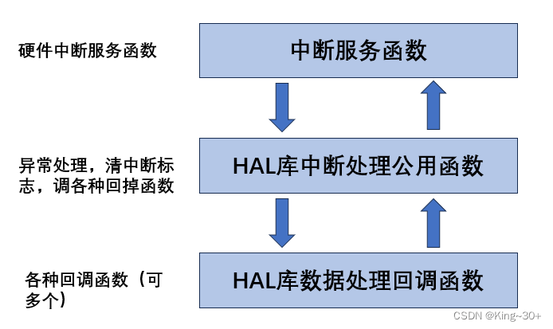

### 7.3 回调函数与非阻塞消抖

机械按键在闭合时会产生数毫秒的抖动，一次按下可能形成多个下降沿。不要在 ISR 中执行 `HAL_Delay(20)`；中断处理越长，其他中断被延迟的时间越长。

一种简单做法是用时间戳忽略过近的重复边沿：

```c
void HAL_GPIO_EXTI_Callback(uint16_t GPIO_Pin)
{
    static uint32_t last_tick = 0;
    uint32_t now = HAL_GetTick();

    if (GPIO_Pin == GPIO_PIN_0 && (now - last_tick) >= 20) {
        last_tick = now;
        HAL_GPIO_TogglePin(GPIOC, GPIO_PIN_13);
    }
}
```

更稳健的工程写法是只在回调中记录 `key_event = true` 和时间，在主循环或周期任务中再次读取按键，确认电平稳定后再执行业务动作。

## 8 原文硬件案例与移植方法

原文版本 1 使用另一块 STM32F1 开发板：LED0 接 PB5，低电平点亮；KEY0 接 PE4，按下为低电平。

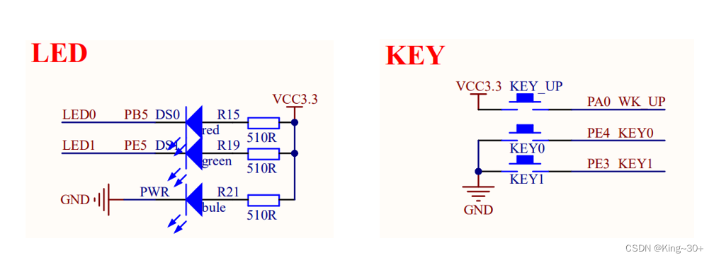

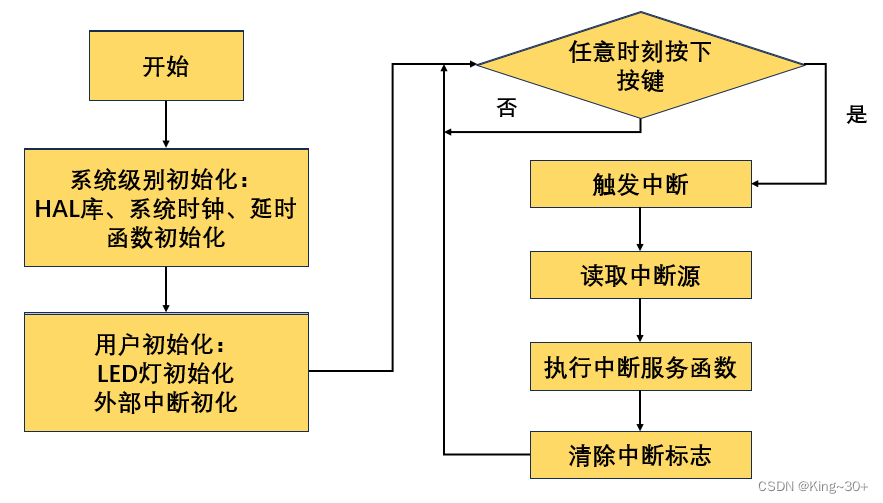

移植示例时不要直接照抄端口号，应先阅读目标板原理图，再替换以下四类信息：

1. LED 的端口、引脚和有效电平。
2. 按键的端口、引脚、上下拉和触发边沿。
3. 对应的 IRQ 编号与 IRQHandler 名称。
4. 是否与 SWD、晶振或其他片上外设复用。

例如，把原文的 PE4 按键移植到 PA0 后，中断线从 EXTI4 变为 EXTI0，IRQHandler 也必须从 `EXTI4_IRQHandler` 改为 `EXTI0_IRQHandler`。

## 9 中断程序的设计原则

### 9.1 ISR 要短

ISR 中适合执行的操作包括：读取状态、清标志、搬运少量数据、更新时间戳和设置标志。文件写入、复杂计算、阻塞等待和长时间打印应放到主循环或任务中。

### 9.2 共享变量要考虑并发

主循环和 ISR 共同访问的简单标志通常应声明为 `volatile`，避免编译器把读取结果长期保存在寄存器中：

```c
static volatile bool key_event = false;
```

`volatile` 不能保证多步读改写具有原子性。对计数器、队列或复合状态，仍需考虑临界区、原子操作或操作系统同步机制。

### 9.3 先清楚中断来自哪里

一个共享 IRQHandler 可能对应多条中断线，一个外设也可能有多个中断标志。处理函数应检查真正的状态位，只清除已经处理的标志。

### 9.4 合理安排优先级

优先级不是越高越好。只有时限更严格、执行更短的中断才应获得更高抢占优先级。过多高优先级 ISR 会让低优先级任务长期得不到运行。

## 10 常见故障排查

### 10.1 完全不进入中断

按下面顺序检查：

1. 用万用表或示波器确认引脚上确实出现了预期边沿。
2. 确认 GPIO 端口时钟和 AFIO 时钟已使能。
3. 确认引脚模式、上下拉与触发边沿匹配外部电路。
4. 确认 AFIO 把正确端口映射到对应 EXTI 线。
5. 确认 `HAL_NVIC_EnableIRQ()` 使用了正确的 IRQn。
6. 确认 IRQHandler 名称与启动文件一致。
7. 在 IRQHandler 和回调函数中分别设置断点，定位链路中断的位置。

### 10.2 只进入一次

优先检查 EXTI 挂起标志是否正确清除。使用 HAL 时，IRQHandler 应调用 `HAL_GPIO_EXTI_IRQHandler()`；不要绕过它后又忘记处理挂起位。

### 10.3 一次按键触发多次

这是机械抖动的典型现象。增加软件消抖或硬件 RC 滤波，不要误以为 EXTI 会自动消抖。

### 10.4 进入错误的回调分支

确认回调中比较的是引脚位掩码，例如 `GPIO_PIN_0`，而不是端口对象 `GPIOA`，也不是数字 `0`。

### 10.5 高优先级中断没有抢占

检查两个中断的抢占优先级，而不只是子优先级；同时确认当前代码没有长时间关闭全局中断或进入更高屏蔽级别。

## 11 学习检查

完成下面的问题，说明你已经掌握了基本中断链路：

1. 为什么使用上拉的按键通常选择下降沿触发？
2. PA0 和 PB0 为什么不能同时作为两个独立的 EXTI0 中断源？
3. `HAL_NVIC_EnableIRQ()` 与 `GPIO_MODE_IT_FALLING` 分别配置哪一层？
4. 为什么 `EXTI_PR` 要写 1 清除？
5. 为什么不建议在中断回调中使用长延时？
6. 抢占优先级相同、子优先级不同的两个中断能否相互打断？
7. 从 GPIO 边沿到用户回调，一共经过了哪些关键模块和函数？

## 参考资料

- 《STM32F10xxx 参考手册》中的中断、NVIC、AFIO 和 EXTI 章节。
- STM32F1 HAL 驱动中的 `stm32f1xx_hal_gpio.c`、`stm32f1xx_hal_cortex.c`。
- 工程启动文件中的中断向量表，以及 `stm32f1xx_it.c` 中的 IRQHandler。
