# 点灯大师
如果你已经顺利完成了使用STM32新建工程，那么就可以开始接下来的**点灯大师**环节了

## 点亮板载灯

### 0.0. 前面基础准备

先按照（[使用STM32新建文件](./Lecture1小作业.md)）的操作完成到打开VSCode这一步

### 1.0. 添加点亮板载小灯代码

在开始前，确保板载小灯(PC13)引脚已经启用，开漏输出，无上下拉。
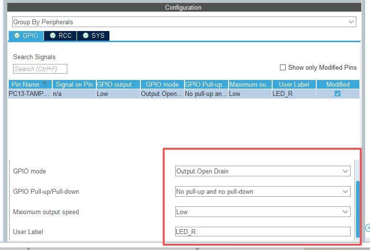

打开VSCode之后,按照下图指示打开**main.c**文件，找到**主函数**

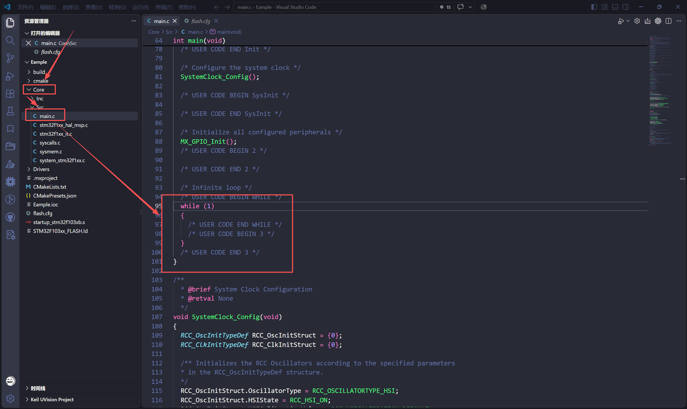

在主函数中插入如图所示代码

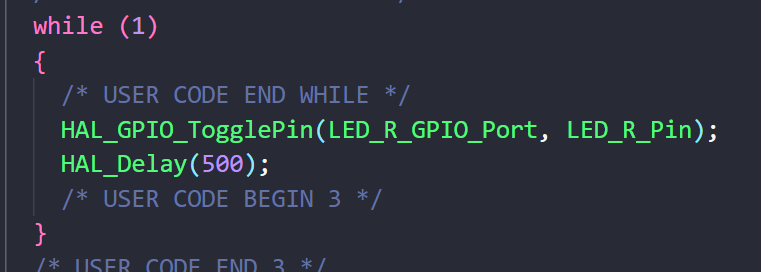

### 2.0 进行交叉编译

完成代码编写之后，进行交叉编译。如果和如图所示一样，那么就可以开始下一步的操作了

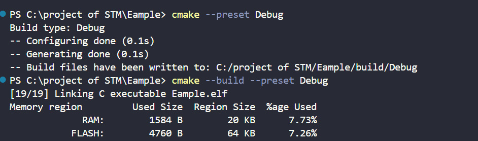

**注：如果这一步的输出有报错，请回顾（[使用STM32新建文件](./Lecture1小作业.md)）的操作**

### 3.0. 代码烧录

#### 3.1 烧录工具准备

首先，我们需要有烧录工具openocd

如果你使用Windows，打开PowerShell,输入以下指令进行下载

``` powershell
winget install -e --id xpack-dev-tools.openocd-xpack
```

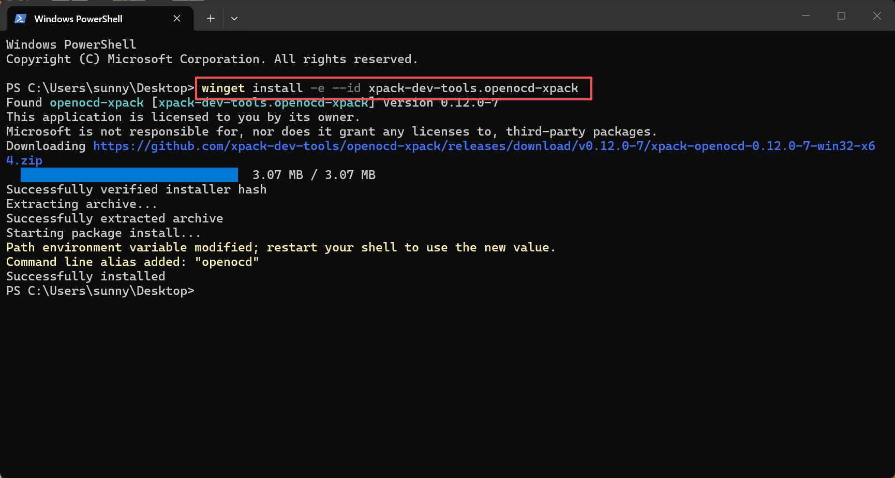

安装完成之后记得添加到环境变量！！！

### 3.2 开发板准备

烧录程序需要用到以下物品：
1、面包板 x1

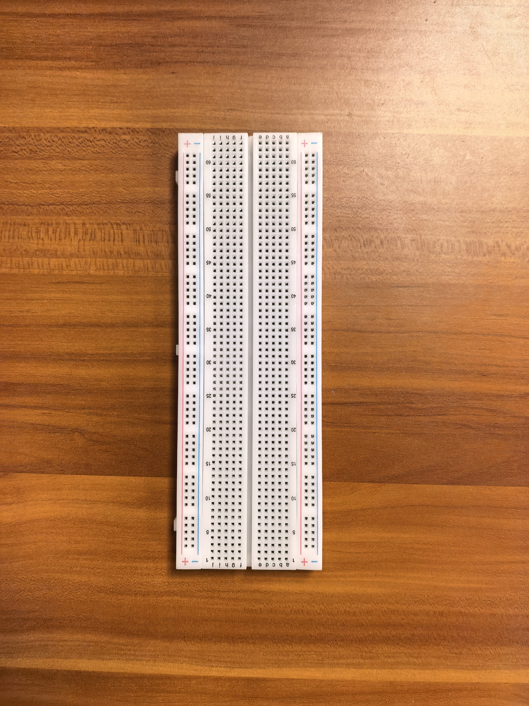

2、STM32F103C8T6开发板 x1

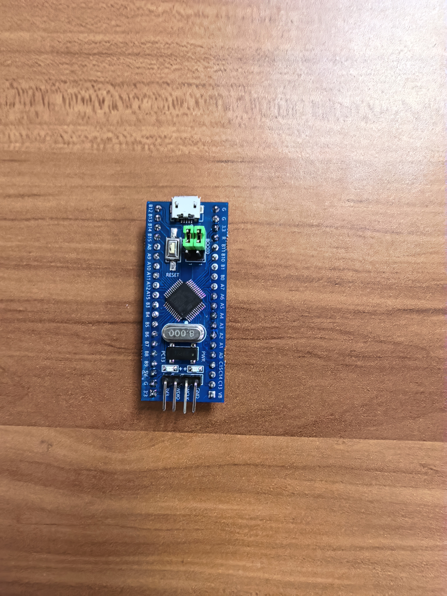

3、stlink烧录器 x1

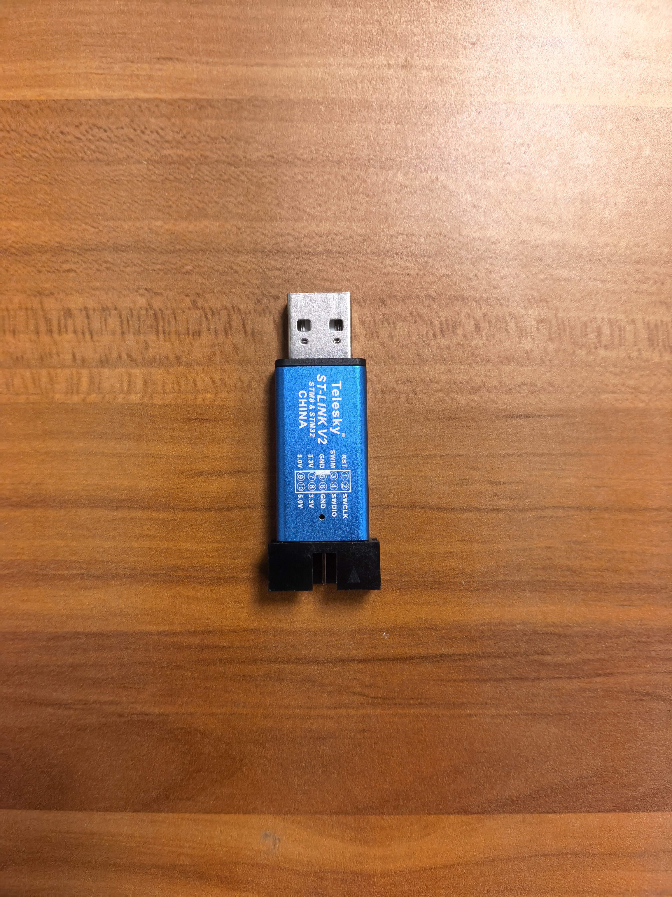

4、杜邦线 x4

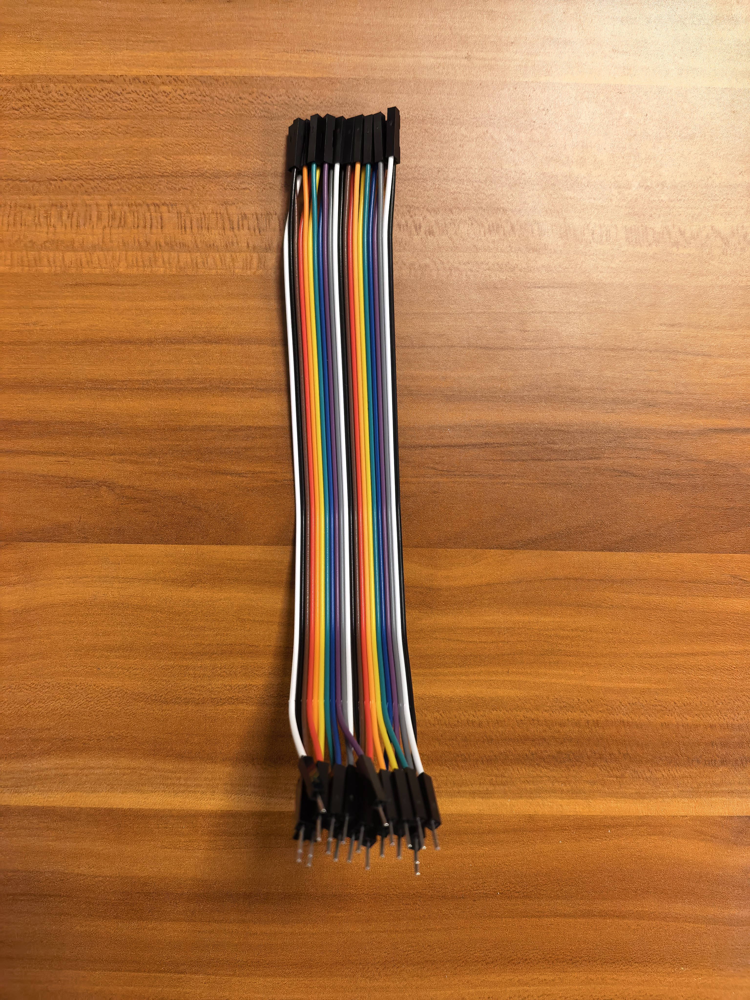

将C8T6安装到面包板上，之后用杜邦线将C8T6与烧录器进行连接（连接的针脚一定要对应：如3v3连接3v3）。全部连接完成后，所有杜邦线都应该插在stlink的第二排。（3V3,GND可插第一排）
**注意**： stlink上方的标注为侧视图
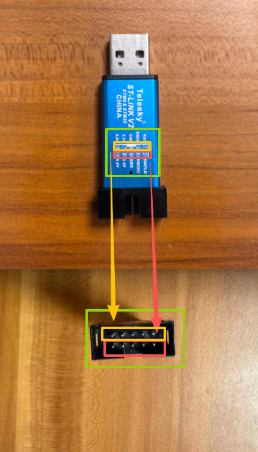
所有连接完成之后如下图所示
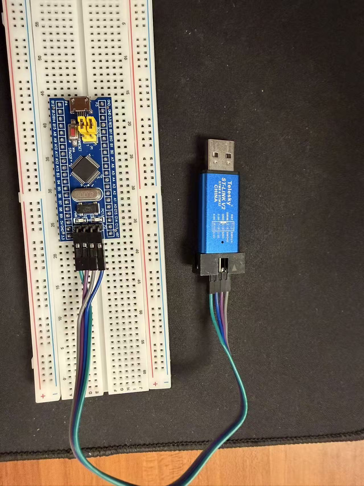

### 3.3 烧录器准备
在烧录前，请确保已经安装了openocd，此外，还需要将此文件放置在项目根目录：
[下载 OpenOCD 烧录配置文件 flash.cfg](flash.cfg)

如果第一次烧录不成功，且打开设备管理器后stlink设备右下角有黄色感叹号，可能是缺少stlink串口驱动程序，在这里下载：
[下载 Zadig 2.9 驱动工具](zadig-2.9.exe)
确保选中WinUSB,然后点击install，等待安装完成。
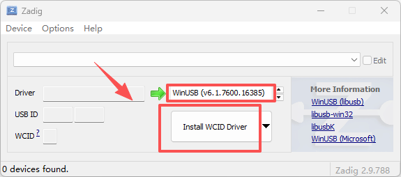


使用 `flash.cfg` 前，请确认其中的 `program` 路径与实际编译生成的 ELF 文件路径一致。注意只修改红色部分，使用相对路径，绿色部分是openocd指令，请勿修改。
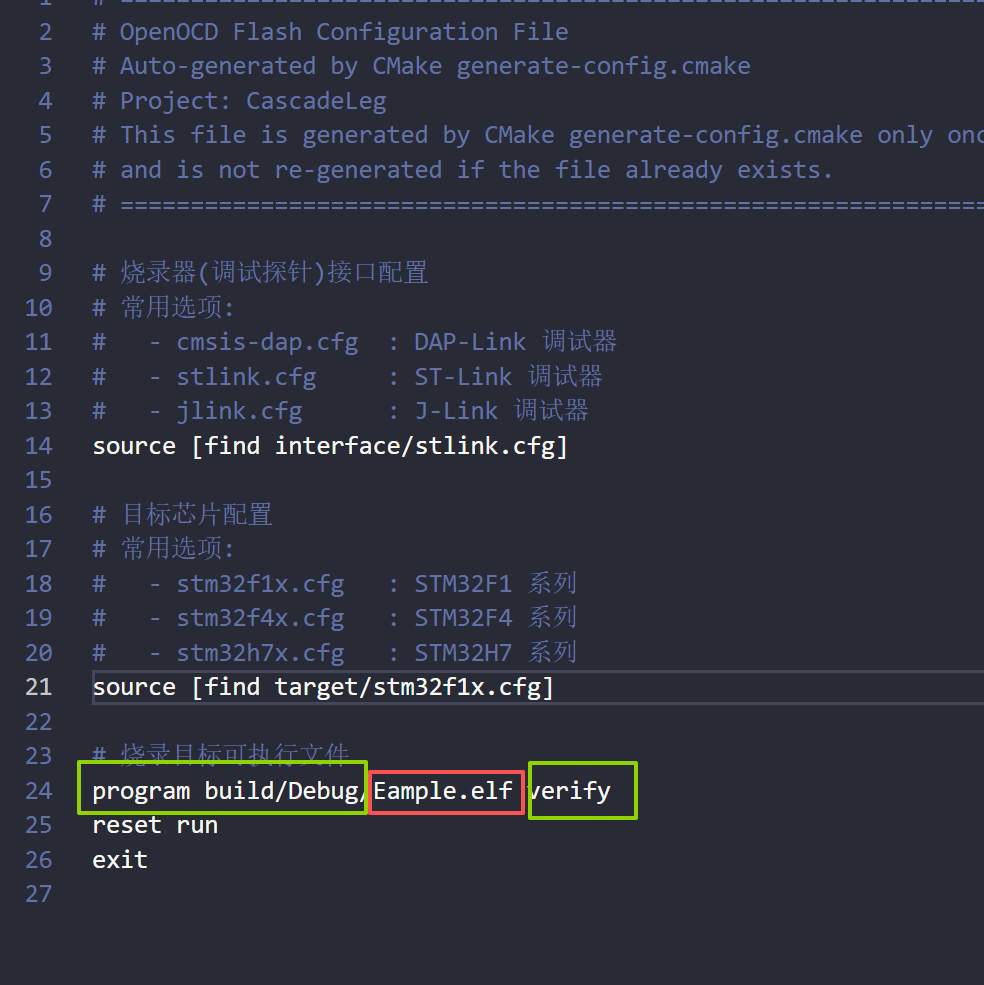

### 3.4 代码烧录

将烧录器插到电脑上，然后在终端输入以下指令并运行

``` powershell
openocd -f flash.cfg
```

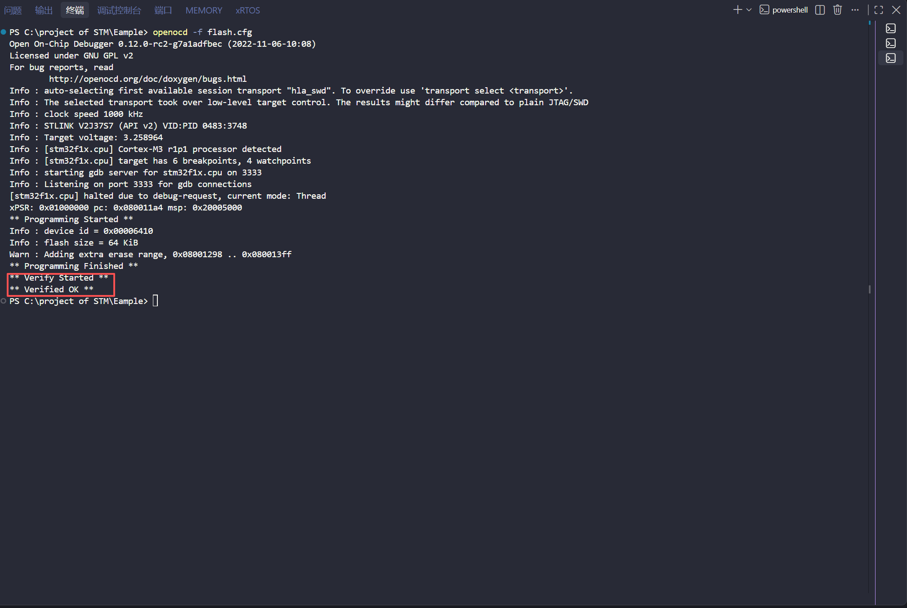

输出如图结果，板载小灯周期性闪烁，即为烧录成功。可以尝试修改HAL_Delay()中的延迟数值，观察小灯闪烁频率的变化。

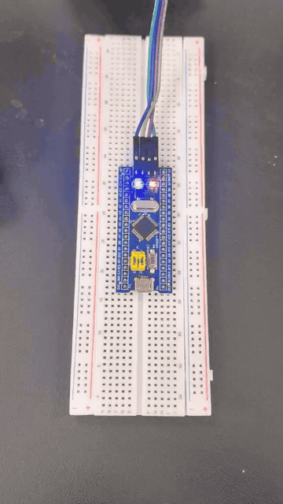

## 4.1 点灯大师进阶
如图，面包板的中间两排引脚横向连通，左右两侧引脚竖向连通：
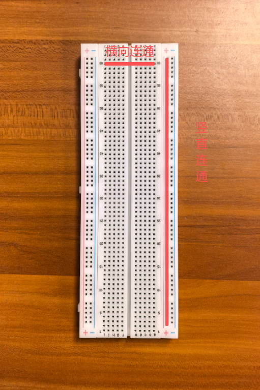
将面包板背面撕开，可以更直观地看到连通情况。
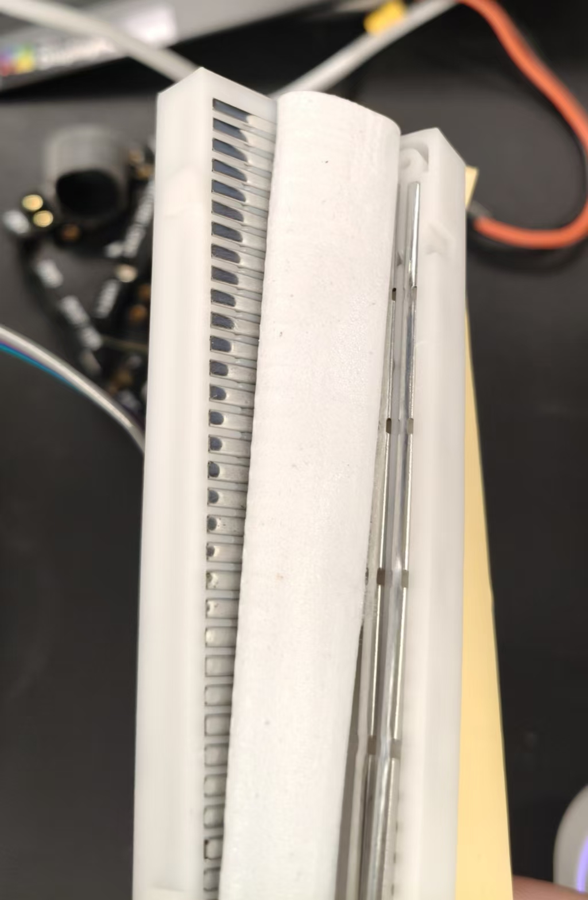

板载LED灯的电路连接图如下：
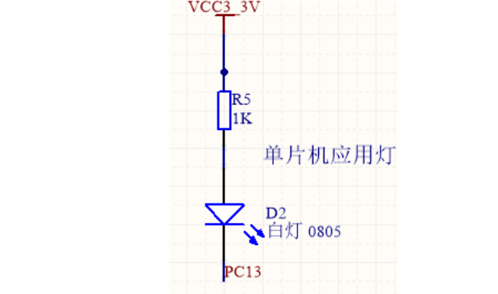
可以观察到，此时LED灯的供电是GPIO外部的VCC3V3提供，此时电流从VCC3V3流向GPIO，GPIO应该配置为开漏输出。

但当我们切换到外置小灯泡时，如果我们直接将LED的长引脚（正极）插入某个外置引脚（这里以PA10为例），则电流从GPIO流向外部，此时，若想让GPIO为小灯泡供电，则需要将其配置为推挽输出模式。
