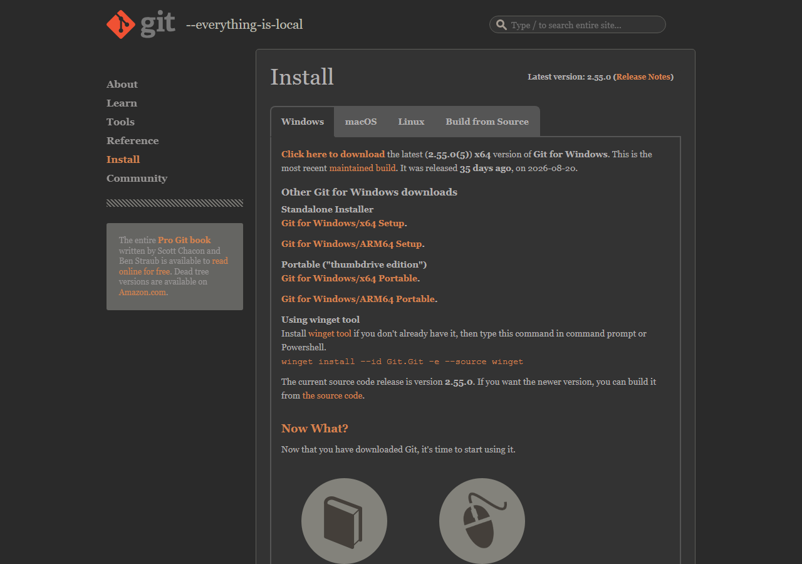
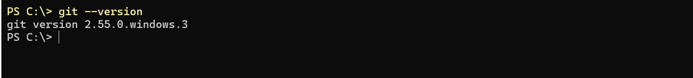
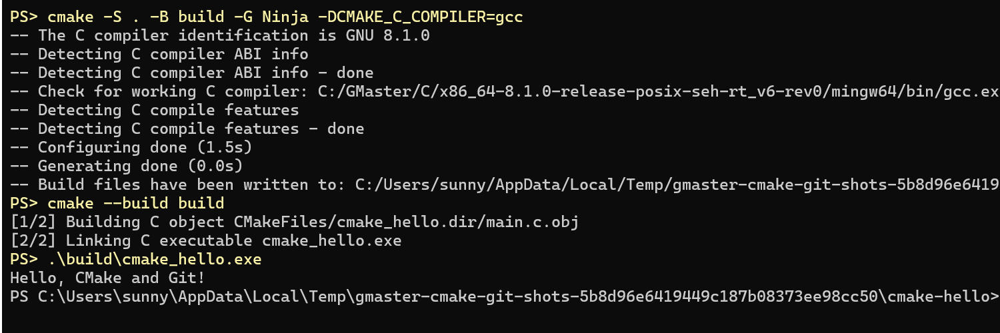
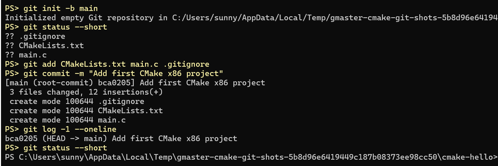

# 用 CMake 新建 x86 工程并通过 Git 提交

这次练习从**安装 Git** 开始，然后在电脑上写一个 C 程序，用 CMake 编译运行，最后完成第一次 Git 提交。本文以 **Windows + PowerShell + 64 位 MinGW-w64 GCC** 为例；这里的 x86 工程指在本机运行的 x86_64 程序，不使用 STM32 的 `arm-none-eabi-gcc`，也不需要开发板。

## 1. 安装 Git

### 1.1 下载 Git for Windows

打开 [Git 官方 Windows 安装页面](https://git-scm.com/install/windows)，点击 **Git for Windows/x64 Setup**，下载安装程序。页面上的版本号会随时间变化，以你下载时显示的版本为准。



### 1.2 运行安装程序

1. 双击下载的 Git 安装程序；如果 Windows 询问是否允许更改设备，确认后继续。
2. 安装目录、组件等页面保持默认选项。到 **Adjusting your PATH environment** 页面时，选择 **Git from the command line and also from 3rd-party software**，这样 PowerShell 和 VS Code 终端都能运行 `git`。
3. 点击 **Install**，等待安装完成，再点击 **Finish**。关闭并重新打开已经开启的 PowerShell 或 VS Code 终端，让新的环境变量生效。

### 1.3 验证 Git

打开 PowerShell，运行：

```powershell
git --version
```

出现 `git version ...` 就说明命令已可用。下图是实际运行结果，版本号不必与截图相同。



## 2. 准备本机编译工具

### 2.1 安装 GCC、CMake 和 Ninja

先按 [Lesson1 开发环境配置](../Lesson1%20开发环境配置.md)中的“安装 GCC”步骤安装 **MinGW-w64 GCC**，并将 `mingw64\bin` 加入 `PATH`。已经安装过的同学可以直接进行下一步。

在 PowerShell 中安装 CMake 和 Ninja；如果已经按 [Lecture 1 小作业](./Lecture1小作业.md)安装过，可以跳过安装命令：

```powershell
winget install --id Kitware.CMake -e
winget install --id Ninja-build.Ninja -e
```

安装后重新打开终端，依次运行：

```powershell
gcc -dumpmachine
cmake --version
ninja --version
```

`gcc -dumpmachine` 的结果应包含 `x86_64` 和 `mingw`；如果是 `arm-none-eabi`，当前调用的是 STM32 交叉编译器，不能用于本教程的 Windows 程序。其余两条命令应输出版本号。

### 2.2 建立工程文件夹

下面以 `D:\Dev\project\cmake-hello` 为例；请把路径换成自己电脑上实际存在、方便寻找的位置。建议先使用不含中文和空格的目录，以便排除工具链路径问题。

```powershell
New-Item -ItemType Directory -Path 'D:\Dev\project\cmake-hello' -Force
Set-Location 'D:\Dev\project\cmake-hello'
code .
```

`code .` 会用 VS Code 打开当前文件夹。如果 `code` 命令不可用，可以在 VS Code 中选择“文件 → 打开文件夹”，打开同一个目录。**后面的命令都在这个工程根目录执行**，终端当前路径应以 `cmake-hello` 结尾。

## 3. 编写一个 C 程序

在工程根目录新建 `main.c`，输入：

```c
#include <stdio.h>

int main(void)
{
    puts("Hello, CMake and Git!");
    return 0;
}
```

保存文件。`puts` 会在终端打印一行文字；`return 0` 表示程序正常结束。

## 4. 添加 CMake 构建文件

在 `main.c` 旁边新建 `CMakeLists.txt`，注意文件名末尾是 `.txt`，内容如下：

```cmake
# 指定本工程要求的最低 CMake 版本。
cmake_minimum_required(VERSION 3.16)

# 工程名是 cmake_hello；LANGUAGES C 表示启用 C 编译器。
project(cmake_hello LANGUAGES C)

# 创建名为 cmake_hello 的可执行目标，并编译 main.c。
add_executable(cmake_hello main.c)
```

在 CMake 文件中，`#` 开头的是注释，不参与构建。这里的三个命令分别指定所需 CMake 版本、声明 C 语言工程，以及把 `main.c` 编译成 `cmake_hello.exe`。保存后，工程目录应为：

```text
cmake-hello/
├── CMakeLists.txt
└── main.c
```

## 5. 配置、编译并运行

### 5.1 配置构建目录

在工程根目录的 PowerShell 中运行：

```powershell
cmake -S . -B build -G Ninja -DCMAKE_C_COMPILER=gcc
```

`-S .` 表示当前目录是源代码目录，`-B build` 表示把 CMake 生成的文件放进 `build/`，`-G Ninja` 选择 Ninja 构建工具。首次配置时，输出中应能看到 C 编译器识别成功，并以 `Build files have been written to: ...\build` 结束。

### 5.2 编译与运行

```powershell
cmake --build build
.\build\cmake_hello.exe
```

程序应输出：

```text
Hello, CMake and Git!
```

下面是配置、编译和运行的实际终端结果；你的 GCC 版本及工程路径可能不同。



此时目录里多了 `build/`，其中包含 CMake 缓存、Ninja 构建文件和生成的 `.exe`。修改 `main.c` 后，再执行 `cmake --build build` 和运行命令即可看到新结果；修改 `CMakeLists.txt` 后，CMake 通常会在构建时自动重新配置，遇到缓存问题可重新执行上面的配置命令。

## 6. 用 Git 保存工程

### 6.1 忽略构建产物

在工程根目录新建 `.gitignore`（文件名以点开头），内容为：

```gitignore
/build/
```

`build/` 是由源文件重新生成的目录，不需要和代码一起提交。此时准备提交的是 `main.c`、`CMakeLists.txt` 和 `.gitignore`。

### 6.2 初始化并检查

确认终端仍位于 `cmake-hello`，再运行：

```powershell
git init -b main
git status --short
```

第一次运行 `git status --short` 应列出三个以 `??` 开头的文件，**不应出现 `build/`**。`git init` 只在当前工程目录执行一次，不要在包含其他项目的上级目录执行。

### 6.3 添加文件并提交

```powershell
git add CMakeLists.txt main.c .gitignore
git diff --cached --stat
git commit -m "Add first CMake x86 project"
git log -1 --oneline
git status --short
```

`git diff --cached --stat` 应显示将提交的三个文件；`git log -1 --oneline` 应显示刚才的提交。最后的 `git status --short` 没有输出，表示当前没有未提交的改动。这里完成的是**本地提交**；把工程传到 GitHub 等远程仓库，需要另行创建远程仓库并执行推送。

下图是第一次提交的实际终端结果：三个源文件进入提交，最后一次 `git status --short` 没有输出。截图中的临时工程路径和提交编号会与你的不同。



若提交时提示 `Author identity unknown`，先在这个工程中设置姓名和邮箱，再重试 `git commit`（换成你自己的信息）：

```powershell
git config user.name "Your Name"
git config user.email "you@example.com"
git commit -m "Add first CMake x86 project"
```

## 7. 进阶：添加头文件目录并自动收集源文件

前面已经完成一个只有 `main.c` 的工程和首次 Git 提交。下面把问候语移到单独的 `.c` 文件，练习 `target_include_directories()` 和 `file(GLOB_RECURSE)`。这些步骤会产生新的改动，可以作为第二次提交。

### 7.1 建立多文件目录

在工程根目录新建 `include/` 和 `src/`，此时目录结构应为：

```text
cmake-hello/
├── CMakeLists.txt
├── main.c
├── include/
│   └── greeter.h
└── src/
    └── greeter.c
```

在 `include/greeter.h` 中声明函数：

```c
#ifndef GREETER_H
#define GREETER_H

void print_greeting(void);

#endif
```

在 `src/greeter.c` 中实现函数：

```c
#include <stdio.h>
#include "greeter.h"

void print_greeting(void)
{
    puts("Hello, CMake and Git!");
}
```

将原来的 `main.c` 改为调用这个函数：

```c
#include "greeter.h"

int main(void)
{
    print_greeting();
    return 0;
}
```

### 7.2 更新 CMakeLists.txt

把原来的 `CMakeLists.txt` **整体替换**为：

```cmake
cmake_minimum_required(VERSION 3.16)
project(cmake_hello LANGUAGES C)

# 从 src/ 及其子目录查找 .c 文件；CONFIGURE_DEPENDS 会在构建时检查文件列表。
file(GLOB_RECURSE APP_SOURCES CONFIGURE_DEPENDS
    "${CMAKE_CURRENT_SOURCE_DIR}/src/*.c"
)

# main.c 仍在工程根目录；APP_SOURCES 是上一步找到的其他源文件。
add_executable(cmake_hello main.c ${APP_SOURCES})

# 让此目标编译时能通过 #include "greeter.h" 找到 include/ 下的头文件。
target_include_directories(cmake_hello PRIVATE
    "${CMAKE_CURRENT_SOURCE_DIR}/include"
)
```

`CMAKE_CURRENT_SOURCE_DIR` 指当前 `CMakeLists.txt` 所在的源代码目录。`file(GLOB_RECURSE ...)` 只在 `src/` 内递归查找 `.c` 文件，因此不会把 `build/` 下的生成文件误收进来。`target_include_directories()` 添加的是**头文件搜索目录**；`PRIVATE` 表示只供当前可执行目标使用。头文件不会因为加入搜索目录就自动变成待编译的 `.c` 文件。

 CMake 官方建议正式工程明确列出源文件：通配查找会增加每次构建的检查工作，`CONFIGURE_DEPENDS` 对所有生成器也不能保证一致。若想改成明确列文件，保留上面的 `target_include_directories()`，并将 `file(GLOB_RECURSE ...)` 和 `add_executable(...)` 两段换为：

```cmake
add_executable(cmake_hello main.c)
target_sources(cmake_hello PRIVATE src/greeter.c)
```

以后每新增一个 `.c` 文件，就在 `target_sources()` 后明确写出文件路径。`PRIVATE` 同样表示这些源文件只用于编译当前目标。

### 7.3 重新编译并检查

在工程根目录运行：

```powershell
cmake -S . -B build -G Ninja -DCMAKE_C_COMPILER=gcc
cmake --build build
.\build\cmake_hello.exe
```

应仍输出 `Hello, CMake and Git!`。如果新增的 `.c` 文件没有进入编译，先检查它是否位于 `src/`、后缀是否为 `.c`，再重新执行配置和构建命令。

想保存这次扩展，可以检查改动后再提交：

```powershell
git status --short
git add CMakeLists.txt main.c include/greeter.h src/greeter.c
git commit -m "Split greeting into a source file"
```

## 8. 常见问题

| 现象 | 检查方法 |
| --- | --- |
| 安装 Git 后 `git` 仍无法识别 | 重新打开 PowerShell；检查安装时是否允许从命令行运行 Git，再用 `Get-Command git` 查看实际位置。 |
| `gcc`、`cmake` 或 `ninja` 无法识别 | 确认对应工具已经安装并加入 `PATH`，重新打开终端；用 `Get-Command gcc,cmake,ninja` 查看实际位置。 |
| CMake 提示找不到 Ninja | 运行 `ninja --version`；确认 Ninja 在 `PATH` 中，然后重新配置。 |
| CMake 选中了 ARM 编译器，或生成的程序无法在 Windows 运行 | 运行 `gcc -dumpmachine`；本教程需要本机 MinGW-w64 GCC。若 `build/` 已缓存错误编译器，换用新的构建目录重新配置，例如把命令中的 `build` 全部改为 `build-x86`，并将新目录也加入 `.gitignore`。 |
| `CMakeLists.txt` 找不到 | 检查终端是否在工程根目录，以及文件名是否被保存成 `CMakeLists.txt.txt`。 |
| `git status` 出现大量构建文件 | 检查 `.gitignore` 是否与 `CMakeLists.txt` 同级、是否写了 `/build/`；如果先前已用 Git 跟踪了这些文件，忽略规则不会自动取消跟踪。 |

完成基础练习后，工程根目录会有 `main.c`、`CMakeLists.txt`、`.gitignore`、`build/` 和 `.git/`；完成进阶练习后，还会有 `include/` 和 `src/`。你应能在终端运行生成的程序，并在 Git 日志中看到相应提交。

参考：[CMake 官方入门教程](https://cmake.org/cmake/help/latest/guide/tutorial/Getting%20Started%20with%20CMake.html)、[CMake `file()` 文档](https://cmake.org/cmake/help/latest/command/file.html)、[CMake `target_sources()` 文档](https://cmake.org/cmake/help/latest/command/target_sources.html)、[Git 初始化仓库](https://git-scm.com/docs/git-init)、[Git 忽略规则](https://git-scm.com/docs/gitignore)。
