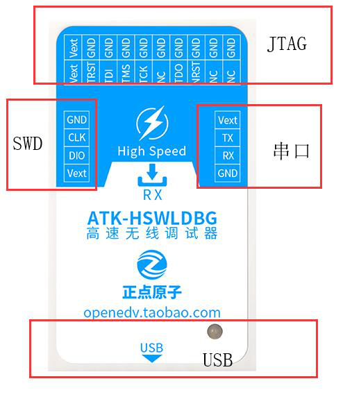

# 烧录器

## 烧录线序
标准线序为 **绿-黄-黑-红**，（也存在少量线序为**黑-红-白-黄**）对应关系如下：

- **绿** → 3.3V (3V3)
- **黄** → GND
- **黑** → CLK
- **红** → DIO

> ⚠️ 连接前请确认目标板电压为 3.3V，避免损坏设备。

---

## 1. ST-Link

ST-Link 配置很简单：

1. 按正确线序连接烧录线  
2. 在 `flash.cfg` 中将烧录器类型设置为 **stlink**
3. 直接烧录即可

## 2. 正点原子无线调试器
- 正点原子无限调试器本质就是DAP，使用的时候烧录器类型需要改为**dap**
- 烧录器插上即用，发送端（TX）接电脑，接收端（RX）接C板

### 指示灯说明

|颜色|状态|
|-----|-----|
|TX、RX都亮蓝灯|发送端和接收端都接电且通信正确|
|TX、RX都亮紫灯|正在烧录|
|TX、RX都不亮灯|只连接了一端/两者串口传输数据通信中断，无法使用|
|TX、RX都蓝灯闪烁|通信时断时续，可能可以正常使用|

### 用户使用手册

[《高速无线调试器用户使用手册 V2.0》](高速无线调试器用户使用手册V2.0.pdf)
